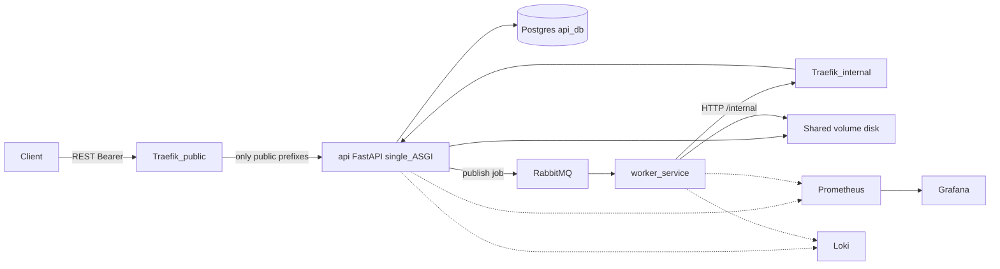
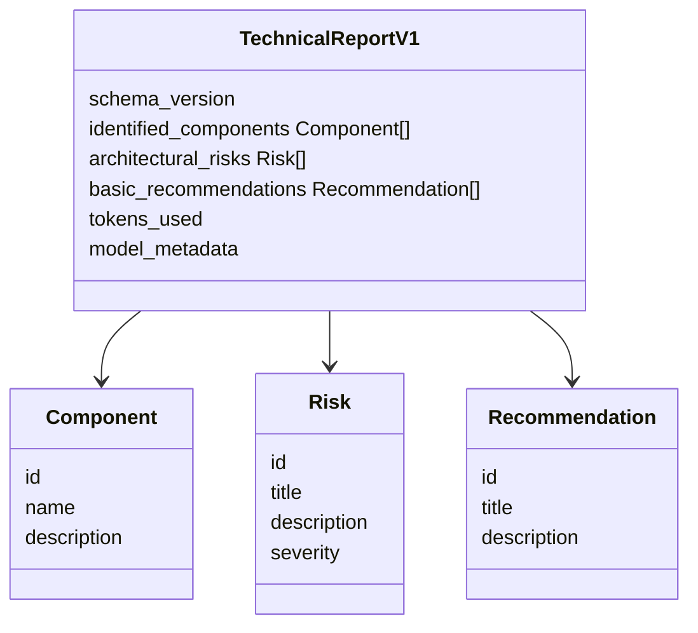
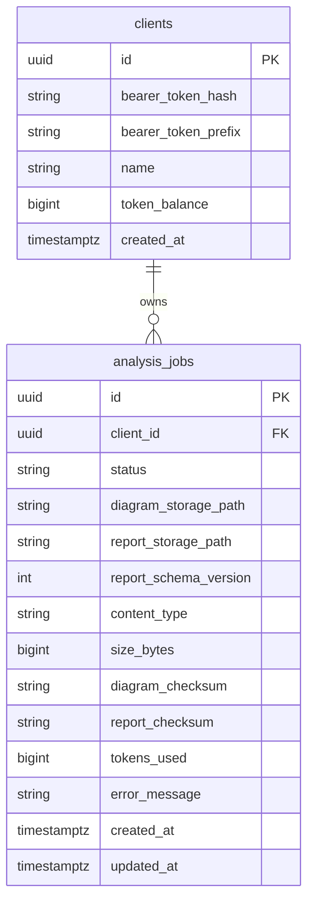

# Plano de execução — Hackathon FIAP Secure Systems (MVP)

## Contexto extraído do PDF

- **Fluxo**: upload → processamento → análise (IA) → relatório técnico → consulta de status.
- **Quatro status obrigatórios** (enums em inglês no código): `RECEIVED`, `PROCESSING`, `ANALYZED`, `ERROR`.
- **Entrada** do MVP (PDF): diagrama como **imagem ou PDF** (upload).
- **Saída / relatório técnico** (PDF): **não** é um arquivo PDF gerado pelo sistema; é o **conjunto estruturado de informações** exigidas pelo hackathon — **componentes identificados**, **possíveis riscos arquiteturais**, **recomendações básicas** — modeladas explicitamente no contrato e persistidas como **documento estruturado em disco** (recomendado: **JSON** ou equivalente com schema versionado), para leitura pela API e entrega via `GET .../report`. O banco guarda **somente referências** (`report_storage_path`, checksum, etc.), nunca o payload completo nem `BYTEA`.
- **Requisitos técnicos do PDF**: microsserviços, REST + assíncrono, clean/hexagonal, testes, Docker/Compose, CI/CD local, logs estruturados.

**Escopo de serviços**: **API** (upload, andamento, resultado) + **Worker** (FSM + placeholder de IA + mensageria).

**Autenticação pública**: somente **`Authorization: Bearer <token>`**, onde o token é um **segredo opaco** gerado na criação do cliente. **Nunca** persistir o token em plaintext: armazenar apenas **hash** (ex.: Argon2id ou bcrypt) e, se útil para suporte, um **prefixo curto não secreto** (últimos 4 caracteres) — o valor completo só aparece **uma vez** na criação/rotate.

**Créditos**: baseados em **tokens de IA consumidos** (`tokens_used` reportado ao final do processamento), **não** por diagrama. Saldo em unidade de tokens; o placeholder de IA deve retornar um `tokens_used` determinístico pequeno para testes; com LLM real, usar contagem do provedor.

---

## Arquitetura lógica

**Worker não acessa banco de dados**: toda persistência de metadados, status, paths, saldo de tokens e registro de uso passa pela **API** em rotas `/internal/...` alcançadas **somente** pelo **entrypoint interno do Traefik** (rede Docker interna). O worker **lê o diagrama** do path informado, **materializa o artefato de relatório estruturado** no disco (ex.: JSON que satisfaz `TechnicalReportV1`) e chama a API interna para **registrar** `report_storage_path`, `tokens_used`, transições de status e erros.

**Banco único (`api_db`)**: atende o PDF com “serviço com banco próprio” no **serviço API**; o worker permanece sem DB próprio por decisão explícita de fronteira (e alinhado ao requisito acima).

---

## Redes Docker, Traefik e superfície da API interna

Em vez de **dois ASGI apps**, usar **um único** FastAPI (Uvicorn) e **[Traefik](https://doc.traefik.io/traefik/)** na frente para **separação de tráfego e política** (routers por entrypoint), sem duplicar a aplicação.

- **`network_edge`**: serviço **`traefik`** com **entrypoint público** (ex.: `--entrypoints.public.address=:8080`) mapeado ao host; routers que aceitam apenas prefixos públicos (`/v1/*`, docs/health se desejado) e **não** expõem `/internal/*` nesse entrypoint. Prometheus/Grafana/Loki conforme necessidade.
- **`network_internal`**: o mesmo Traefik com **entrypoint interno** (ex.: `--entrypoints.internal.address=:8081`) **sem** `ports:` para o host — só rede interna; routers com `entrypoints=internal` encaminhando **`PathPrefix(/internal)`** para `http://api:8000`. **Worker**, **api**, **traefik**, Postgres e RabbitMQ na rede interna; Traefik também na `edge` se precisar publicar só a porta 8080.
- **FastAPI**: um app com dois routers (`/v1/...` + Bearer; `/internal/v1/...` + **`X-Internal-Token`**). O Traefik reforça que **`/internal` não existe no entrypoint público**; a API continua validando o token interno.
- **Config Traefik**: versionar em [`infra/gateway/`](infra/gateway/) (ex.: `traefik.yml` estático + `dynamic/*.yml` com routers/services) ou equivalente com labels Docker, conforme preferência do time.
- **Produção**: firewall / private link; **mTLS** entre worker e Traefik como evolução.

**Prometheus**: scrape direto em `api:8000/metrics` na rede interna (sem passar pelo Traefik público), salvo decisão contrária documentada.

---

## Organização do repositório (monorepo + Clean Architecture)

- [`services/api/`](services/api/) — FastAPI + `uv`, **um** `create_app()` com routers público e interno.
- [`infra/gateway/`](infra/gateway/) (ou raiz) — manifestos **Traefik** (static + dynamic) versionados junto ao Compose.
- [`services/worker/`](services/worker/) — consumer, FSM, `AIAnalysisPort`, cliente HTTP para **`http://traefik:8081`** (entrypoint interno; prefixo `/internal/...`), **sem** drivers de banco.
- [`packages/contracts/`](packages/contracts/) — **obrigatório**: schemas versionados para fila (`AnalyzeDiagramJobV1`), conclusão interna (`JobCompletionV1`), e **`TechnicalReportV1`** — artefato de saída alinhado ao PDF, **sem** semântica de PDF:
  - `identified_components[]` (componentes identificados)
  - `architectural_risks[]` (possíveis riscos arquiteturais)
  - `basic_recommendations[]` (recomendações básicas)
  - Metadados opcionais: `schema_version`, `tokens_used` (espelho para auditoria no arquivo), `model_metadata` (quando houver IA real)

**Mensageria**: interface `MessageBus` + `RabbitMqMessageBus`; corpo da mensagem importa tipos de `packages/contracts`.

---

## REST — paths e alinhamento

Objetivo: **substantivos de recurso**, **códigos HTTP semânticos**, **criação via `POST` com `201` + `Location`**, leituras com `GET`, sem “verbos” na URL.

| Método | Caminho público | Semântica |
|--------|-----------------|------------|
| `POST` | `/v1/analysis-jobs` | Cria **recurso** de job de análise; corpo `multipart/form-data` com o arquivo; resposta `201` com `Location: /v1/analysis-jobs/{id}` e corpo mínimo (id, status). |
| `GET` | `/v1/analysis-jobs/{job_id}` | Representação do job: status, timestamps, **paths são opcionais ou omitidos** para não vazar filesystem; metadados seguros (tipo MIME, tamanho). |
| `GET` | `/v1/analysis-jobs/{job_id}/report` | **Sub-recurso canônico** (path **`/report`** mantido): **relatório técnico estruturado** do PDF (não PDF binário de saída). Quando `ANALYZED`, ler disco, validar `TechnicalReportV1`, `Content-Type: application/json`; `404` / `409` ou `425` conforme política documentada. |
| `GET` | `/v1/clients/me/token-balance` | **Obrigatório**: retorna `token_balance` (e opcionalmente `currency_unit: tokens` / limites) para o cliente autenticado por Bearer. |

**Por que não `/diagrams` + `/status` separados?** Em REST, **status do job** pertence à representação do **job** (`GET .../analysis-jobs/{id}`). O resultado da análise é o sub-recurso **`.../report`** (mantido explicitamente), materializado como JSON em disco — documentar que **não** é export PDF.

**API interna** (alcance apenas via **Traefik entrypoint `internal`** + `X-Internal-Token`; upstream único `api:8000`):

| Método | Caminho interno (via Traefik `:8081`; sem bind no host) | Descrição |
|--------|----------------------------------------------------------|-----------|
| `PATCH` | `/internal/v1/analysis-jobs/{job_id}` | Atualização de estado (`PROCESSING`, `ERROR`) e metadados parciais. |
| `POST` | `/internal/v1/analysis-jobs/{job_id}/completion` | Conclusão com sucesso: `report_storage_path` relativo ao volume, `tokens_used`, checksum opcional; transação que persiste paths, decrementa saldo de tokens e fixa `ANALYZED`. |

Idempotência: `Idempotency-Key` ou `completion_id` nos POST internos para reprocessamento seguro.

---

## Política de tokens (créditos)

- Tabela `clients` com `token_balance` (inteiro) e **hash do bearer token** (nunca plaintext).
- **Upload (`POST /v1/analysis-jobs`)**: validar saldo contra **estimativa mínima** ou política “permite ficar negativo” — para MVP recomenda-se **bloquear** se `token_balance < MIN_TOKENS_ESTIMATE` (constante configurável) com `402` ou `403`, documentado no README.
- **Conclusão (`POST .../completion`)**: corpo com `tokens_used` (inteiro ≥ 0 do placeholder ou provedor); API executa `token_balance -= tokens_used` em transação com atualização do job; se saldo insuficiente, retornar erro à worker para marcar `ERROR` e **não** gravar relatório como concluído (ou política de **partial commit** documentada).
- **Métricas**: `ai_tokens_consumed_total{client_id}` (cardinalidade: cuidado em produção; para hackathon aceitável ou usar `hash(client_id)`).

---

## Persistência: só disco para bytes; banco só referências

- **Diagrama (entrada)**: arquivo binário (imagem ou **PDF de entrada** do usuário) em `/data/uploads/{job_id}/...`; colunas `diagram_storage_path`, `content_type`, `size_bytes`, `diagram_checksum`.
- **Relatório técnico (saída)**: **documento estruturado** (JSON serializando `TechnicalReportV1`) em `/data/reports/{job_id}.json` — contém as três listas exigidas pelo PDF; **não** é um PDF gerado. Colunas `report_storage_path`, `report_checksum` (opcional), `report_schema_version` (opcional, para migrações de contrato).
- **Proibido** no Postgres: `BYTEA`, `jsonb` com cópia do relatório ou do diagrama — apenas paths, números, enums, timestamps, `error_message`, `tokens_used` no job (auditoria de cobrança), etc.

---

## Modelagem de dados (conceitual)

Domínio lógico do artefato em disco (não tabela; documentado em `packages/contracts` e no README):

- **Fonte da verdade do conteúdo analítico**: arquivo em disco referenciado por `report_storage_path`; o ER relacional **não** duplica listas de componentes/riscos/recomendações.
- Índices: `(client_id, created_at)`, `status`.

---

## Mensageria (RabbitMQ)

- Fila `diagram.analysis` (ou nome equivalente); payload tipado `AnalyzeDiagramJobV1` de [`packages/contracts`](packages/contracts): `job_id`, `schema_version`, opcionalmente `diagram_storage_path` se não depender de round-trip à API.
- Worker, ao iniciar, pode chamar `PATCH ... internal` para `PROCESSING` e obter dados necessários, ou confiar no contrato da mensagem + paths convencionados.

---

## Observabilidade

- Prometheus scrape na API (um app) e no worker.
- Custom: `analysis_jobs_total{status}`, `diagram_upload_bytes_total`, **`ai_tokens_consumed_total`**, `worker_state_transitions_total`.
- Grafana + Loki + Promtail como já previsto; logs com `job_id`, `client_id` (ou hash).

---

## Docker Compose “pronto para uso”

- Serviços: `postgres`, `rabbitmq`, **`traefik`**, `api` (um Uvicorn), `worker`, `prometheus`, `grafana`, `loki`, `promtail`.
- **Volumes**: `uploads_data` montado em `api` e `worker` nos mesmos mount paths; volume de config para arquivos Traefik se usar file provider.
- **Redes**: `network_internal` para `api`, `worker`, `traefik`, `postgres`, `rabbitmq`; `network_edge` para `traefik` (bind só `8080`) e UIs; host → **somente** Traefik público.

---

## Testes

- **Unitários**: FSM, validação MIME, hashing de tokens, política de saldo, serialização `contracts`.
- **Integração**: stack com Traefik; worker chama `http://traefik:8081/internal/...`; fluxo multipart → fila → worker → `TechnicalReportV1` em disco → `GET /v1/analysis-jobs/{id}/report` valida schema.

---

## README (trechos a acrescentar)

- Diagrama de redes (edge vs internal).
- Como o bearer é entregue uma vez e armazenado com hash.
- Política de tokens e `tokens_used`.
- Tabela de endpoints públicos vs internos, portas **Traefik** (`public` vs `internal`) e rota de scrape do Prometheus.

---

## Ordem de implementação sugerida

1. Monorepo + `packages/contracts` (`TechnicalReportV1`) + `uv`.
2. API: modelos DB, migrations, disco, hashing de bearer, routers públicos e internos no **mesmo** app.
3. Traefik no Compose (entrypoints `public` + `internal`) + token interno + redes.
4. RabbitMQ + publisher; worker + HTTP ao Traefik `:8081`.
5. Observabilidade + CI.
6. README + diagramas (incluir class diagram do relatório vs ER relacional).

---

## Riscos e mitigações

- **Token de cliente vazado**: rotação documentada; rate limit futuro.
- **API interna alcançável do host**: não publicar o entrypoint **internal** do Traefik (`8081`); teste opcional em CI com `curl` no host não alcançando `/internal`.
- **Concorrência em `token_balance`**: transação com `SELECT ... FOR UPDATE` no cliente na conclusão do job.
- **Integridade do relatório**: checksum opcional no completion; validação de schema ao servir `GET .../report` (ler disco, validar contra Pydantic, então stream).

---

## Estado actual da base de código (revisão)

Esta secção resume melhorias já incorporadas no repositório além do texto original do plano (PDF / MVP).

- **API (ports/adapters):** `application/persistence.py` com port `UnitOfWork`; `presentation/deps.py` concentra o wiring para `infrastructure`. Relatório público e métricas de job / HTTP expõem ports (`TechnicalReportReaderPort`, `JobMetricsPort`, `HttpRequestMetricsPort`) com implementações em `infrastructure/observability` e `infrastructure/adapters`.
- **Worker:** `execute_diagram_job` não depende de `httpx` na camada de aplicação; `InternalApiClient` recebe o cliente HTTP no construtor; `presentation/deps.py` espelha o composition root da API; métricas Prometheus em `infrastructure/observability/`.
- **Fronteiras e CI:** `scripts/check_layer_boundaries.sh` (usado no GitHub Actions); `docs/architecture-layer-boundaries.md` define regras API/worker e o papel de `hackathon_contracts` face ao domínio por serviço.
- **Implementação:** Sem `global` para singletons de métricas do worker ou estado RabbitMQ (`_RabbitResource` em `rabbitmq_pub.py`); imports e docstrings de composição alinhados ao código.

Discussões e planos auxiliares em chats são histórico; o código-fonte e os documentos em `docs/` são a fonte de verdade operacional.
