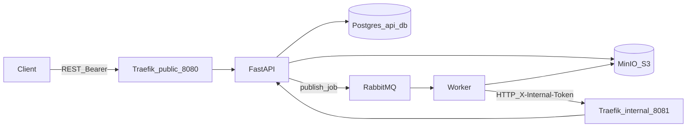

# FIAP Secure Systems — MVP backend

Backend MVP for the FIAP integrated module: upload architecture diagrams (image or PDF), asynchronous analysis with a placeholder “AI” step, structured technical report (components, risks, recommendations), token-based usage accounting, and observability (Prometheus, Grafana, Loki).

## Problem and goal

Organizations maintain many architecture diagrams (images/PDFs) that are reviewed manually. This MVP automates a minimal pipeline: **upload → queue → worker → structured report**, with **status tracking** and **token debits** tied to model usage.

## System composition

| Component | Role | Published on host (Compose `ports:`) |
|-----------|------|----------------------------------------|
| **Traefik** | API gateway: `public` (:8080) exposes `/v1`, docs, health; `internal` (:8081) exposes `/internal` only on the Docker network; **dashboard/API** on `traefik` (:8082, basic auth — see Observability) | `8080`, `8082` |
| **api** | FastAPI listens on `api:8000`; no `ports:` — clients use Traefik `8080`, which forwards to `http://api:8000` | — |
| **worker** | Consumes RabbitMQ, MinIO I/O, internal HTTP client; metrics on `worker:9100` for Prometheus on `internal` | — |
| **minio** | S3-compatible object store for diagram uploads and JSON reports; **Console** UI for browsing buckets | `9000` (S3), `9001` (console) |
| **postgres** | Relational store for clients and job metadata (object keys only, no file bytes) | — |
| **rabbitmq** | Message bus (exchange `hackathon.diagrams`, queue `diagram.analysis`, **DLQ** `diagram.analysis.dlq`); Prometheus plugin on `rabbitmq:15692` | — |
| **prometheus** | Scrapes `api:8000`, `worker:9100`, `rabbitmq:15692`, `minio:9000` (cluster metrics, bearer token) over `internal` | `9090` |
| **grafana** | Dashboards; provisioned Prometheus + Loki datasources (`admin`/`admin`) | `3000` |
| **loki** | Log aggregation | `3100` |
| **promtail** | Ships Docker container logs to Loki (Docker socket mount) | — |

Volumes: `minio_data` (object store), `pgdata`, `grafana_data`. Diagrams and reports are **not** stored on a shared Docker volume between API and worker; both use the same MinIO bucket and keys.

## Architecture (logical view)



- **Traefik** exposes the public entrypoint (`8080`) and the **dashboard** entrypoint (`8082`) on the host. The internal entrypoint (`8081`) exists on the Docker network only; the worker uses `INTERNAL_API_BASE` (e.g. `http://traefik:8081`).
- **API**: a single ASGI process with `/v1/...` (client Bearer) and `/internal/v1/...` (`X-Internal-Token`).
- **Worker**: no database; reads diagram objects and writes report objects in the same MinIO bucket as the API; updates state and completion via the internal API.
- **Contracts**: shared types in `packages/contracts` (`AnalyzeDiagramJobV1`, `JobPatchV1`, `JobCompletionV1`, `TechnicalReportV1`, RabbitMQ topology in `messaging_topology`).
- **Shared platform**: minimal cross-service utilities in `packages/platform` (`hackathon_platform`), including `configure_logging` for structlog across API and worker.

### RabbitMQ messaging topology

Exchange name, routing key, and the **default** queue name are centralized in `hackathon_contracts.messaging_topology`. At runtime the queue name remains configurable per service via `RABBITMQ_QUEUE_NAME` / `Settings.rabbitmq_queue_name` and must match between API and worker in the same environment.

## Data flow

1. **Upload** — Client sends `POST /v1/analysis-jobs` (multipart) through public Traefik with `Authorization: Bearer <token>`.
2. **Initial persistence** — API validates upload policy (MIME, size, minimum token estimate), stores the file as an object in MinIO (`uploads/...` key), creates the job row (`RECEIVED`), and records metadata in Postgres (no file bytes in the DB).
3. **Queue** — API publishes `AnalyzeDiagramJobV1` (including `job_id`, `diagram_storage_path`, etc.) to the direct exchange defined in contracts with the analysis routing key.
4. **Consumption** — Worker consumes the queue, declares the same topology (exchange, main queue with dead-lettering, DLQ, bindings). Failed messages are **rejected without requeue** and routed to the DLQ via `hackathon.dlx`.
5. **Processing** — Worker calls `PATCH /internal/v1/analysis-jobs/{id}` with `JobPatchV1` (`status: PROCESSING`). API updates the job.
6. **Analysis (placeholder)** — Worker reads the diagram object from MinIO using the relative path from the message (`uploads/<path>`), runs placeholder analysis, produces `TechnicalReportV1`.
7. **Report object** — Worker writes JSON to MinIO under `reports/<job_id>.json` and computes a checksum when applicable.
8. **Completion** — Worker calls `POST /internal/v1/analysis-jobs/{id}/completion` with `JobCompletionV1` (relative `report_storage_path`, `tokens_used`, checksum, schema version). API updates the job to `ANALYZED`, persists references, and debits `tokens_used` from the client balance in a transaction.
9. **Read results** — Client calls `GET /v1/analysis-jobs/{id}` for status and, when `ANALYZED`, `GET /v1/analysis-jobs/{id}/report` for JSON (validated against the contract when served).

On processing errors, the worker typically records `ERROR` via `PATCH` with a truncated message; the API reflects that on the job row.

### Source of truth

| Data | Source of truth |
|------|-----------------|
| Client/job metadata, token balance | Postgres (`api_db`) |
| Diagram and report bytes | MinIO bucket (`hackathon` by default); DB stores relative keys and checksums only |
| Queue payloads and internal API bodies | Schemas in `hackathon_contracts` |

## Prerequisites

- Docker + Docker Compose
- (Optional local dev) Python **3.12+** and **uv** or `pip` for tests

## Quick start (Docker)

Use the same `INTERNAL_TOKEN` for the API and worker (repo root `.env` from `.env.example`). `/internal/...` must not be reachable on the **public** Traefik entrypoint; the internal entrypoint (`8081`) is not published on the host by default.

```bash
cp .env.example .env   # set INTERNAL_TOKEN for non-local demos
docker-compose up -d --build
```

Wait until Postgres, RabbitMQ, and the API are healthy (first run applies migrations on API startup).

```bash
curl -sS http://localhost:8080/health
```

Expected: JSON with `"status": "ok"`.

Seed a client (prints **bearer token once**):

```bash
docker-compose exec api python -m hackathon_api.seed
export TOKEN='<bearer from seed>'
curl -sS -H "Authorization: Bearer $TOKEN" http://localhost:8080/v1/clients/me/token-balance
```

Upload a diagram (example: minimal 1×1 PNG). You can replace the path with any allowed PNG, JPEG, or PDF:

```bash
printf '%s' 'iVBORw0KGgoAAAANSUhEUgAAAAEAAAABCAYAAAAfFcSJAAAADUlEQVR42mP8z8BQDwAEhQGAhKmMIQAAAABJRU5ErkJggg==' | base64 -d > /tmp/test-diagram.png
curl -sS -D /tmp/analysis-job-headers.txt \
  -H "Authorization: Bearer $TOKEN" \
  -F "file=@/tmp/test-diagram.png" \
  http://localhost:8080/v1/analysis-jobs
```

Response body includes `id` and `status` (typically `RECEIVED`); the `Location` header points at the created resource. Set `JOB_ID` from headers or JSON:

```bash
export JOB_ID=$(grep -i '^Location:' /tmp/analysis-job-headers.txt | sed 's/.*analysis-jobs\///' | tr -d '\r\n ')
# or: curl ... | jq -r .id
echo "$JOB_ID"
```

Processing is asynchronous (queue + worker). Poll until `ANALYZED` or `ERROR`:

```bash
curl -sS -H "Authorization: Bearer $TOKEN" "http://localhost:8080/v1/analysis-jobs/$JOB_ID"
```

When status is `ANALYZED`:

```bash
curl -sS -H "Authorization: Bearer $TOKEN" "http://localhost:8080/v1/analysis-jobs/$JOB_ID/report"
```

If the job is not finished, the report endpoint may indicate the report is not ready; confirm status with the job `GET` above.

**Optional — internal API debugging** (not used in normal operation; the worker calls internal routes after consuming the queue). From the API container against Uvicorn on `8000`:

```bash
export INTERNAL_TOKEN='<same value as INTERNAL_TOKEN in .env>'
docker-compose exec api curl -sS -X PATCH \
  -H "Content-Type: application/json" \
  -H "X-Internal-Token: $INTERNAL_TOKEN" \
  -d '{"status":"PROCESSING"}' \
  "http://127.0.0.1:8000/internal/v1/analysis-jobs/$JOB_ID"
```

| Variable | Purpose |
|----------|---------|
| `TOKEN` | Client Bearer token (public API) |
| `JOB_ID` | Analysis job UUID |
| `INTERNAL_TOKEN` | `X-Internal-Token` header (`/internal/...`) |

## Local install and run with uv

The repo is a **multi-package** workspace (`packages/contracts`, `packages/platform`, `services/api`, `services/worker`). Use **[uv](https://docs.astral.sh/uv/)** (Python **3.12+**) to install editable dependencies and run tooling without Docker for the apps themselves.

### Install (editable) and run unit tests

From the repository root:

```bash
uv venv .venv --python 3.12
source .venv/bin/activate
# Windows PowerShell: .venv\Scripts\Activate.ps1

uv pip install pytest-cov pytest
uv pip install -e "./packages/contracts[dev]" -e ./packages/platform \
  -e "./services/api[dev]" -e ./services/worker[dev]"

export PYTHONPATH=services/api/src:services/worker/src:packages/contracts/src:packages/platform/src
pytest packages/contracts/tests packages/platform/tests services/api/tests services/worker/tests \
  --cov=hackathon_contracts --cov=hackathon_platform --cov=hackathon_api --cov=hackathon_worker \
  --cov-config=.coveragerc --cov-report=term-missing --cov-fail-under=70 -v
```

### Linters (example)

```bash
uv run --directory services/api ruff check src tests
uv run --directory services/worker ruff check src tests
```

### Run API or worker on the host (optional)

You still need **Postgres, RabbitMQ, MinIO, and Traefik** (or equivalent URLs) in `.env`. By default, Compose does **not** publish Postgres on the host — the usual pattern is `docker-compose up -d` for the data plane and attach your IDE/terminal to the same network, or expose ports in Compose for local experimentation.

```bash
# API (from repo root; set DATABASE_URL, RABBITMQ_URL, INTERNAL_TOKEN, MINIO_*, etc.)
cd services/api && PYTHONPATH=src uv run uvicorn hackathon_api.main:app --reload --host 0.0.0.0 --port 8000

# Worker (separate terminal; same env for RABBITMQ_URL, INTERNAL_*, MINIO_*)
cd services/worker && PYTHONPATH=src uv run python -m hackathon_worker.main
```

Traffic from your machine to the HTTP API normally goes **through Traefik on :8080** when using the full Compose stack (`http://localhost:8080`). A direct `:8000` process is mainly for debugging.

## CI / deployment

CI builds Docker images for `api` and `worker`, runs **Ruff**, `scripts/check_layer_boundaries.sh`, and **pytest** (see `.github/workflows/ci.yml`). A separate job runs `scripts/integration_compose_observability.sh` on `ubuntu-latest`. For **local deployment**, `docker-compose up -d` is the baseline. Production would add firewall rules, secrets management, TLS, and optionally mTLS on internal routes.

## Data model (relational)

- **clients**: `bearer_token_hash`, `bearer_token_prefix`, `token_balance`, …
- **analysis_jobs**: `status` (`RECEIVED` | `PROCESSING` | `ANALYZED` | `ERROR`), `diagram_storage_path`, `report_storage_path`, `tokens_used`, checksums, timestamps.

Structured report content lives **only on disk** as JSON conforming to `TechnicalReportV1` in `packages/contracts`.

## REST surface (public)

| Method | Path | Description |
|--------|------|-------------|
| `POST` | `/v1/analysis-jobs` | Multipart upload; `201` + `Location` |
| `GET` | `/v1/analysis-jobs/{id}` | Job metadata + status |
| `GET` | `/v1/analysis-jobs/{id}/report` | Structured JSON report when `ANALYZED` |
| `GET` | `/v1/clients/me/token-balance` | Remaining AI tokens |

Internal (Traefik `internal` only): `PATCH /internal/v1/analysis-jobs/{id}`, `POST /internal/v1/analysis-jobs/{id}/completion` with header `X-Internal-Token`.

## Security

| Surface | Defaults (demo / Compose) | Where to override |
|---------|---------------------------|-------------------|
| **Traefik dashboard** (`:8082`, `/dashboard` + `/api`) | User **`test`**, password **`test`** (basic auth in [traefik-dashboard.yml](infra/gateway/dynamic/traefik-dashboard.yml)) | Regenerate an `htpasswd` line and replace the `users:` entry; see **Observability** below. |
| **MinIO** (Console `:9001`, S3 `:9000`) | **`minio` / `minio12345`** (`MINIO_ROOT_USER` / `MINIO_ROOT_PASSWORD` in Compose; API/worker inherit the same credentials as `MINIO_ACCESS_KEY` / `MINIO_SECRET_KEY`) | [docker-compose.yml](docker-compose.yml) and application env vars. Change before any shared environment. |
| **Grafana** | **`admin` / `admin`** | `GF_SECURITY_ADMIN_USER` / `GF_SECURITY_ADMIN_PASSWORD` in Compose. |
| **PostgreSQL** (Compose) | **`app` / `app`**, DB **`api_db`** | `POSTGRES_*` in Compose. |

**General**

- **Bearer tokens** are never stored in plaintext; only **bcrypt hashes** and a short **prefix** for lookup.
- **Internal token** (`X-Internal-Token`) is required for `/internal/*`; Traefik splits public vs internal entrypoints to reduce accidental exposure.
- **Upload validation**: MIME allowlist (`image/png`, `image/jpeg`, `application/pdf`) and configurable max size (`MAX_UPLOAD_BYTES`).
- **Token debit** occurs on successful completion using `tokens_used` from the worker (placeholder returns a small deterministic value today).
- **Operational caveats**: treat the table above as **insecure defaults** for local demos only; rotate secrets via `.env` and Compose. Promtail needs Docker socket access; mTLS is not configured in this MVP.

## Observability

- **Prometheus:** `http://localhost:9090` — scrapes API, worker, RabbitMQ (`/metrics/per-object` on `rabbitmq:15692`), and MinIO **cluster** plus **bucket** metrics on `:9000` (`bearer_token` must match `MINIO_PROMETHEUS_AUTH_TOKEN` in Compose).
- **Traefik dashboard:** `http://localhost:8082` — basic auth **`test`** / **`test`** by default ([dynamic config](infra/gateway/dynamic/traefik-dashboard.yml)); regenerate with `htpasswd -nb user password` (Apache `apache2-utils`/`httpd`) or `docker run --rm httpd:2.4-alpine htpasswd -nb …` and replace the `users:` hash line.
- **MinIO Console:** `http://localhost:9001` — default root user **`minio`**, password **`minio12345`** (same values as `MINIO_ACCESS_KEY` / `MINIO_SECRET_KEY` for API/worker in Compose).
- **Grafana:** `http://localhost:3000` (`admin` / `admin`) — datasources **Prometheus** and **Loki** are provisioned (fixed UIDs `prometheus`, `loki`). Organization **home dashboard** defaults to **Application metrics** (`GF_DASHBOARDS_DEFAULT_HOME_DASHBOARD_UID=app-metrics`). Provisioned dashboards are tagged **`hackathon`** (**Dashboards → Tags** filter). Grafana OSS cannot bulk-provision starred dashboards; rely on default home and tags or mark stars in the UI.
- **Panels:** **Application metrics** — HTTP rates and latency (**mean + p95** per **HTTP method + endpoint**, UUID segments normalized as `{id}`), template variables **`path_group`** + **`method`** + **`minio_bucket`** (default from Prometheus); **MinIO** row includes cluster capacity, bucket usage/objects, S3 traffic, and scrape `up`. **Application logs** and **Platform logs** — **`compose_service`** / **`container`** (short); Promtail sets **`level`** (and static **`service`** on infra images where applicable).
- **Loki:** `http://localhost:3100` — ingestion via **Promtail** (Docker container logs).

Promtail derives **`compose_service`** and **`container`** as the short Compose service name (**`api`**, **`worker`**, **`promtail`**, … — not `fiap-ai-tech-challenge-05-api-1`) via `com.docker.compose.service`, with fallback regex from the container name (`…-service-N` / `…_service_N`). **`stream`** (**stdout**/ **stderr**) is kept. That avoids duplicated Loki streams for the same app log line and trims **unknown**/`service` clashes. **api**/**worker**: structlog JSON → **`level`** (defaults to **`info`** when the line is not JSON); **`service`** is no longer duplicated as an extra label (**`compose_service`** is enough). Other services: parsers as documented above (Postgres/RabbitMQ/Traefik/MinIO/metrics stack).

### HTTP latency (Grafana)

Mean / p95 include **full handler time**: multipart body read, Postgres, RabbitMQ, and MinIO on uploads—not only Traefik overhead. Histograms expose **`method`**: combine **`method`** + **`endpoint`** to separate POST `/v1/analysis-jobs` (upload-heavy) from GET/PATCH cousins on templated routes. **`path_group`** narrows rows by path prefix (`v1`, `internal`, …).

### Environment variables (MinIO)

| Variable | Purpose |
|----------|---------|
| `MINIO_ENDPOINT` | Host:port (e.g. `minio:9000` in Compose) |
| `MINIO_ACCESS_KEY` / `MINIO_SECRET_KEY` | S3 credentials |
| `MINIO_BUCKET` | Bucket name (created on startup if missing) |
| `MINIO_USE_SSL` | `"true"` / `"false"` |

### Docker Desktop (macOS) vs Linux

Promtail depends on the Docker engine and host log paths. **Linux** (including GitHub Actions) is the reference for “logs in Loki”. On **Docker Desktop for macOS**, `/var/lib/docker/containers` on the host may not match Linux; if Explore is empty, validate on Linux CI or a Linux VM.

### Compose integration (CI and local)

From the repo root (requires Docker, `curl`, `jq`):

```bash
bash scripts/integration_compose_observability.sh
```

Set `KEEP_COMPOSE_UP=1` to skip `docker-compose down` at the end (debugging).

## Tests (without Docker stack)

Unit tests use mocks/in-memory doubles (no real Postgres/RabbitMQ/MinIO). Layout mirrors source packages (e.g. `services/api/tests/hackathon_api/...`). Prefer **`uv`** using [Local install and run with uv](#local-install-and-run-with-uv).

```bash
python -m venv .venv && source .venv/bin/activate
pip install pytest-cov
pip install -e "./packages/platform" -e "./packages/contracts[dev]" -e "./services/api[dev]" -e "./services/worker[dev]"
export PYTHONPATH=services/api/src:services/worker/src:packages/contracts/src:packages/platform/src
pytest packages/contracts/tests packages/platform/tests services/api/tests services/worker/tests \
  --cov=hackathon_contracts --cov=hackathon_platform --cov=hackathon_api --cov=hackathon_worker \
  --cov-config=.coveragerc --cov-report=term-missing --cov-fail-under=70 -v
```

CI runs the same coverage gate (minimum **70%** overall). Integration tests under `services/api/tests/test_integration_*.py` still rely on **SQLite + TmpFilesystemStorage** overrides (no Docker).

## Repository layout

- `packages/contracts` — shared Pydantic contracts (queue, internal payloads, `TechnicalReportV1`)
- `packages/platform` — shared utilities (`hackathon_platform`: structlog `configure_logging`, MinIO helpers `object_keys` / `minio_io`)
- `services/api` — FastAPI + Alembic + storage + RabbitMQ publisher
- `services/worker` — async consumer + placeholder AI + internal HTTP client
- `infra/gateway` — Traefik static + dynamic routing
- `observability/*` — Prometheus, Grafana, Promtail

## Layer boundaries (API + Worker)

Both services split **domain** and **application** from **infrastructure** so that ORMs, concrete HTTP clients, and Prometheus wiring stay behind ports and composition roots. `scripts/check_layer_boundaries.sh` (also run in CI) enforces which modules may import each service’s `infrastructure` package.

### API

`services/api/src/hackathon_api/presentation/deps.py` is the composition root under `presentation/`: it connects FastAPI dependencies to implementations in `hackathon_api.infrastructure`. Other modules under `presentation/` avoid importing `infrastructure`; `main.py` and `seed.py` perform top-level wiring as well.

`application/persistence.py` defines the transactional port and `UnitOfWork`; `infrastructure/sqlalchemy_unit_of_work.py` supplies `SqlAlchemyUnitOfWork`. Routes and use cases receive `job_persistence` from the `get_job_persistence` provider.

### Worker

`services/worker/src/hackathon_worker/presentation/deps.py` plays the same role for the worker: it registers `InternalApiClient`, Prometheus metrics, `MinioObjectStorageAdapter`, and the scrape HTTP server from `hackathon_worker.infrastructure`. `services/worker/src/hackathon_worker/main.py` runs the RabbitMQ consumer loop with `httpx.AsyncClient` and pulls concrete implementations from `deps`, analogous to Uvicorn + `deps` on the API.

`execute_diagram_job` talks to the internal API through `WorkerInternalApiPort`, reads/writes objects via `WorkerObjectStoragePort`, and records pipeline metrics via `WorkerPipelineMetricsPort`. Counter definitions (`worker_state_transitions_total`, `diagram_jobs_processed_total`) live in `infrastructure/observability/metrics.py`; `infrastructure/observability/prometheus_worker_pipeline_metrics.py` implements the port and is wired in `presentation/deps.py`.

The table summarizes the layout. `check_layer_boundaries.sh` greps `application/`, `domain/`, and `presentation/` for `hackathon_api.infrastructure` or `hackathon_worker.infrastructure`; under `presentation/`, only `deps.py` may contain those imports (empty `__init__.py` files are skipped). It does not scan top-level `main.py` or `seed.py`, which remain manual composition roots alongside `deps.py`.

| Layer | Imports `...infrastructure` |
|-------|-----------------------------|
| `application/` | Avoided |
| `domain/` | Avoided |
| `presentation/*.py` (except empty `__init__.py`) | `deps.py` only |
| `main.py` / `seed.py` | Composition root |
| `infrastructure/**` | Internal to that layer |

### Contracts, platform, and per-service domain

`packages/contracts` (`hackathon_contracts`) centralises queue payloads, internal patch/completion DTOs, `TechnicalReportV1`, and `messaging_topology`. Those types are the single integration surface for cross-service messages and HTTP bodies.

The API keeps `JobStatus` and persistence-oriented models in its own tree; the worker keeps consumption-time state (e.g. `WorkerJobPhase` in the local FSM) separate. There is no shared “generic domain” package—each service’s model reflects its role.

Database, broker, and Prometheus code live inside each service’s `infrastructure/` tree. `packages/platform` (`hackathon_platform`) currently offers shared structlog setup (`configure_logging`) and similar small utilities without business DTOs.

Application code depends on `hackathon_contracts` for boundary types; `hackathon_platform` is limited to technical helpers (logging bootstrap, etc.), not domain rules or duplicate DTOs.

### Local verification

Run the same static check CI uses before opening a PR or after refactors that touch imports. The script scans Python under each service and **fails the shell with a non-zero exit** if it finds `hackathon_api.infrastructure` or `hackathon_worker.infrastructure` inside `application/` or `domain/`, or inside any `presentation/*.py` file other than `deps.py`. On success it prints a single confirmation line; on failure it prints the offending paths and line numbers so you can move wiring into `deps.py` (or keep infrastructure types behind a port).

```bash
bash scripts/check_layer_boundaries.sh
```

No containers or database are required; only `bash` and `grep`.

## License

Educational use.
