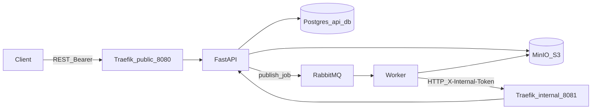

# FIAP Secure Systems — MVP backend

Backend MVP for the FIAP integrated module: upload architecture diagrams (image or PDF), asynchronous analysis with a placeholder “AI” step, structured technical report (components, risks, recommendations), token-based usage accounting, and observability (Prometheus, Grafana, Loki).

## Problem and goal

Organizations maintain many architecture diagrams (images/PDFs) that are reviewed manually. This MVP automates a minimal pipeline: **upload → queue → worker → structured report**, with **status tracking** and **token debits** tied to model usage.

## System composition

| Component | Role | Published on host (Compose `ports:`) |
|-----------|------|----------------------------------------|
| **Traefik** | API gateway: `public` (:8080) exposes `/v1`, docs, health; `internal` (:8081) exposes `/internal` only on the Docker network; **dashboard/API** on `traefik` (:8082, basic auth — see Observability) | `8080`, `8082` |
| **api** | FastAPI listens on `api:8000`; no `ports:` — clients use Traefik `8080`, which forwards to `http://api:8000` | — |
| **worker** | Consumes RabbitMQ, MinIO I/O, internal HTTP client; metrics on `worker:9100` for Prometheus on `internal` | — |
| **minio** | S3-compatible object store for diagram uploads and JSON reports; **Console** UI for browsing buckets | `9000` (S3), `9001` (console) |
| **postgres** | Relational store for clients and job metadata (object keys only, no file bytes) | — |
| **rabbitmq** | Message bus (exchange `hackathon.diagrams`, queue `diagram.analysis`, **DLQ** `diagram.analysis.dlq`); Prometheus plugin on `rabbitmq:15692` | — |
| **prometheus** | Scrapes `api:8000`, `worker:9100`, `rabbitmq:15692`, `minio:9000` (cluster metrics, bearer token) over `internal` | `9090` |
| **grafana** | Dashboards; provisioned Prometheus + Loki datasources (`admin`/`admin`) | `3000` |
| **loki** | Log aggregation | `3100` |
| **promtail** | Ships Docker container logs to Loki (Docker socket mount) | — |

Volumes: `minio_data` (object store), `pgdata`, `grafana_data`. Diagrams and reports are **not** stored on a shared Docker volume between API and worker; both use the same MinIO bucket and keys.

## Architecture (logical view)



- **Traefik** exposes the public entrypoint (`8080`) and the **dashboard** entrypoint (`8082`) on the host. The internal entrypoint (`8081`) exists on the Docker network only; the worker uses `INTERNAL_API_BASE` (e.g. `http://traefik:8081`).
- **API**: a single ASGI process with `/v1/...` (client Bearer) and `/internal/v1/...` (`X-Internal-Token`).
- **Worker**: no database; reads diagram objects and writes report objects in the same MinIO bucket as the API; updates state and completion via the internal API.
- **Contracts**: shared types in `packages/contracts` (`AnalyzeDiagramJobV1`, `JobPatchV1`, `JobCompletionV1`, `TechnicalReportV1`, RabbitMQ topology in `messaging_topology`).
- **Shared platform**: minimal cross-service utilities in `packages/platform` (`hackathon_platform`), including `configure_logging` for structlog across API and worker.

### RabbitMQ messaging topology

Exchange name, routing key, and the **default** queue name are centralized in `hackathon_contracts.messaging_topology`. At runtime the queue name remains configurable per service via `RABBITMQ_QUEUE_NAME` / `Settings.rabbitmq_queue_name` and must match between API and worker in the same environment.

## Data flow

1. **Upload** — Client sends `POST /v1/analysis-jobs` (multipart) through public Traefik with `Authorization: Bearer <token>`.
2. **Initial persistence** — API validates upload policy (MIME, size, minimum token estimate), stores the file as an object in MinIO (`uploads/...` key), creates the job row (`RECEIVED`), and records metadata in Postgres (no file bytes in the DB).
3. **Queue** — API publishes `AnalyzeDiagramJobV1` (including `job_id`, `diagram_storage_path`, etc.) to the direct exchange defined in contracts with the analysis routing key.
4. **Consumption** — Worker consumes the queue, declares the same topology (exchange, main queue with dead-lettering, DLQ, bindings). Failed messages are **rejected without requeue** and routed to the DLQ via `hackathon.dlx`.
5. **Processing** — Worker calls `PATCH /internal/v1/analysis-jobs/{id}` with `JobPatchV1` (`status: PROCESSING`). API updates the job.
6. **Analysis (placeholder)** — Worker reads the diagram object from MinIO using the relative path from the message (`uploads/<path>`), runs placeholder analysis, produces `TechnicalReportV1`.
7. **Report object** — Worker writes JSON to MinIO under `reports/<job_id>.json` and computes a checksum when applicable.
8. **Completion** — Worker calls `POST /internal/v1/analysis-jobs/{id}/completion` with `JobCompletionV1` (relative `report_storage_path`, `tokens_used`, checksum, schema version). API updates the job to `ANALYZED`, persists references, and debits `tokens_used` from the client balance in a transaction.
9. **Read results** — Client calls `GET /v1/analysis-jobs/{id}` for status and, when `ANALYZED`, `GET /v1/analysis-jobs/{id}/report` for JSON (validated against the contract when served).

On processing errors, the worker typically records `ERROR` via `PATCH` with a truncated message; the API reflects that on the job row.

### Source of truth

| Data | Source of truth |
|------|-----------------|
| Client/job metadata, token balance | Postgres (`api_db`) |
| Diagram and report bytes | MinIO bucket (`hackathon` by default); DB stores relative keys and checksums only |
| Queue payloads and internal API bodies | Schemas in `hackathon_contracts` |

## Prerequisites

- Docker + Docker Compose
- (Optional local dev) Python **3.12+** and **uv** or `pip` for tests

## Quick start (Docker)

Use the same `INTERNAL_TOKEN` for the API and worker (repo root `.env` from `.env.example`). `/internal/...` must not be reachable on the **public** Traefik entrypoint; the internal entrypoint (`8081`) is not published on the host by default.

```bash
cp .env.example .env   # set INTERNAL_TOKEN for non-local demos
docker-compose up -d --build
```

Wait until Postgres, RabbitMQ, and the API are healthy (first run applies migrations on API startup).

```bash
curl -sS http://localhost:8080/health
```

Expected: JSON with `"status": "ok"`.

Seed a client (prints **bearer token once**):

```bash
docker-compose exec api python -m hackathon_api.seed
export TOKEN='<bearer from seed>'
curl -sS -H "Authorization: Bearer $TOKEN" http://localhost:8080/v1/clients/me/token-balance
```

Upload a diagram (example: minimal 1×1 PNG). You can replace the path with any allowed PNG, JPEG, or PDF:

```bash
printf '%s' 'iVBORw0KGgoAAAANSUhEUgAABccAAAEyCAYAAAA/emiaAAABRmlDQ1BJQ0MgUHJvZmlsZQAAKJF9kDlLQ0EUhb9oQsANC+0s0ggqcUtc0C4GFMEiRMWle3l5ScQsw8sTtba1thYLf4EQCwuxshdc/4FFGiGNhucdE01ccOByvjlzuXO40OI1lMp6gVzeseMLc4H1jc2A/xkfvXQyS9gwiyoSiy1JC5/6/VRu8Wi9Gdazfr//e9qSVtEUfZMaMpXtgGdAOLbrKM17wj22hBI+1Jyu8bHmRI3PPnpW4lHha+FuM2Mkhe+Fg4kmP93EueyOWc+g03dY+dVl0S6pPqKEmGaeSWYYl9383TtR7y2g2MdmizQZHAJExFFksYQXyWMyQlA4xJjUlN7xz901POtcRh/IVw8Nb7sMFycSr9zw+kfl/gRXKWXYxtdGPRVvMRUO1bi9BL4j131ZA/8gVO9c97XkutVTaH2Ey8o7qglb/TvxHAUAAABWZVhJZk1NACoAAAAIAAGHaQAEAAAAAQAAABoAAAAAAAOShgAHAAAAEgAAAESgAgAEAAAAAQAABcegAwAEAAAAAQAAATIAAAAAQVNDSUkAAABTY3JlZW5zaG90ThVwswAAAddpVFh0WE1MOmNvbS5hZG9iZS54bXAAAAAAADx4OnhtcG1ldGEgeG1sbnM6eD0iYWRvYmU6bnM6bWV0YS8iIHg6eG1wdGs9IlhNUCBDb3JlIDYuMC4wIj4KICAgPHJkZjpSREYgeG1sbnM6cmRmPSJodHRwOi8vd3d3LnczLm9yZy8xOTk5LzAyLzIyLXJkZi1zeW50YXgtbnMjIj4KICAgICAgPHJkZjpEZXNjcmlwdGlvbiByZGY6YWJvdXQ9IiIKICAgICAgICAgICAgeG1sbnM6ZXhpZj0iaHR0cDovL25zLmFkb2JlLmNvbS9leGlmLzEuMC8iPgogICAgICAgICA8ZXhpZjpQaXhlbFlEaW1lbnNpb24+MzA2PC9leGlmOlBpeGVsWURpbWVuc2lvbj4KICAgICAgICAgPGV4aWY6UGl4ZWxYRGltZW5zaW9uPjE0Nzk8L2V4aWY6UGl4ZWxYRGltZW5zaW9uPgogICAgICAgICA8ZXhpZjpVc2VyQ29tbWVudD5TY3JlZW5zaG90PC9leGlmOlVzZXJDb21tZW50PgogICAgICA8L3JkZjpEZXNjcmlwdGlvbj4KICAgPC9yZGY6UkRGPgo8L3g6eG1wbWV0YT4K70SCygAAQABJREFUeAHs3QecU1XexvFDR0W6iAKiSAdBxd6xYAPLKqyCroq9N2Bt2DvYsOy6u7bF3vAVK+riYgOVVRCQJoo0QRi6NIH3PIc58U5IMkkmM8lNfufzYZLc3HLu9yYZ5rkn/1upabPmGw0NAQQQQAABBBBAAAEEEEAAAQQQQAABBBBAAIECEqhcQPvKriKAAAIIIIAAAggggAACCCCAAAIIIIAAAggg4AQIx3khIIAAAggggAACCCCAAAIIIIAAAggggAACCBScAOF4wR1ydhgBBBBAAAEEEEAAAQQQQAABBBBAAAEEEECAcJzXAAIIIIAAAggggAACCCCAAAIIIIAAAggggEDBCVSNt8c1atY0NWrUiPc00xFAAAEEEEAAAQQQQAABBBBAAAEEEEAAAQQQyFmBNWvWmDWrV8ftX8yR4wTjcb14AgEEEEAAAQQQQAABBBBAAAEEEEAAAQQQQCAEAhr8raw7XosdjjNiPJ4X0xFAAAEEEEAAAQQQQAABBBBAAAEEEEAAAQRCIpCoOkrMcDwk+0U3EUAAAQQQQAABBBBAAAEEEEAAAQQQQAABBBBIS4BwPC02FkIAAQQQQAABBBBAAAEEEEAAAQQQQAABBBAIswDheJiPHn1HAAEEEEAAAQQQQAABBBBAAAEEEEAAAQQQSEuAcDwtNhZCAAEEEEAAAQQQQAABBBBAAAEEEEAAAQQQCLMA4XiYjx59RwABBBBAAAEEEEAAAQQQQAABBBBAAAEEEEhLgHA8LTYWQgABBBBAAAEEEEAAAQQQQAABBBBAAAEEEAizAOF4mI8efUcAAQQQQAABBBBAAAEEEEAAAQQQQAABBBBIS4BwPC02FkIAAQQQQAABBBBAAAEEEEAAAQQQQAABBBAIswDheJiPHn1HAAEEEEAAAQQQQAABBBBAAAEEEEAAAQQQSEuAcDwtNhZCAAEEEEAAAQQQQAABBBBAAAEEEEAAAQQQCLMA4XiYjx59RwABBBBAAAEEEEAAAQQQQAABBBBAAAEEEEhLgHA8LTYWQgABBBBAAAEEEEAAAQQQQAABBBBAAAEEEAizAOF4mI8efUcAAQQQQAABBBBAAAEEEEAAAQQQQAABBBBIS4BwPC02FkIAAQQQQAABBBBAAAEEEEAAAQQQQAABBBAIswDheJiPHn1HAAEEEEAAAQQQQAABBBBAAAEEEEAAAQQQSEuAcDwtNhZCAAEEEEAAAQQQQAABBBBAAAEEEEAAAQQQCLMA4XiYjx59RwABBBBAAAEEEEAAAQQQQAABBBBAAAEEEEhLgHA8LTYWQgABBBBAAAEEEEAAAQQQQAABBBBAAAEEEAizAOF4mI8efUcAAQQQQAABBBBAAAEEEEAAAQQQQAABBBBIS4BwPC02FkIAAQQQQAABBBBAAAEEEEAAAQQQQAABBBAIs0DVMHeeviOAAAIIIIAAAggggEBmBeo2bR13hfWbt4n7XLJPFM2cEnPWJbOnxpzORAQQQAABBBBAAAEEykuAcLy8ZFkvAggggAACCCCAAAJZFAiG3MFQu37zjiV6Vb9FyccLpo4t8XzwwYLp44IP07q/ZaNmplHLzpst26h1l82mFc2YEJlWNPOP+5oYDNkJ1iNM3EEAAQQQQAABBBBIQaBS02bNN0bPX7tOnehJPEYAAQQQQAABBBBAAIEcEYgOvoOBtw+7gyF3MNReGAictTuLZk7Okb3avBsNmreNTGwYFeIHA3YfrPswPRikK0QnPI8wcgcBBBBAAAEEEChIgWVLl8bcb8LxmCxMRAABBBBAAAEEEEAg+wI+BNfIbx+AK/yODr6DgXcuh93lLerDdB+k+wA9GJ774JzQvLyPButHAAEEEEAAAQRyR4BwPHeOBT1BAAEEEEAAAQQQQGAzAR+EtzzoJPdcMATXyG8fgBdy+L0ZWooTFJ4Hg/NYofmMz4anuFZmRwABBBBAAAEEEMh1AcLxXD9C9A8BBBBAAAEEEECgoASCYXgwCJ804jnnQAhecS8HH5prpLkPzKePfNF1gBHmFXcc2BICCCCAAAIIIFBeAoTj5SXLehFAAAEEEEAAAQQQSFJAgbhGhhOGJwmWpdl8WK7Ndzymr+uFwnKC8iwdEDaLAAIIIIAAAgiUUYBwvIyALI4AAggggAACCCCAQDoC0YE4I8PTUczuMj4sDwbllF/J7jFh6wgggAACCCCAQCoChOOpaDEvAggggAACCCCAAAJlFPCh+O+/rzEE4mXEzKHFg0G5RpMTkufQwaErCCCAAAIIIIBAHAHC8TgwTEYAAQQQQAABBBBAIJMC0aE4tcMzqZtb62rT9WRXdoWQPLeOC71BAAEEEEAAAQSiBQjHo0V4jAACCCCAAAIIIIBAhgVa7N/DtOx6ivn4kasMoXiGcXN4dT4k//LpW8yS2VNzuKd0DQEEEEAAAQQQKEyBeOF4ldp16t4cTVKjZs3oSTxGAAEEEEAAAQQQQACBBAIKxms3aWW+emEwwXgCp3x8atFPk8wGWz5nt55XmkUzJpjVyxbl426yTwgggAACCCCAQGgF1qxZE7PvlWNOZSICCCCAAAIIIIAAAgikJKAR45/8cyDBeEpq+TPzlJGvum8MtDzopPzZKfYEAQQQQAABBBDIcwHC8Tw/wOweAggggAACCCCAQPkLaNT4gqljy39DbCGnBVRKp36LjjndRzqHAAIIIIAAAggg8IcA4fgfFtxDAAEEEEAAAQQQQAABBBBAAAEEEEAAAQQQKBABwvECOdDsJgIIIIAAAggggED5CjRq3cXowoy0whXg+BfusWfPEUAAAQQQQCCcAoTj4Txu9BoBBBBAAAEEEEAgxwQmvPOkadSyMwF5jh2XiurOgefeVlGbYjsIIIAAAggggAACGRIgHM8QJKtBAAEEEEAAAQQQQEAX5FTTCGJGERfG66FB87ZGwfiC6eOMLspJQwABBBBAAAEEEAiPQNXwdJWeIoAAAggggAACCCCQ+wIKSBWMdzymb6SzhKYRiry5o1C8fbc+bn8mjXjO6GKcNAQQQAABBBBAAIFwCRCOh+t40VsEEEAAAQQQQACBEAgoDA+G5ArKVXZl4YwJhKghOH7xuugDcdWXXzB1rCEUjyfFdAQQQAABBBBAIBwChOPhOE70EgEEEEAAAQQQQCCEAj4kV9c1mlwjjRWsEpSH52DGCsR9+Zzw7AU9RQABBBBAAAEEEIglQDgeS4VpCCCAAAIIIIAAAghkWCBeUK4RyKpXraZ5aNkTUBCu5sulBEeIE4hn77iwZQQQQAABBBBAoLwECMfLS5b1IoAAAggggAACCCAQRyAYlCuQbdiio5vzpEHvuFuNLPeNUixeIrO3PgiXfaOWnd2Ifp2oUFO5FDUCccfADwQQQAABBBBAIG8FCMfz9tCyYwgggAACCCCAAAJhENCFHP3FHP3IcZVgUXOhbSC49SPM9RyhuRQSNx+Aay4fguu+HxGu+zJVGE4QLg0aAggggAACCCBQWAKE44V1vNlbBBBAAAEEEEAAgRAI+JDc36rLwRHmeuzrl+u+WrA8ix4rPFfzwbt7kEc/ooNv7ZpOJrhbW9ddzY8Ed/eLQ3DdJwiXAg0BBBBAAAEEEECAcJzXAAIIIIAAAggggAACIRAIjjBXd6ODc03z5Vl0P1g3W499iw6M/XR/60N1/1i3mQ7Yg8F2cDu6H9wHH3b7eTTi27dY+0E5FK/DLQIIIIAAAggggEAyAoTjySgxDwIIIIAAAggggAACOSzgw2t/q64Gw/Ng130wHQyhg8/7UD04LRhKB6enez8YbEevI1g6xofdfh5GfHsJbhFAAAEEEEAAAQQyIUA4nglF1oEAAggggAACCCCAQEgEfIDub6O7HS9Uj56PxwgggAACCCCAAAIIhF2gcth3gP4jgAACCCCAAAIIIIAAAggggAACCCCAAAIIIJCqAOF4qmLMjwACCCCAAAIIIIAAAggggAACCCCAAAIIIBB6AcLx0B9CdgABBBBAAAEEEEAAAQQQQAABBBBAAAEEEEAgVQHC8VTFmB8BBBBAAAEEEEAAAQQQQAABBBBAAAEEEEAg9AKE46E/hOwAAggggAACCCCAQFgEqlStarbaaitjKlUKS5dzvp+Vq1Qpcx93atHCdDvySLNVrVpuXXvtvbc56KCDyrxeVoAAAggggAACCCCQ2wJVc7t79A4BBBBAAAEEEEAAgfwQ6Nu3r+nWrVtkZ37//XdTVFRkHvvb38zk77+PTC/LncbbbWd+mTevLKsI1bK169Qxj//972b+/PnmiiuuSLvvx/XoYfbdd18zZ84cM3HCBHPB+eebGjVqmFGjRqW9ThZEAAEEEEAAAQQQyH0BRo7n/jGihwgggAACCCCAAAJZEOjR/VijfxlrxaPFFYjPnj3bDh6vZBo1amRuvukmc+hhh5V5M3fedZd54P77y7yeMK1g3dq1Zs2aNe4kQ5j6TV8RQAABBBBAAAEEckOAkeO5cRzoBQIIIIAAAggggECOCfTqeXKJHg1/6+0Sj9N98O5775nhb77pFtdo53322cccc/TR5j8ffZTuKt1y2zRsmPTyu+66q5k4aZJRuBzmtmrVKnPmmWeGeRfoOwIIIIAAAggggEAWBQjHs4jPphFAAAEEEEAAAQRyX6C8QnLt+TP//rcLxxs3buwgtrEjya+79lrjHy9dutQ8+NBDkbIrRx11lDn++ONNvXr1zIoVK8z48ePNkCFDzJ133mm23nprt46hQ4e62zvsNJVr2bp2bXOtXedOO+7ops+dO9dsv/32Ztr06ebGgQPNjXbkequWLc1TTz9tTj/tNLPFFluY999/3zz11FOmefPm5uqrrzbbbLONW3bJkiXmkUcfdaVHNCFef9zMiX7YUfPnnXee2c+WMqlZs6ZZv369+eabb5zHrwsWuCUvuPBCs/9++5lZdpS97/uy5cvNo3b748eNM+3at3dWmvnbb7819913X6ItlniuU6dO5pJLLjG1rY0cN5Z4dtODKraW+WOPPWbq16/v+jd16lRz9z33mDWrV8eYm0kIIIAAAggggAACYRSgrEoYjxp9RgABBBBAAAEEEKhwAYXk+pfJcit72ws/qq387TcXSj/4wANmO1s3/KeffjJTpkwxdevWdWVXmjRtara1AbpGSWvajB9/dPO3bdvWLT9t2jSzceOmiPeHH34w+rd82TL33F02JG+x005mxcqVrjZ3kyZNXEkXhcxq9W3QXq1aNXPuOecY1UFXAP7Ou++67d19992u9ItCev1TKD/whhtMC3sBy0T9cStO9MP21QfjS20/1fc99tjD3HH77ZGlfL8UjP9o93fDhg2mjg2zdfJAF9BcZc1UokZ9r2cD7GSbgvHrrrvOBeOzZs0yixcvNlsXX4gzeh0K7ifb46Btt2vXzjz04IPRs/AYAQQQQAABBBBAIMQCjBwP8cGj6wgggAACCCCAAAIVL1DWkeSNt93WKKA94MADzb62pIraODsS+ix7wU6NVh47dqwZNGiQm36ULbdy5hlnmPPtBSJHjBjhpv1og3MFxJUqV3bBtSZqlPd+dpR1LRvy3nzzzW4+/VCA3dCWW1H5EYXfanpeoboC7vm//OKm6cckW2bltttuizwePHiwC9GffPLJyLZ7HHec6dO7t+l79tnmPVseRi1WfyIrSXDnLhu8K4h3fbAjyZ+y29FIbgXdi23o7dstt966aeS8necse3LgyCOPNOeee64z0Kh3XZAzlaYR42r//Ne/zEcffujuD7Qj6Dt06ODu+x8K7LWfNrk3NWxIru3oxEQ3u/0RdmQ9DQEEEEAAAQQQQCD8AoTj4T+G7AECCCCAAAIIIIBADAGVColubdu2iZ6U9uNgSP574/Zm3P++Tmpdh9mLb+qfbwtsGZHHH388cjHN/4wc6Z9yAfQZf/mLaWpHeytAV2CrUeCXXX65eeKJJ0qE25GFAnc00lvtl0AIrlHmCsdbWp8vPv88Mvdrr78eua87GmGu1rJVK/dP96va8F5tWxvwp9Mft3DxjymTJ5uDDj7YXGjLp2iUePXq1d0zzZo1KxGOa4S4a3bfn37mGdOtWzezvR1dn06rY8NtBfAq4+KDca1nWfEo++A6NVpcwbiaSqmMGTPGHGz7u0eXLoTjQSjuI4AAAggggAACIRYgHA/xwaPrCCCAAAIIIIBAIQv48FuBt0pe+LZLx5IjgP308rpVSD5uUZWkw3GF4Qqr58+fb8Z99535+ssvXdd8zXDV3o40G84qpFUdcJVJGWzral9hg3GVJNl7r73Mw488YkZ/8UVk9ug7Ks2iQH2HHXYw9Rs0cKVR9rXLqvmR6H6ZSRMn+rtmKzsCvZIdqa2mbQWbSq8stSO+0+lPcD3XXHON0YVB1TSCXP1UU5mUeG2jtVCwXaNGjXizJJyuEwJqM3/+OeF8sZ786D//ceG4apDTEEAAAQQQQAABBPJDgHA8P44je4EAAggggAACCOS1gA/CTzzxBLefyQTg3034I+z1ON/bC1Qm24IjwxMto+1MXLxpRHWi+fxzH9hSHsPffNM/jNyutqOTFYL7UFpPqMSISq3oObWxX39tzjjzTNP3rLPM4Ycf7oLyM2yYHu8ikQqTP7TbO+KII8xjtsa4Amit34XzgdHkbuWBH78Vj9bWbV9b7iVeS7U/fj3tbQkTBeNa/+VXXOGCdo0g18js0po8FNCn0/x+bWNLzaTaahYH8kW2RjkNAQQQQAABBBBAID8ECMfz4ziyFwgggAACCCCAQF4JKAz3I8ITBeEKpn3gPXnyFGcwbfr0jFiUFo5r28OGvWG0vRb79yjzNufOnesueNn1kENcoK0VHnDAAW69CxcudLeqfa0g/F+2Xnbz5s1NK1vyRHXLP/74YxcYK/huZEueLLCj0n1T/xSkr1mzxqxYscKMsSPVhw4d6p+OeatQXUHylltuadraUfmTAycVVOtcz6sl6k/MFRdP3N/WR1dT3XJ/4VBtS03rj9dUUkX7qFH36bSf7IU91TRKv64t5bIkhaBbJxjUVA6GhgACCCCAAAIIIJAfAoTj+XEc2QsEEEAAAQQQQCDUAsGR4bHCcD8KXEG4QvBMBeDpoAVD8XSWj7eMLnx5ny2bcra9CKRqequcSvfu3d3sT+hilXXquItCqtb37DlzzE629riatxg9erQ52l7A84brr3f1sXURztdtHfHz7MUrta7JNtTVxTk77bKLOfGEE8w7774bd8S51qsLVl5+2WXmphtvNNNtwD5r9myzz957u5Bdo7xL64/WEa+ppIurvW5D+xUrV5rWrVubPffc083erk2bSKkZTbjclpH59NNP3cmAvWwpGbUn7QVI02ky0WtIZXj+9thj5ntrMsuWWPHrDa5TI9RvtRcoHfftt2YXa6Y67evWrTPD3ngjOBv3EUAAAQQQQAABBEIsQDge4oNH1xFAAAEEEEAAgTALKBCPVybFh+F+ZHYu7GeZQ/Himtq+tnb0Ps2xgfeDDz1kLr7oItOjx6aR6KqvrVHi30+a5C6gqdrcKkeifyq18t7775s5NrRWU2i72267mcaNG7vll9oa5QrHv7A1yTUCvXPnzi7YVr3uP//5z0YXvhwyZEh0NyKPdbFO1dfufeqpboS6Rqmr7z/PmuVGdzfaZhtXKzxefyIrinFn5syZRmH+3jZs/8vpp7v1vv322+aoo44yRx55ZImR7dvZi2/26tXLrUUeOlHg66NHLIttY2xqs0l333OPuXHgQLPzzjub9jYk39GOwP/NhuZb2zrrkfXZpZbbUfZ6jba2+61WVFRkbrn1VrPB9oGGAAIIIIAAAgggkB8ClZo2a77pyjeB/dEoEBoCCCCAAAIIIIAAAuUh4EPx6BHiPnzWNv1o6PLYfrLrHPrMptHJvl+J+qSyKqtX/WamjHw12dUnnE8lPzRyeVFxOZXgzNWqVzd169Y1v9oLe8ZqDezocIXIvmSI5l+3dm1kVpUtef6551wZltNtMJ1MU6kWjZpebAPi6Bbdnx1s2NzQXvwzXttgg+xviy86qrIstWvXjuxLlapV3ej2+bYe+nXXXWc6depk/vrXv5pV9kRAvO377VS3oX9HW8s8UZtjS9do3WraVh37d0/RokWbLdKkaVPz66+/um02bdLEzLfWa21ZmmTaSYPeMSNu75PMrMyDAAIIIIAAAgggUEECy5YujbklRo7HZGEiAggggAACCCCAQCYFSgvEEwXPmexHKus6/YyzUpk9o/P6YDvWShV0xwvGNX90oH7f4MFmC1vPWxfmXL58udnH1ihX3e5FMULhWNvTtGAN8+h5ovtz2aWXmqY2XE7UTrGj0e0wbVfW5dfii41q/vX2Qps+vA4un2j7fj5tc8CAAf5hzNsxY8aYBx54wD2nbcUKxvWkH42v+7PsSHkaAggggAACCCCAQH4KEI7n53FlrxBAAAEEEEAAgawLKBBXU+mU4CjxZEZiZ73zedIBjY4ushedbNuokaszrt1S6ZB58+aZm26+uVz2sl+/fuWy3tJWOuOHH8wpp5xS2mw8jwACCCCAAAIIIIBARIBwPELBHQQQQAABBBBAAIFMCMQaJa5APBcuppmJ/QvTOjQ6+uabbjIqOaKa4dWqVTO6oOdGe4HOXG8vvviiGW1Hev8yf36ud5X+IYAAAggggAACCIRUgHA8pAeObiOAAAIIIIAAArkmEC8Uz6WLauaaWUX1R/WyJ06YUFGby8h2ZsyYYfSPhgACCCCAAAIIIIBAeQkQjpeXLOtFAAEEEEAAAQQKRIBQvEAONLuJAAIIIIAAAggggECeCRCO59kBZXcQQAABBBBAAIGKFBjQvx/1xCsSnG0hgAACCCCAAAIIIIBAxgQIxzNGyYoQQAABBBBAAIHCEejR/VjTq+fJkR3mIpsRCu4ggAACCCCAAAIIIIBASAQIx0NyoOgmAggggAACCCCQCwKE4rlwFOgDAggggAACCCCAAAIIZEKAcDwTiqwDAQQQQAABBBDIc4HouuKMFM/zA87uIYAAAggggAACCCBQAAKE4wVwkNlFBBBAAAEEEECgLALB0eKE4mWRZFkEEEAAAQQQQAABBBDIJQHC8Vw6GvQFAQQQQAABBBDIIYHo0eIvv/KqGf7W2znUQ7qCAAIIIIAAAggggAACCKQvQDievh1LIoAAAggggAACeSswoH8/s0vHDm7/GC2et4eZHUMAAQQQQAABBBBAoKAFCMcL+vCz8wgggAACCCCAQEkBjRa/ceD1kYmMFo9QcAcBBBBAAAEEEEAAAQTyTIBwPM8OKLuDAAIIIIAAAgikK8Bo8XTlWA4BBBBAAAEEEEAAAQTCKEA4HsajRp8RQAABBBBAAIEMCkTXFr/1tjvMtOnTM7gFVoUAAggggAACCCCAAAII5J4A4XjuHRN6hAACCCCAAAIIVJhAj+7Hml49T3bbo7Z4hbGzIQQQQAABBBBAAAEEEMgBAcLxHDgIdAEBBBBAAAEEEMiGQLCMCrXFs3EE2CYCCCCAAAIIIIAAAghkU4BwPJv6bBsBBBBAAAEEEMiCQPRFNymjkoWDwCYRQAABBBBAAAEEEEAg6wKE41k/BHQAAQQQQAABBBCoOIHoMir3DhpccRtnSwgggAACCCCAAAIIIIBADgkQjufQwaArCCCAAAIIIIBAeQlEX3STMirlJc16EUAAAQQQQAABBBBAICwChONhOVL0EwEEEEAAAQQQSFMgWEaFi26michiCCCAAAIIIIAAAgggkHcClfNuj9ghBBBAAAEEEEAAgYiAyqjcOPB691jBuMqoTJs+PfI8dzIjUDRzimnUsnNmVsZaEEAAAQQQQAABBBBAoEIEGDleIcxsBAEEEEAAAQQQqHiBYH1xyqiUr/+S2VNN1ao1TIPmbc2imZPLd2OsPWcF2nQ92Uwf+WLO9o+OIYAAAggggAACCJQUYOR4SQ8eIYAAAggggAACeSEwoH8/06vnyW5fCMYr5pAWzZxgDrnkfheQV8wW2UouCSgY73hMX6NvEdAQQAABBBBAAAEEwiHAyPFwHCd6iQACCCCAAAIIJCUQvPAm9cWTIsvYTDM+G+7WpYB8wjtPmikjX83YullRbgsoGN++7V5mxO19cruj9A4BBBBAAAEEEECghEClps2abywxxT6oXadO9CQeI4AAAggggAACCOS4QLCMiq8vnuNdzsvu1W3a2tRv3sa07HoKIXleHuFNO6USOu279TGNWncxRTMmmK+fvyuP95ZdQwABBBBAAAEEwi2wbOnSmDtAOB6ThYkIIIAAAggggEC4BILBOGVUcuPYtdi/h+uID8kX2gCVeuS5cWzK0otgKK764v4bA2VZJ8sigAACCCCAAAIIlK8A4Xj5+rJ2BBBAAAEEEEAgawIE41mjT3rDCsoVkqup5ApBedJ0OTFjMBDXKPHpo14zuggrDQEEEEAAAQQQQCAcAoTj4ThO9BIBBBBAAAEEEEhJQBfe3KVjB7fMrbfdYaZNn57S8sxcsQLBkivasoJyNcJyx5AzPxSGN2zR0TRq2TlSNkWBuBqheM4cJjqCAAIIIIAAAggkLUA4njQVMyKAAAIIIIAAArkvwIU3c/8YJdNDX3qlfvOOpr4NYxdMHWsWTB9HWJ4MXobmURCupvrhar6GeNHMCaZo5hTCcKfCDwQQQAABBBBAINwChOPhPn70HgEEEEAAAQQQiAgoGL9x4PXuMRfejLDkxR0/styH5dopH5jrPiPMpZBe8yG4HxGutfggXPcZGS4FGgIIIIAAAgggkJ8ChOP5eVzZKwQQQAABBBAoMIFgfXGC8cI4+D4w195Gh+aappHmvik8VyvEC3/68Fv7HwzA9TgYgvsR4ZpOiRQp0BBAAAEEEEAAgfwXIBzP/2PMHiKAAAIIIIBAngsEg/GXX3nVDH/r7TzfY3YvkYBCc7X6zdtEZlN47qbZEi1qGnXuWzBE1zQfpOt+LobpwbBbfVTgraY64MGm4FtNF8r0LRiAaxohuJfhFgEEEEAAAQQQKEwBwvHCPO7sNQIIIIAAAgjkiQDBeJ4cyAreDR+ga7PBEH3T401hs7tfHDzrfrAFw/Xg9Oj70cF7dIAdPX/wsQ+3g9N0Pxh2u8e2Bvim2ynu1v8g+PYS3CKAAAIIIIAAAgjEEyAcjyfDdAQQQAABBBBAIMcFCMZz/ADlcfeC4Xqi3YwO3nUhy2Qb4XayUsyHAAIIIIAAAgggkK5AvHC8arorZDkEEEAAAQQQQACB8hcY0L+f2aVjB7ehW2+7w0ybPr38N8oWECgWSDa4TnY+YBFAAAEEEEAAAQQQyCWByrnUGfqCAAIIIIAAAggg8IcAwfgfFtxDAAEEEEAAAQQQQAABBDItwMjxTIuyPgQQQAABBBBAIAMCPhj/bsJEM2zYG4wYz4Apq0AAAQQQQAABBBBAAAEEggKE40EN7iOAAAIIIIAAAlkWaNWypTnxxBNcKRUF4/cOGpzlHrF5BBBAAAEEEEAAAQQQQCA/BQjH8/O4slcIIIAAAgggEEIBBeM3Drze9ZxgPIQHkC4jgAACCCCAAAIIIIBAqASoOR6qw0VnEUAAAQQQQCBfBQjG8/XIsl8IIIAAAggggAACCCCQqwKMHM/VI0O/EEAAAQQQQKBgBILB+MuvvGqGv/V2wew7O4oAAggggAACCCCAAAIIZEuAcDxb8mwXAQQQQAABBBCwAj26H2t69TzZWRCM85JAAAEEEEAAAQQQQAABBCpOgHC84qzZEgIIIIAAAgggUEKAYLwEBw8QQAABBBBAAAEEYgjUbdo6xtRNk+o3bxP3uaKZUzZ7bsnsqZtNYwIChSxAOF7IR599RwABBBBAAIGsCRCMZ42eDSOAAAIIIIAAAjkh4ENvH3DXb94x0q/6Lf64v2Dq2Mj06DsLpo+LnhR5vON+3SP3/Z1Grbv4u+62aMaETbczN93qgUJ1QnTHwo8CEKjUtFnzjdH7WbtOnehJPEYAAQQQQAABBBDIkADBeIYgWQ0CCCCAAAIIIBACAR+CtzzoJNdbH3z70NsH3AuLg2rNtGjm5ArZswbN27rtNAyE8Y1adjbBEH36yBfdPITmFXJI2Eg5CSxbujTmmgnHY7IwEQEEEEAAAQQQKB8BgvHycWWtCCCAAAIIIIBArggoDA8G4T4EnzTiOdfFigq+M+XRpuum6+MEQ3MfmM/4bHimNsN6EChXAcLxcuVl5QgggAACCCCAQOkCBOOlGzEHAggggAACCCAQRgEfiGtUuMLwsAbhydr7wLzjMX2NSrMU2bIsjCxPVo/5siFAOJ4NdbaJAAIIIIAAAggUCxCM81JAAAEEEEAAAQTySyBWIB62UeGZOCIqzaKyLH5kuUaVM6I8E7KsI5MChOOZ1GRdCCCAAAIIIIBACgIE4ylgMSsCCCCAAAIIIJDjAsFQfMI7T5opI1/N8R5XXPeCI8oJySvOnS2VLkA4XroRcyCAAAIIIIAAAhkXIBjPOCkrRAABBBBAAAEEsibQYv8epmXXU8zHj1xVYRfNzNrOlnHDCsprbrElo8jL6MjimRGIF45XzszqWQsCCCCAAAIIIIBAtADBeLQIjxFAAAEEEEAAgfAKKBiv3aQVwXiSh1Aj6lev+s3s0fvaJJdgNgQqXoBwvOLN2SICCCCAAAIIFIAAwXgBHGR2EQEEEEAAAQQKSkAjxj/550BGjKdw1BWQ//77GqNSNDQEclGAcDwXjwp9QgABBBBAAIFQCxCMh/rw0XkEEEAAAQQQQGAzAY0aV31xWuoCk0Y8Z1oedFLqC7IEAhUgQDheAchsAgEEEEAAAQQKR4BgvHCONXuKAAIIIIAAAoUl0Khl58La4QztbcMWHU19+4+GQC4KEI7n4lGhTwgggAACCCAQSgGC8VAeNjqNAAIIIIAAAggkJdCodReji0zSkhdo0Lyt4aRC8l7MWfEChOMVb84WEUAAAQQQQCAPBQjG8/CgsksIIIAAAggggEBAQGVVFPQSkAdQEtxVMH7IJfebBdPHJZiLpxDIrgDheHb92ToCCCCAAAII5IEAwXgeHER2AQEEEEAAAQQQSEJAF+RUO2nQO4TkcbwUih947m0uGP/4kauMLspJQyBXBarmasfoFwIIIIAAAgggEAYBgvEwHCX6iAACCCCAAAIIZE5AYa/+aQS5QnKNKF84Y4JZNHNy5jYSwjUpFG/frY/ruS7C6U8khHBX6HIBCRCOF9DBZlcRQAABBBBAILMCBOOZ9WRtCCCAAAIIIIBAmASCIbnKh6gpKFcrhNHSCsPVFIirHvuCqWONQvFCP0ngUPgRGgHC8dAcKjqKAAIIIIAAArkkQDCeS0eDviCAAAIIIIAAAtkT8CG5wuKGLTq6uuQdj+nrwmJfbzsfwvJgGC7tYCDOKPHsvf7YctkECMfL5sfSCCCAAAIIIFCAAgTjBXjQ2WUEEEAAAQQQQKAUAY2Y1j8fhPuwXIup/IqaRlf7wFylWNRyaaS1D8DVLx/0674PwnVfo8PVCMQdAz9CLkA4HvIDSPcRQAABBBBAoGIFCMYr1putIYAAAggggAACYRXwYbn6Hysw9/W5FTyrKTh3t9PHuVv/w4fo/rG/LS1UDwbdfhndKvT2rVHLzv5uiQBcExXiE4RHeLiTpwKE43l6YNktBBBAAAEEEMi8AMF45k1ZIwIIIIAAAgggUEgCsQJzv/8+zA6G13rOh+h+Pn/rQ3X/OPrWh+2bTQ+E7z781jyMBI+W4nEhCBCOF8JRZh8RQAABBBBAoMwCBONlJmQFCCCAAAIIIIAAAgkE/Ehwf+tn9aPO/WNuEUAgcwKVM7cq1oQAAggggAACCOSnAMF4fh5X9goBBBBAAAEEEEAAAQQKW4BwvLCPP3uPAAIIIIAAAqUIEIyXAsTTCCCAAAIIIIAAAggggEBIBQjHQ3rg6DYCCCCAAAIIlL8AwXj5G7MFBBBAAAEEEEAAAQQQQCBbAtQcz5Y820UAAQQQQACBnBYgGM/pw1PmzrVq2bLUdbRt2ybhPO3atUv4fGlP7tKxQ2mz8DwCCCCQlsB3EyamtVxpC33//felzZLw+cmTpyR8PvrJadOnR0/iMQIIIIAAAhkVIBzPKCcrQwABBBBAAIF8ECAYz72jGB1mxwqu44XVhNC5dzzpEQIIlK9AeX3uldd6M6FR2gmBZIP9eAE+QX0mjhLrQAABBHJPgHA8944JPUIAAQQQQACBLAoQjJc/fjDoDobc0eF2eYYwpYUoUigtSIkXoCQrSNCSrBTzIYBAqgLBz9lUl000f/AzO9F88Z6L/pyPN5+fnsrvgdLmLe15v810b+P9Xknndwm/H9I9CqkvN6B/P/f7fvhbb6e+cIaWqFylitmwfn2G1mZM/QYNTBW7zl8XLEh7nVWqVjVNmjQxq1evNgsXLtysf9s0amSqV69u5s6dazZu2JD2dlgQgVwQIBzPhaNAHxBAAAEEEEAgJwQIxst2GIJhjAKUYAhS1lAiOnSIFTbEC6sJGcp2XFkaAQTCJ1Ben3tlXW95BpDB30GxjlgywX7w91b0Okr7PRbv+XjTo9ef7OPo34daLtbvRL++WL8by3oc/brDfqvXjI6P/vXqebJ5+ZVXTSZeo7179zYHH3KIOf+880oQXXb55aZZ06amf//+kekHHXSQueiii8x7779vnn7qqcj0RHdOO/100/3YY81LL71khg0bFpn1pJNOMn/6059cMK6JGzduNJMmTTJ333OPWbd2bWS+0u5cffXVZs8994zMpvXcdffdZvy4caZ9hw7mumuvNVVteK6m59577z3zzDPPRObnDgJhEyAcD9sRo78IIIAAAgggUC4CBOOls/rgwQcMPkRI9Q//4B/2wT/oo/+A54/30o8JcyCAAAIIbBIo7XdGac9rLWUJRv3vyOjj4X9nRk/3j/3vUv9Yt4l+r8Z6Lta04PqSuR/83eznD/6O9tN0G/37WtOS8dV8udwUkGciJG/VqpWpU7u2qVe/vllcVBTZ5U677GJq1KgReaw7y5YtM+vtqPElixeXmJ7oQaVKldzTlStXjsx25llnmaOOPNKta5wNsTfY0dx6bXWwYfajjzxizosK6iMLRt3p1KmTC8bXrVtnPv30U1OrVi2z2267mZkzZ7o5ly9fbrT9Sfb6AwrcNf/RRx9tpk6bZr74/POotfEQgXAIEI6H4zjRSwQQQAABBBAoRwH9Qas/htQyNWqoHLtbrqv2f9wHR34n+0d38A9r/we1/wM6H/5oLld4Vo4AAgggEGqBeL/n4k33O5tqIO9/T/vldZsogE82fI/1uz7WtOB2S7sf/H+Bn9f//8A/1q3/v0JwWmluwXkzfd//n1D9SqcfKkeidowNjZ977jl3X0G5gma1Lbfayvy2cqW7/+2335o+ffq4++n+2GKLLcyR3bq5UdzXXHONmTVrlltVjZo1zZAhQ1xQf9RRR7kR3qVt49RTT3WzPPTww+brL7/cbPZZP/9cor9+lPkB++9POL6ZFhPCIkA4HpYjRT8RQAABBBBAoFwE9EfmjQOvd+supGDc/3GdSgju/8j1f9j6P2bT+cOxXA4mK0UAAQQQQCDPBWL9zo01zTMkG777/xf45XQbL3TPVuDu/x/i++j/P+If+1v//xP/OJGPnyf61gfk6fzfcOutt3ar23fffSPh+OGHHRbZRMeOHc2XY8YYlUdRqK3276FDzQcjRpgLLrzQdLSjvd98802j8iw1bcCtut8P29HfY7/+OrKO4B2VUtFobo0Y98G4nl9jl3vKlmq5wpZz6d69e1LhuEacq61ds8bdlvZjxYoVbpY5c+aUNivPI5CzAoTjOXtoytaxBs3bmfW/ryvbSkKy9PIFP5v165KvnxWS3aKb5SBQtcYWplbDTWfxy2H1rBKBhAJrViw2q5YuSjhPrj+5zc6dzLrVv+V6N1Pu3/n9bjDzVxnz8ciPzaffTDF1m7RMah2Vba3FopmTk5o3mzP5P3aTDcH9H576g9P/cZnOH5XZ3Ge2jQACCCCAAAKpCcT6XR9rmtaa6cA93bC9LCPb/f93SlNSSK5/CsknJlH5ZLvtt3dBtdbbsGFDs5UdJb7SjhLfZ599IptSeRWF4wt//dWstiH01nZEee3iQL1+vXpuub59+7qLXSpo17+rrrzS/OWMM2zO83tkPf7OTjvt5O5+9tlnflLkdvTo0cbYcLxOnTqRaYnu/O+bb8zOO+9s+vfrZ4bY0eNfxRg9ruW3sn0+7rjjjGqmq+74+zbYpyEQVgHC8bAeuVL6XbvJzqbuDu1KmSv8T1ffamsz4Y2/m5WL5oZ/Z9iDchfYqv62puUhvWwdtsI4cVTuoGwgJYE5//sw/OF4mz1MjdoNUtrvMMz88mfTXDfXVdrG7HTgiUl3ecPa1TkXjvsg/MQTT3D7keiPRv9HISF40oecGRFAAAEEEEAgBYFY4XqsaemG7cmObI/1/6FY0xLtmgLycYuqmOefTXzhSY0KV9MI7mbNmpnDjzjCDB8+3GxvQ/P58+ebbbfd1rRu3drNowtZVrGDLU4/7TT3OPjjWVuO5S27nNq9995rdthhB6Na5pPt4IXophBebYEN2zdrNrhWTfNq1apt9lSsCa+//rppY/unWuJXX3WVWbBggbn5lltM0aKSg3wOsRccPd6G42qP2FHtixYujLU6piEQCgHC8VAcpvQ6OX/q/8yUka+mt3BIljr8qodD0lO6mUsCox6/Lpe6Q18KQGDv3gPyZi+nfTLMzJv0Vd7sT7o7Uq9ZK9Ph8N7pLp6R5VINwgnBM8LOShBAAAEEEEAgSwLRwXr0Y9+tZMJ2/T9KgwlSDcn9NuLdtm3Txj31wgsvmP79+5sDDzjAzJs3z40m/+9//+vKmzRq1Cje4pHp340fH7k/zV7sUuF4YxusxwrHfSkUrTfW87pwp0Z3J9M22rIqd955p+lmL+7Z29Yf1zoftnXLFZBPmzo1sgrVSj/YjhrXCYCLL77YqLyKptEQCKMA4XgYjxp9RgABBBBAAIGCE0gmDI8eDR7vj8aCw2OHEUAAAQQQQACBgID+j6SBA6WF4/q/1bBhb7gLc7bYv0dgDbHv+hInEydNMj/MmGF2btHCdLOjx9VUemSPPfc0LWwZFF0sUzXBk2mriuerXKVKzNkX2lHbGpm+++67m1E2gA82jUxXPXLVLU+ljXj/ffPhhx+60eNdunQxf7H10QcOHBhZxZzZs82AAQPMsbaWuUa+qz464XiEhzshEyAcD9kBo7sIIIAAAgggUBgCfkST9jbeH276g82PCCcIL4zXBXuJAAIIIIAAAuUvEAzFU9naNttsY9atW+eC7w8/+MC0vOACo1IrCrBX2tHVP9rAXOG4psW7wGYq29O8P/74oyuDonIo0e1IOwJcbcmSJdFPlfp4gy3Hcv8DD5jnnn3WjRCPtcAHdh8VjjdpwrW9YvkwLRwChOPhOE70EgEEEEAAAQTyXKC0MNyPCtfoJTXC8Dx/QbB7CCCAAAIIIFDhAumG4uqoRmmrtvcvv/zi+v3Jp5+a888/343c/vzzz900DWo47LDDjC7Kmalw/PVhw9zFMevZi3l2sKH7xAkT3LZq24tw9urZ091/9bXX3G1pP6pVr26q2hHqq1bZq9Xb1rx5c3frS7do9Lou7rm4qMhN79y5s7vVCQEaAmEVIBwP65Gj3wgggAACCCAQagGF4bqQVLt27WKODGdUeKgPL51HAAEEEEAAgRwX0P/B1MoSiAd3UaGx2s/2Ypxq63//3cxQaZWddzbv2otvqk2YONHd6uKamWoqz6IR3N26dTM3XH+9+1ahwuoOHTqYqjawL7JB9qeffJLU5k4++WRzXI8eZpItC6MLeWodai++9JK7Pefss03Xrl3NmDFjTK1atdz/Y/XEN998457nBwJhFCAcD+NRo88IIIAAAgggEDqBYM3wWGVSCMNDd0jpMAIIIIAAAgiEWECjuNXuHTQ4I3tRr25dt56pgQtXfmDrdjdo0CAy0nrJ4sUudG7cuLGb118oM/p2Q+ACmrpIZvHMJW79Mpr45JNPutHe3W0N8Pbt2xfPvtGMtxf2vOfeezctl8RPjRBXfXIfimuR0TYIVw1ytR9/+skcaEP/ffbZxz1WH1Rr/OFHHnGP+YFAGAUqNW3WfLNL1uqrF7RwC+y0X3db42qVmTLy1XDvSCm9P/yqh82EN/5uVi6aW8qcPI2AMXW229G0OrS3GflYfzgQqFCBvXsPMAunfW0WTA33iIr2x/Q1P48bZeZN+qpC/XJxY/WatTIdDu9txr0+JGH3EpVKURiu5i/ylHBFPIkAAggggAACCCCQMQH9H+3GgddH1pfMIAVdkHP1qt9SyllUhqSuDc2LFi2KbKu87zTebjtTpXJlM2fOnBKb2sGWSGlog/p4TYH8t8UjwOvb+WpvvbUbBa/a49GtXv36protwTJ//nxjAkF+9HzBxycNeseMuL1PcBL3EahQgWVLl8bcHiPHY7IwEQEEEEAAAQQQSF0gUamUYBiuNVMzPHVflkAAAQQQQAABBDIhEP3/MH2rL/jNvpdf2TTQcPhbb5dpcwqWKzIYV2d/mTcvZp8vu/RS07Rp05jP+YmnnHqqC7vV50T99jXH/XLcIhBmAcLxMB89+l4hApXtGdca1atVyLYKfSPrN2w0a9euLXQG9h8BBEIkkEypFC6gGaIDSlcRQAABBBBAoGAENHAhGIgHd7xXz5PdQ936UeUTFwfnCN/9fv36ha/T9BiBChAgHK8AZDYRboHKlSqbJttvF+6dCEnvFy4qIhwPybGimwggYEzTHXYwpxz/x9dxZRIcHR49IgkzBBBAAAEEEEAAgfAJ+FHl4xZVMc8/+0z4doAeI4BAQgHC8YQ8PIkAAggggAACCCQWUCDO6PDERjyLAAIIIIAAAgjkkoC+/acLcsYbOR6rrxMnbbpeTKznmIYAAuEVIBwP77HLeM/r2ItENLAXVZhtL9qwds2ayPoP6drVrFixwnz9VckLsOnCErEuzBBZMM/uVKpUydSoUcNddEKlP3QF53RbzZo1TX1rLddly5alu5q4y6mv1apVc/9+t1eSXhM4nnEX4omcEmjdpo3ZfvvtzQ8//GBm/fyzMfaY6rj6K5XvtffepqZ9PY4aNSqr/U6mH506dzaNt93WjBgxokRfy+MzpJItg7S9vQDNenuV9V9++SX2xWGsY3M74neurcW3LkYZn2r2wjJNrP0Se7EOXU0+Vqtu7be1+zRr1qzY24i1ENMqTKCWvXiQPvdiHd8qVau6987K334r87Gbbd+bpz/I11Mr7MCyIQQQQAABBBBAIA2BYBk8LZ5KIK75NRDi3kGDjS7ISUMAgfwTIBzPv2Oa8h716tXLHHfccaaqDQx8W2wDoYsuvtgFceefd55Zvnx5iXD8iiuvNPvYcO622283EydM8Itl5FZXVo53AYmMbCCNlejq0ueff36JJTfY8G38+PHmww8/NOuLr948YMAAF2CWmLH4wT/+8Q+zatUqc+aZZ5o6depEZlm3bp15+OGHzdlnn11iemSGwJ0pU6aYN954IzAl9t3+/fuX6Ie2+7MNcd566y2jsJwWW2CLLbc0Tz35ZOwnA1NPOeWUwKPM3x08eHDkQikKeK+44grz+OOPm1pbbWXO6tvXnby6wL4edbIm2+F4Mv3oe9ZZpnHjxiXC8YMOOshcdNFF5r333zdPP/VURhAPOPBAc+EFF5gq9sSdmt6Xf/vb38ynn34aWf951q3rIYdE3h8zZswwN918cyRE1fOH2hOCvukE1sAbbzTz5s51kxSs3nXnnWYHG66rbbRXZlfo/1SG9sGtNOQ/7r//fndiJ9ZuTJ482dxsvcvatrWvp/k6+RGn3XrLLea7777b7Lj0te+fbt26RZbS52FRUZF5zL5OJtuRQ2qnnX666X7sseall16yo8GHReblDgIIIIAAAggggEDuC6QShCv0Li0o14U5y3pRztxXo4cIFLbAH2loYTsU7N5faUPuvW3IrYBHocWCX391odxWNiT0I1Rj4ShMUPC0SiPvMtjuvOsus9OOO5pTdYXkHGzaZ4WV9erVM1tao1133dUoOFeIEmxuxGpwgr2vkeaHHXaYC8AVuE2fPt1ss802bl0KyH/88UcXIGoxhXt6TgH8ggULImtyo1QjjxLf0TEdN26cqV27tgvy2tiRyDoB8uqrm666nXjpwnxWQdl0O1LbN40u1gj8+fPnm+X2mLlmXcuzHXX00e49OHv2bPPQQw9Ftrt0yRJTzR6/fDm5oW9M6P0Ub2R2qsYaMa4TebqA7pgxY4xOdHTaZRdzsT3J9+lnn7kRwj179nTB92/2c2v06NFmz732Mi1atDCX2qu233/ffaaJvXK7gnG9HxWot2/f3o0O728vXHPVVVe5Lt12663u/aTjo/fsfvvtZ4488kgzZepU87m2Q3PHQAz6vFoTNTJfJxTL1Oyo/2eHDjW/2t9V+v0Vq9Wz38rRty702bfZSQu7vJp+h+l1sJ09GduoUSNz8003mX/885/mPx99FDlxotcSDQEEEEAAAQQQQCA3BXwI3rZtG9OuXTvXyXhBt78mjMqoTJ48xQSvCzOgf7+4Afmtt91RYt7clKBXCCBQVgHC8bIKhnj5Zjb488H49ddfbzSCMtn272eeMfqX6bZNw4aZXmVG16dA79lnn3Xr3GmnnYxG3Tdr1qzENhSsPRPHRmGbmkaRa75ge9+OoPVNwbsCO43Yj7cuP2+8W4Wofp0Kik63oyGbNGkSb/bQTh/6zKZRxzqjr1aWs/oqwXCDfS/4dqMNzNrb/2gpNMv0NyT8NqJvd7MnXNQee+yxTSU7imfQtxLyqX377bemT58+GdulzrZ0i05kzLOlUh544AG3Xr3PFJAqANXI72OOOcadCLzSBt062fDSyy+bv9sRw7vvtpub/3j7DRq1//znPy5UrWHLHz3z9NMuPNV0ha4K0/U54K/0rtHJGgHfo3v3UIbj/v2j/cv0qBid7FxsQ+hMt+C3nGKtu+fJJ7vJtWrVMjvak60//fTTZrO9+957Zvibb7rp+mbGPvvsY46xJ6YUjtMQQAABBBBAAAEEckvAB+EnnniC61i8EFxP+iC8LNeD0Tq0fDBEzy0ReoMAApkUIBzPpGbI1qUyHmojP/44pWD89jvucPV6texll18eCT9UJkElQxTsakToHFu7/O577jFFixYZ1ed94l//cmHUIQcfHAlpVSZEpVnW2yD3TluqYGtbJ1ZtqB0ZqHaHnea/6u4m5NAPjRrV6GyN8lYoFx12x+qq5te/im7VbQ1lNYXtvql+9VFHHeVGxyps0jFTfevhw4e70ckKlo4//ngXLGoftX8TbAmdkSNHRvb1cnv8tU6NbtfZeo20fNkGjrLp1KmTGymvbWsE/CL7OtCodV9jPday993/gK3znF4N9l49NwVifv/KEpL7dcS6VWCu/5w9ZUPT0087zWyxxRbuJMRnn3/uSnqofIhsNTJVJXBK1Nm208+x77uD7XvAv2bG/u9/rqyO3gOPPPKIadCggdvsLbYshIJeheJP223pGMhaQWysphM1PXr0cKV+Bg0aFGuWEtMuuPBCs78d9TzLjoDWtzXUltn1P/roo2a8/caBmsrz6DieZ0dkqzSP2gEHHOBKDD333HPmPRswqqlvCvNVR1+vo6l2FLXe+2vi1OVX2Yoji0tb/Nu+1z8orkWuUhkapa0wW+vUyN6PbFipbZXWptltqslfIfYSG37r2Oj9ppH/OjGkx3NtSK5gXE23eqzntMwkO5JEn2N72RHl6pf2R03HUu2Iww93t59/8YW71Q+VtbnQWqrPYW96D+lfpkPyaBdd30Lv/9atWrlvs+hbNfpceZhWfy0AAEAASURBVOHFFyPXu9Bnkz5/9C0dfdNGI86HDBkSKcGj46zfEzoJeJYt2xNsGs2v46734Z9OOsl9KyD4fPT9Z/79bxeOa500BBBAAAEEEEAAgewK6G+tZEaDq5cKsf1ocD1OJ8yOvihnef9fWP2kIYBAbgkQjufW8ajQ3vhRxK+88kpK21U98B2bN3ehhg9dD7eh0TnnnOPWo0CvoR0Brpq8Dz34oOlrw0CFFAoDT7MjRRWyaiTfjjaQa9u2reltS6go5Jg2bZrRaGzNq5BWbXk5XKzSrTgDPxQaqq8rV66MhMVarUI9lVvxTaGwL4eycOFCV6bh3HPPNXJXaYDyaurHHnvs4cLC1q1bu7BII2J9U4kJeStEUr8Uymo+jTBXKQId26a2zISaQlmduNjNjrDV7Wuvveamq+a1Li6qEjAKI+WhYHz33Xc3RxxxhJtH0xW0ax7ttwIuvQZiLRurHI1bSQo/yjskr2/DOr2Wz7Wvd4V22r933n3XWSsgVTisEwAKVlXfeIV9ffhyG9dec43RCGeZqyyH3oOq3a+yDtdde627QKTCQB07vW50wUg1nXzQNxT8yaNoDl3w8k9/+pNzVe3kZJrfDwXjOmbN7Xu6jh1lrX5ce9115kf7TRIFxtpXXTjTNx1LTdOI7GDT62CyPdm1sx1ZrRMleu9fYOt/x2oL7et+tb1Y4tZ2XbWLT4htZ7/doNImeg3pdSDXnXfe2bkmE47rfagyQvJ9zAb8+hxSP8eOHesuHKySKWo6aRdsi2zwreOgixF/8sknpk/v3i6Q/acdda6TOmq+zr8PwKfbz6pg04kDBe/50jIVkh9oT6TohItv8tVJIL1W9I0MNf/Zc7Qdtd3A/t7Qa0AnSc60J1r1Ppmh16b9XaLfFWr6hpO+geNP5kWXGepiP/O0fn3WHWhr0PtvBbiF4/zQN6jU3AU648zDZAQQQAABBBBAAIHMCvjR4MkE4X40uA/C0wnB4/VeZVZ8o4yKl+AWgcISIBwvrONdYm91cT+FD6l+7V2jWxV++7BCwZlG7mldl9uvpy+wozTVbrYjX9vaOtfH2dGsb739tpumkaAX2pGvGlGqsi6D7r3XdOnSxYXjCmQ14k/h28033+zmz7UfupCmLsypkFIBptpXX31VopsaPa0axL5p1OrTduSvmgJxWWl5Bac6SaDR1Ap6Mt3UD9U4901hoQ+fFbQqGNeITY0UVsCkIFGlXBTUKtj1I59nzpzp5lOfNWp5x+JRxn69ulUQ5R2C21VZC13cVe00O8paIaSCqOAFEoPLuhkz9KO8Q/JJkyaZ2267LdLbt+1rXPv6hR1VrHr9GvmqgE8jpBWOt7InHhTcKlA/34bGCgmr2RMQ/7AX2mxhj4UCwTvttzJUikKPr7/hBrOyuM55cPR4ZIPFdxRg/9WOLtf77yY7qt0vEz1fvMe32Bra7tsZNpQ+S/21r12dxFBInmzTtnUSzHbCqBTJ43//u6vF382ua0SgXJBfn0ac68KWGnnv29W21ImC8XftiQZfSkifLTWKv/Xg50t0+3drqWBc61EpIb2u7y8usaLPLDX5B9taG9Kr1bcnh3QdgCfsBVmvsKOa9Q0YNb1n/EklXV9AzX/7wT2wP/T+1TbzrZU1JO9tTzQEm/6Y0UU09W+wDcH1HvrNntSoa08IqbyNLynUyo4oV/vRfj7qdah68vpcUrvVvudefOEFd2Ix1u+JP514opvv/2zJlIb2hJzqziswH/v11266/9F4223dtyJ0Edd9bUkVNZ1coSGAAAIIIIAAAghkXsAH4RVVFiXVPVAorpbJ0D3VPjA/AghkT4BwPHv2ebNlBXkKijUa+OTiWq/aOR9qtbRfi/JNowR9qYVZP//sAr2tbBhelta16yGm0uqlZVlFwmXXrfvdLPx1U+Cv4FcBuQ/CNKJUpWGCTaNN//vf/0YmBUeHa3Sryk9olGSHDh3MjjZoVkmGf9mSMwqqM9kU2Clk1ChKjQjXKHKF36rH7C9YomOmvvjmQ3KN+lc4rrBQZSbUT430Vouu96tgVKNzfVMoKSetSyU4fFP4ruZH3+p+9LIaTarRo5lswZB845YNzC8ZWvlrr79eck3WQWVnLi4+geC/VaGR4Gr77buvu9Vx1gkW3+Sk1s6OjFVomGpToK73n0LlVK4b4LcTuaiu7f/T9vXSzYb526dYIsSNsLbLq+n9rQtiqnTMHvbEV6xw3G87eOu/yfL6sGGRyRvsa9iXc4lMjHNnK3uyb4i9gKnem6Pt9lvaUecKxB+4/36jGuM+BNdrM9j8cdL7paMNUi+/7DL3uvzggw9MV3txTpXa0Pvm4YcfjnxDJHod/kRZcL2x7u+5596mcuvtYz2V09OCIfkPmwbTJ9VfvUeCpZx8eRot/M0337hrNuxizXUBaDX/2aKQWp8N+t2i0l1PPPFEUu+NLe1rQDXhtU29l3QMFY7rBG10OK4Th8GTh/p2xuP25AoNAQQQQAABBBBAoGwCyZZFiR4Nrq1mI5zOxjbLJszSCCCQaQHC8UyLhmh9Cp00OlKBgkbvpdt8+K1gwweAfl0K/hSIx2sK1apEhVXx5o01XSGVRubWrVF+dbw1SlSj2tU0Mlijof/85z+7wFilVaLDcYVsX375ZazuumnaZ40yVo1djSLXSHmNnv/Mji7OZNN2fDCvsi4qm6HSJgrG/ShabbuNHd0fbOq/RvgrZLz44osj5SKCIVdwfr2OXDhaPNGH33o9xFp3cD3Ry3bs2MGVQgiuP1P3FfD9urqyeX5UyZMZ6a5/0sSJJRZtbR1vsd94kJte9yoLouZPCuiEg5rK18R6n0SPRnYzl/JDoawP3zUCVrWTbapYylLxn9aIdx1/fyIk/pyJn/nIfpNA4biv2Z14bmN0gkxuet2lW0rpUBt2ylrfYHhQo8Xt+lSiQydrVN5jcfHx0Gs+2IIjxDViXv3Qt2P07YaX7Tc9NKJ5//33dycOli7ddBKutj1BFmzartwStcpVKpt999vXNK+1qYRHonlz9Tm9h+566ZOku/fhhx/G/GaSRoLLVd9GUQiuEkK6lb2aXgMaWa4R/Hqv7G1rwD9sj8noQK33WJ04wdYo1zq+GD3aPf21HS2u9erkoL6poG9r+KYwXN8K0Dd7xtmLqn6d4DPbL8MtAggggAACCCCAwB8CfjS4L4uSzEUyy6Msyh894h4CCCCQngDheHpuebGURvEpGDrxhBOSuuBdvJ1eaIMNte9swKCLasZqKrVQXu19ezG/8h45Ht33//u//3OjSTVKUXW5VT861eYvNqiLzqnESabD8ej+KChXOK6TGRrBrqbw6n/2gpCxmsprqI6yajS/aC+Up8BXZVUUaCVqPuRVyZiXXnop0aybPTdhwkQz75dNo/Q3ezLOhODI8DizuMkamfDOqC9NzZZ/jGZPNH+qz1199dUumJOVr1H9gi3/4JsPyzUKVu6Zair5oRBade5VLzuZ+tyJtq3A3Y9m9/MlOzLaz1+z+FsGRcUldfz0eLd6L6jp9RYdYsZbJnq6AlS1j/23Nmwo+p4t6dLXnoDa1was/liopFCw+XIden+oXrqaLq6qtsKOQFYd9Y72Wx66SOfS4msgqKTUqOLt6LNN4XjwpI9bOMaPLz7/woxZOivGM9mblOz7Rz30o3vK2luV79HnyOTJkyMXZPbluvy6NdL7DDufjp+uaaGg/Aw72nxNcRkcH6T7+XV76KGHuoeH2duuhxzi7vv5dDFVfwFZPfGBfQ8Ot6VXaAgggAACCCCAAAKlC/ggPFfLopS+B8yBAAIIxBcgHI9vk/fPvGBDvP79+pljjjnGjLIXSlOZEzWFU33shTP/XTwKVaOCVbIgXlPAoaYyIQqKfNkUN1EjAW1IlWxTKKcwo5GtB+trlydaVn0bOfJjs3LR3ESzlem5qlWqml07dyyxDpXG0MhSlRw5wZ5cULCTTNPJCI2W1mhGNV9KorRRp8msu7R5/Ah/BflyVsCnUivBcFz2vm8K7NUUKPmwNJmQ9Ofi15FGSqtkxdq1ayNdC64/MjFwZ5KtSbxk6bLAlNLvlhbuKdAbNuwN9xW9OtvtaFq1LH2d6cyhC0vKyQfjei/4YE7rm2jrK2sEst5vwXBco2g1YjudpteNvsmgbT1pQ/fu3bubt995xyxJMpSO3qZKqqjPGk2rppG1Km2hC6x+bL/poKYyGKU1fzHWKcWfDf71o+sM+M+Z4Dq0/wrI9f7Y3153YNSoUZGnkw3LfVmiLravvoSGvxjjT7Zu/kz7upSXThCpxrWMGtvyMbqwqEYRq+yKygwp6NYFHyfaEjlquviwmi4YrAuXdj/2WLOnfd+oVryaasuraZRyorZh/QY7qv1rs2DqN4lmq/DnSnv/qEPB91D7Y/qWuY+qva/2uH3t+tHcvryNX7n/XaKSU/rWi+qQqza4P/mhb2AEm765oW8F6BhOmTo18pReU3oN62RfMByPzMAdBBBAAAEEEEAAgYiAD8H9aHA9EW9EuB844UeDa15KlEiBhgACYRMgHA/bEctgfxUgaVSwAtp777nHfG+DLF3MTyG3AgWN0HvJBug/zJhhWttg4l578UxdDE2jKYNNj1Xjdx97oUUFdAqJVFJDAYhKHDxk6wAn20bbr8OrBvYN11/v6hYrSH49urZzsisr5/l04UWVQ9GJA9XW9heZVLh2xhlnbLZ1nWw45ZRT3IUKFSBr5KQftap60ZluOgYK7nURQZVRUbCtANJfOFNBrUpyXHnllW4Ep/qi+spv2tGU+g+OysVotKzCXJ0AUSiq14WaSlXMnRv7hISO2VQbTqmUweV2tOcPP/zgapDvaOuW6/6wQE3pTO9zcH3BQC84vbzuq3SNTgicbS9MqW9THH/ccW5TCl8V8P7no49Mr549nd2T9qKPn9vRyTva0E6jlR948EHzpX0Ppdt0QkolVTTKdkD//ua6665LelU6RnrtKoDU8VZ7sriMkMJElbU4076e9S2Jnewx9BdLDG5Ary19Noz79lv3OtGJF4WUw2xNfrVvbQ1pfcPixhtvNPfZchnuAqDBFdj7zz77rDnvvPNcDX59Bi2wI7m1bb2O1cfS2qe2LFHHjh1dnXB9pmkUuo6HTvboM0QBvGrC63Np8KBB5lvbV10cVu0N+00QNb3md9ttN3cRyPHjxxu9ZhW4qjTUzzZgV9N7SO/dwYMHm7n2IrcKyt02Kuh17TpRQT/K6z2kz3l9Y+Yie70FjdLXSG+9T9R2sq8zlVnRRV1Ve3y2/R3lT9S5P7bs8dRnjz6DrrO/J+bZ+9/Z4+pPUoyw3yQaOnToH0L2ZM9z9rWlck+17HGjIYAAAggggAACCGwS8EE4o8F5RSCAQKELEI4X+Cugnw3SrrYXq1PIq4shqinoUXDkQ0yFVldecYULmhrZUZcKw/3oYn+ri9XZiS5s8oGTRosmU1YhWK9aYZrCKYW0PexF1FTGIBfCcb+f/ta/bGR02mmnmf3saFcfOus59T+6aUSugmONeNzZXixQTfuuUbK+5IZfJno7fnoqt9qer/mtEbPzbJCn4Ns3hfWqna6SHKqdrqbRt/54qMyLRpsrVNI/hZ268KZeKxph/PTTT7tlYv3Qdo6z4bACch+mqg/JlJ6Itb5UpmU00LOvabVkjsc/7QhXfRPDj5rWqGsftuokxWuvvmqutaH19fafgmKVilBbYU9IyWazVrztzabHmaALX2pUs0JsjfQOfiMgziJuso5tr1693H314wkb3Pt66lNtWKyLa+obBt2OOMK9BjS6X58Vm2Q2rXm53Qf951on0dRUsumWW281uqCmml4Pu9pQWvu95557unDcm/pblYdR7fFT7GtS9crVZBNd0989EeOHRrbr80n+wdf9UPv55b/NojrWN910k7tYp05oaduq/68TF2pDhgwxt9xyi/us0+eQmsJw1bv2TcfwNrtv2hf90+ec1vurHX2eLy1T7yF/bKNddNFVvab02aB/+lzUNx6OtSfizrEnl3SNB30mqlSQ/ulzSSVy5hSXr9LJm6vsST1dbFP/9E2ADna0v9qbw4eX3Jw9xv4E77H2/aHfU2rx+lb8ZOnzuDn4gQACCCCAAAII5L6AD8EZDZ77x4oeIoBAdgQqNW3WPJhxuF5EX2wsO11jq2UR2Gm/7jYQWmWmjHw16dWoFq+CUY0mj9U0QnqVwtNYQZ5fwAayzWxgpJGWCjzSbQ3sSGcFdaWVhzj8qofNhDf+Xu5lVXZs3jTdXYm5nMJzlRtRiJhK03J+hGWs5RT4qPxDKk0j3RWQ65jFCmk1SlYBoD+eNVOosayAXmUsdCFDXys4Ud8WLipKuazK0GeecqtMJtBzZVUO7W1GPtY/UTfK9Ny29hjpuK4rLidTz9qutu8F76eVV7PlZnQsNQLWl5Uo00ajFu5gR1DXsNuI11QXXoG4Tor89a9/de9rnfxYHO/1aI/jtrbU0Xwb+Ee3Jvb9rnrdWr6pHbE9v7hESfR8eiwLve71DZVETe9/BaJ+vh3sqPaGUWU0gstvsK/7b209at90DNSfouLrIfjp/lYj+eXvw1Y/3d/qee2L3hO+Pr9/zt/qQsYaVZ5M+Scts3fvAWbhtNwrq+LfP+pjMu8hlVX5edwoM2/SV1qkTE2hto6TP84yVXkV/7mv94m++RLvxIO+IaALrZblgtJl2YF6zVqZDof3NuNeH1KW1bAsAggggAACCCCQMQEfhDMaPGOkJVbUYv8e9m+731LKWUqsoMAfnDToHTPi9j4FrsDuZ1Ngmc2mYjVGjsdSKdBpKguRqMULiUosY0Oq0tZTYv44DxbZUCqfm0YVp9M0ml5BdqKm8jcJR0VGLaxwyteYjnrKPYwe7a3QUv+SaeqH6jmXZ0sm0CvP7UevOzpAjhU4KziPVXs7el3pPr7u2mtdGZ14y+sbGTPtBVN9KzXgtccxer/8ssGAubT3fiwLv57gbfT7/7JLL3WjtIPzRN8/5dRTI6OC4/XVL6MTEsF+++n+Vs/PLC6j4qdF3yqQzVYoG92Xsj7O1nvIh+C+/9Gmep/EC8a1TLwTuX593CKAAAIIIIAAAvkq4ENwPxo8Xl1w7b/+r6dGbXDHwA8EEEBgMwHC8c1ImIBA7gr885//zN3OZaln9w4anKUt5+5mdUHd0loqdclLW1d5P9/PlquhlY/A6WecVT4rZq0IIIAAAggggAACZRaIDsG1wmSC8GHDNl37hwtklvkQsAIEECgAAcLxAjjI7GIZBWxJCZWToZW/gMqw0CpG4EV7sV1dSPeX+fMrZoNsBQEEEEAAAQQQQAABBOIK+CA8lZIojAaPy1kuTxTNnGJ2tCVsUylfWy4dCeFKGzRva4pmTAhhz+lyIQgQjhfCUWYfyyTw++/rzJy56ZVBKdOGWRiBchSYMWOG0T8aAggggAACCCCAAAIIVJyAD8F9SRRtubTR4ITgFXd8Em1pyeyppmrVGkZB76KZkxPNynNRAg1bdDRFMwnHo1h4mCMChOM5ciDoBgIIIIAAAggggAACCCCAAAII5IdAOiG49pySKLl9/BXwHnLJ/WbCO08ygjzJQ3Xgube5kwpfP39XkkswGwIVK0A4XrHebA0BBBBAAAEE8kSgeo3qebIn7AYCCCCAAAIIpCuQbgjOaPB0xbO73IzPhtsR0FPMXmfe5DpCiZX4x0Mj7Nt362OWzZlm5EZDIFcFCMdz9cjQLwQQQAABBBDIaYE6deuZoc88ZV5+5VUz/K23c7qvdA4BBBBAAAEEyiZACF42v3xaWuVVRtzex7TYv4c5adA7bhS59o+gfNNR9qG4StBMH/WakRcNgVwWIBzP5aND3xBAAAEEEEAgZwVq16nt+tar58lG/76bMNFoFBhBec4eMjqGAAIIIIBAqQKphuBaof8/wOTJU9z6p02fXup2mCH8AhoNrX8KyVt2PcV0PKavC8oX2gtPFlJNcoXhahol3qh1F3fhTULx8L++C2kPCMcL6WizrwgggAACCCCQMYEfpk4zL0/4wa1P4bgupqV/uq/R5GoE5Y6BHwgggAACCOScQLohuHaEuuA5dziz2iEfktdt2trUb97GdLIheX17AUrVJVfLt7Dch+G6yGajlp1LBOLfvnx/Vo8FG0cgHQHC8XTUWAYBBBBAAAEEELACPvzWbY/uxzoTP5JcDwjKHQk/MiBQtcYWGVgLq/AClStXNmtXrfQPuY0hwGtuE0qVqtXMmpXLYggxKSwChOBhOVLh76fKh+ifr6+tEeVqPixfMHWsWTB9nJsWlsA8XhCundDFSX/6/C1DIO4OKT9CLEA4HuKDR9cRQAABBBBAIHcEooPydu3aRUaSq5c+KNdXrvm6de4ct7D05ODLHzYb1q8PS3dzvp+/TBpjvn9304i+nO9sljq4z9m3m2pb1MrS1nNns8vm/WjGPn937nSInsQVIASPS8MTWRLwIbm/9SPL1R0fmPuuBYNzTVN47lt5lGjxobffhkaBq2kkuLu15VHUior7QRDuOPiRpwKE43l6YNktBBBAAAEEEMiegIJyH5ZrRLmCcTV/q/tcyFMKtFQE3r79dLN+7ZpUFmHeGALbtd/T7ND5oBjPMCla4IP7LjSrli6Knlwwj7dq0Njs2evKgtnfsOxoqiG46oH7RjkUL8FtNgT8yHJt2wfmvh/B4FzTFJ77phIt0U1heipNtcCDzYfefprCbzWNBFdjNLhj4EeBCBCOF8iBZjcRQAABBBBAIDsCPijXH/Nt27aJBOQKyvXPX8TLh+nZ6SVbRQABBBBAIHcEUg3A1XMfguvi2FwYM3eOJT1JTiAYnGuJ6PA8ei0K01NphN2paDFvoQkQjhfaEWd/EUAAAQQQQCArAiqlon8KwYP1ybmQZ1YOBxtFAAEEEMiygA/A1Q2dPFY5MjX9XkzUCMET6fBcoQgoTKchgEBmBAjHM+OYk2up3aiZ2fPPfA0wJw8OncqqAO+LrPKz8TALbDSm6S4HuH9h3o3M9d2CpNn8KPHooNyXXdGtyq6o+XnT3BSLIYAAAgggkFUBH4ITgGf1MLBxBBBAAIE4AoTjcWDCPnn1kkXmt8Xzw74bpfZ/8cyJ5vdVK0qdjxkQkMDa35abWf/7AAwEsiKwdsXSrGw3kxtdPHOS2bAx/y4IePxxJ5gmzZqaMaPHOK6xY79Kiq1K1epJzVfaTD78JigvTYrnEUAAAQRyVSCdAFz7wijwXD2i9AsBBBAoHAHC8Tw91vMmfZGne8ZuIZC+gC4oVcgXlUpfjiUR2CQwb9LovKSo2/1g02Lr7U2LI/Z0+3eqvc3WqO1kgnJfo1z1VFWmhYYAAggggEBFCBCAV4Qy20AAAQQQqGgBwvGKFmd7CCCAAAIIIJBTAsOGvbFZfdPo8ibZCKLjBeW+RrlHVJCfjf757XOLAAIIIJA/AgTg+XMs2RMEEEAAgeQECMeTc2IuBBBAAAEEEChQAR+Ua/cVRPvQuiI5/DZ1G7yYp/oQ3T9N8/PrPg0BBBBAAAEv4MNvPU6lBrjmj1UCRdP5FpMUaAgggAACYRUgHA/rkaPfCCCAAAIIIJARAf1Rrz/4NSK7tKYgul27dubeQYNLmzUjz1epUsVs3Fjywp9vv/OuW7duW7TYybRu1cqccPxxbpoPznX7/feTzZSpU930994fkZH+hHklcoy2DPP+0HcEEEAgnoAPwIPht+ZN5vdcrACc8DueNNMRQAABBPJBgHA8H44i+4AAAggggAACFSbw/fffV9i26tSuberXqxN/exvWm6lTJpt7750cfx77TIsdd0j4fCE8+ePMn8369SVPNBTCfrOPCCCQfwI+/NaeBQPwZMJvLUMALgUaAggggAACmwQIx3klIIAAAggggEDBC8SqOx4L5dbb7uDr47FgmIYAAgggkFEBH4AHw29tIJkA3Iffml8ndHVdCjVGgDsGfiCAAAIIIFBCgHC8BAcPEEAAAQQQQKAQBZIprRLmYLxSpUqmS5cuZtGiRebHH3+MeYhr1qxpOnbsaObOnev++Zm0rFppJUmaNWtmtt12WzN+/Hizdu1av3hat8luM7hylbupVq2a235wekHdt8dqC3sca9h/GzZsMMuWLk159+s3aGD22GMP891335l59rUQqyUzj1vO9kfHcqPtS3k19UXlh35dsKC8NsF6c0Qg6dddjvS3tG6UJfzWun0ATvhdmjTPI4AAAgggkFiAcDyxD88igAACCCCAAAIuhAjziDuFxocddpj59ddf44bjCrY1z3Rbg/21116LHPVLLrnEKDh/8MEHzbp16yLTo+/st99+ZscddzSzZ882v/zyS/TTKT2++OKLzRZbbFHqNoMrPeqoo0zVqlULOhwf+u9/uxMEQZcJEyaYhx95xCxdsiQ4Oe793XfbzfQ96yzz5ptvmueffz7mfMnMowUff/xxU2urrcxZffuatWvWuHVVr1HDbGWnLS4qKrHu3r17m4MPOcScf955JaZfdvnlplnTpqZ///4lpp908snmTyee6IJxPaGTN5MmTTJ333OPWVfGkzMlNsSDuAL333+/2W677Uyf004zG9avj8w3ZMgQM+KDD8xbw4dHpnXv0cOc1qePGTt2rBk0aFBkeip3kn3dpbLO8pw3GH5rOzqBp5bMyG/NFyv81vQw/y5S/2kIIIAAAgjkmgDheK4dEfqDAAIIIIAAAlkRiFdaRQGFwowB/ftV2IU4swIQZ6MrV650ofP6QPgVZ9aMTdY2Fehr9DMtdYFJtoxCQzuiuoH9p28DPGBDzL42oK7opkC+mj1h8fvvv7tNt+/QwQy84QYzYsQI89RTT5XoTit7YVnV2K9Xv36J4LzTLruYGjZQD7YzbXh/1JFH2hry6814O8JdwWzbtm1NB7v+R+2JgPOiAvbgstzPnMAseyJs++23d980+HLMGLdindRq1KiROejAA0uE4/vtu697/r+jRmWuA1leUybDb+0KpU+yfEDZPAIIIIBAwQoQjhfsoWfHEUAAAQQQQCAoEGs0nkqpqCkcL9SA/MknnwwyVcj96OC0QjZawRsZ+symcPjlV151Wx7+1tsZ6YFGUN96yy1uXRql/czTT5stt9zSbNu4sZlfxhH9qXZwwIABJRapb4NvXzKnxBP2QZMmTdykY44+2jz33HPuvoLyWrVquftb2tHmv9mTJgpfj+zWzY0Uv+aaa8ysWbPc8yoloxHLCtj1LYL33nvPTefHHwKZfs199dVXZu+99jIHH3SQ8eF4165d3QZVZqlS5cqRkjrNmzd3x+zrr7/+o0MhuVe1WlXTo/uxZRr5rV0l/A7JAaebCCCAAAIFJ0A4XnCHnB1GAAEEEEAAgXgCfpS4ng/WGNf9Gwde7wJyhSSZCjLj9SM4XaNgVYZCo6nr1avnAqbFixebl19+2Swtrimt0icqeaIyFr4dd9xxpnXr1uZf//qX+e2339xkhZNXXXWVG5Wt+SdOnGjef/99v8hmt5q3sg24Vq1aZR599FH3/LHHHuvWW716dbNixQpXJmH06NGRZffff3+jIEwjv7XcsGHDIgFmZKY4d3bYYQfTq1evyLMKyVUnXU37otBT4ahGlGu6DNQH39RXlWRRoKp55s2bZ1566aWE5WD8stm67dXz5BKbzuRrS6VMZKDRve3syGqF40fYYPlkW5Kk9tZbu+2qBv2zNoyeZF8Lwdb10EPNMccc4741sNwaP/HEE2b0F18EZzGJ5nnahvKqBb58+XJz0UUXmQ52BPuFF1zglu9m+3CoXf/MmTPNDXYkudrWxf3Z144w9uH44bbMj28aAa8A9kRbSkUB+7hx40q8rtasXu1Go19hy7B0796dcNzDxbjN1Gvuyy+/NPYNFwmNtakD7IhxNR0j1a7/ys7T1pYT0WtBJZc0yr+K/TbBAFsmRyP9VQpJnxOvvf56ZKT5SSedZE444QTz8iuvmGPta7Bu3bpu2egTHjph8sADD5ga9rPo+uuvN3PmzNGGzTlnn20OPvjgyOfc2P/9zzz88MNmvf0GQ7x19+vXz/U71o/69eqbXoeWfJ9qPl/2RPep+y0FGgIIIIAAAuEUIBwP53Gj1wgggAACCCBQDgIqraKm2+BIct33AbkPljIZYibaFQXjCqIVNi1cuNA0bNjQKOQ+99xzXTCk0hKqCa55gk0BsQIphdS+6bHC5NU2SFSN8V133dWNKlaAHastsWUxttlmGxdI6/mddtrJlenQNlW/XM+phEKwtWzZ0mg5lcJQkK2Q3gfrwfli3V9jw9xly5aZ2nb0b7DvO++8swtFtYxGCstE29aJA4VjwYuFykEhWWM7Ulqjkc8//3zziC21kevNv658PzPx+traOqomtHy+KD6Bsb+tDa/R1XoN6ARCixYtXKmTCy68sERd8q3t6+eHH35w1rJU6PyIff18+umnvosm0TwL7AUyNXrYh966OKhOaOj1osBcF36dUXxx2O1seO9HlOv17U8G7bPPPpFtqbyKwnH1V+2zzz6LPOfvuJM0tp916tTxk7hNIFDW15xOvug465hqlL/e9zvZ6w6ojI5Cb53cUDiuEyFq/pjdN3iwe39qfp0gUUiueuSV7Wecat3XsWG4Prf62Dr0WpeuYfDhRx9ttie333abey2/9fbbm4JxO8e19tsEnTt3dq95hfH6DNhn771dH6+79tqk1x3c2Cr7XtE3PBj5HVThPgIIIIAAAvkjQDieP8eSPUEAAQQQQACBMgooBL930OCYa8lmQK5wUxfEVJip0Ogvf/mLC8kPOOAA89///jdmf2NN1Ijzf/zjH+4phcuqQ60R2fHCRJVU8aPHtZDCdDWNGB1lawcrlNdo7WD7+OOPzZji+sN+FLfmUxhbWps/f77r35///Gezow3ZfNOIcTWNHNWIYbU+Nkxrai/UqJHGn3/+uZvmnXQrp0svvdQFrRrB+uPMn908uf6jrIGlQma9VnSCQeVU1PQNAY2sVhtiR9Aq7PYjxQcOHOjCSZXGUDDp23v2GwVPF9cF12htHZOz7YjcYDieaB6VVHm6ePS41qmTGhoJfIkdafyFHYEeLJ2jUeF+HgXqhx9xhBluL+aoEe96TehEjl6nagrP1X6x0zdr9rjrxE3whNBm8zBhM4GyvOa+tKVVuttvk3Q95BDzsw2j9fp7+513jMrjtG/f3m1LYbWaAu4u9r2o159OkOiEjE2xTSN7fIc89JDp2bNnidegvvFyrj0BphHfaocffri71Y8L7bJ6fUyZMsU8O3Som97Kvka0LZ0APN9+S0HLVbMny/5hv1HTwp7YU2kh36LX7afHul1uT9h9nKGyR7HWzzQEEEAAAQQQyK4A4Xh2/dk6AggggAACCIRIIFsBucJeBeNqKofyySefuJHUCodTaf7CiFpGI78VUGlkr0Zm+/IlidY3bdo0F1JqRK9CSIXS6luwaSSobyrZsYsd8dumTZtIqO2fS+XW152eMGFCZDEF9Np/ham+qS++P3KaOnWqC361f5decrEdXb/pwo4qgZBs86NFk50/U/NFB5abCuMkt3aFyX4ktkbrqqSEb0V29LbKVFxrR9EqpPQjuzXCPNg0Kti3N21QrXI3+iaASln4lmge1QdPtrW1rw+1F154wfS35TYOtCd9VA5G+6CTPyqT4r+h4N8H6vtUG4xGN52s8a+B6OeCjzU63V9QMTi9kO9Hv+YWJ4Ghi6sqHNdnQht78k1NJ7Ga2hHbXbp0MboIq76psNQGzAqZ97DT1NxJruLPjgX2RIf/VoxeY77pmwA+GPfTdLv77ru7974+g261o8d98xf91Ik4fWPEN/+5p9JCvsVbt3+eWwQQQAABBBAoHAHC8cI51uwpAggggAACCGRAIFsBebDrCpLUfGgcfC6V+yqbodHgKtOSTDiucFojzveyF+HTqHWFXwo0FbTHaqolrKYSKek2H5ZppKfCMN8U7KtphHS8pgBOJRs0j+qZ+5HUurhqWJoPLJ+e+Me+J+q7guFTTz3V1RY/234zoFOnTq4Os0boqmn07TnnnOPuy9SHzYlGWyugVGkLBeiNbfAeq0XPM2PGjFizxZymcj1qEydNMj/Y5Xa2pVO62dHjau/b8HWPPfd0I3910U299jViWAHpqKhvTaiWtQL1ZL6l0LRpM3NZ9+vdNvhRUsC/5h4fU1TyiRiPFGzrdaTyJXp9qCzS4qIie12Gt9znw+W2zI3aN9984279SQ7VAQ82rUNNJXZ8m2RfD7GaPymoz5UDbY3zj0eOdLPpPa7WoEED44NyN8H+UECuvvkWb93+eW4RQAABBBBAoHAECMcL51izpwgggAACCCCQIYFsB+Qa+avmA6V0d0t1gdVUbiXZNtIGUSqbohIIGr17yimnlBiZnOx6kp3PB51+JLRfzgeqiQx8HXaFYv964km7aCW3eNu2m0Yq+3Ulum1nLyZYHi2VgN5d+K/SH6Nek+nPBzZU7lE84lph+QvPP+9Gfp911lluZLVGjv/000/u5Mg1tk5zac2f4FA5E1/3O3qZ4DzRzwUfR5fi0QkXjfRX6ZcPP/jAtLQlMVRqRUH4Slsi40cbmKsshqbp2wgK/NsUl1kJrteX3/EXqg0+F31/5coV9oKKC6In5/XjlF9zpuS3CeLhjB8/3o0c1/H/pLgm/WT77QwdU40aV9MIczV/bKJPxvjQPHiibUPxCR23YOCH1nvHnXeam2680V18U99g0bcYVMNcTReP/fDDDwNL/HF31912cw/irfuPObmHAAIIIIAAAoUiQDheKEea/UQAAQQQQACBjAooINdF2jTK0o+0zMRFFJPp5N72AnNqKj2hpgBZZSJ8bW8FyRo9WVrzIef/t3cn8FbP+R/Hv+2JbqsW7am0E2KiYVTalIRMqD8xtmTmj2r+hEEYlH1fmiSP4Z9GiRjhb61BIolKWUq7NJK0KP2/72/3e+Z3T2e73XPu2V7fx+Pe3zm//ff8XVf3/fuez3fFihVuAD2tH63+uJZpvwrUFUhPmjTJXHnlla43dnjQpXWT1dQTWmGYepCrBIjvMa5SKWrq0Ryt+RrpGqBTgz/u2rWnNI3uXaItVfd08qSJcU9BobgfHLb76Mfjrh++wrhx44y+Tu7f37z88suux7UCTFkoGFfznz4ID6zdwsJvBXaASx9gRyuXksg6/pME/sGGdq/e4Pr58fdR4apKYuhnzdeSVxmc7nZwRw3K+Xf7SQUN8lqjRg3TzoblnxWW2tEgjoNOP92d8Su2Xnq8psEaZz2qByb504r7M9d1+B0J4bxqg2g/eKp+znzTJzdU71+9tr+yn1JRU6mjY+ygsF2PPTbU81+Deep3lz4ZotIr8ZrKtih816cKevfqZS4dPtwNzKtPHhxr99u3b98i4XgZldopLEsVb98sRwABBBBAAIH8EyAcz797zhUjgAACCCCAQJIEfHCa6oBcwaVqPq9evdq0aNHCDVCochh+ME7VAlcQrAE2l9ngt2XLlqESIsFLVcCpYFEBs3pEq8yIQknfW1MhltY55ZRTzPTp04ObutedbK9LhZQa4NEH5dpGX6ls6qmuMi66vrl2AECdo8o4yEADg/omJw1WqpIeTe2AnlpH5+ZDVr9epk+DoXhJzlWDYM6xg1+qxMTIkSPNNddc4zya2PIT6vmvnvWq563mS1L44/WxAyoqSNfDkG7durn7Hf4zkcg6fn+afmRLaSgA1YON4TbQ1P2aXzjA6gp7rmoqz6L7p3VetiGo2kL786amn2v1Ln/V9i7v2bOnuWbMGKPgXA9PVD5H56ra1i8FAlq3Id/iCpTkZ04PKHRfdR++tQ/afHtx5kwXjisQ902Btj5tot7/KrmiTwL0t7+T1F63A3Ym0nxNeT2gO86WVdHDQv33/n92+zPsz7XK7mgwYf1339R+4kBleu6yg9R+UDhQcCLHCK5TvkL5UH364jxYC+6D1wgggAACCCCQuQKE45l7bzgzBBBAAAEEEMgCgdIKyNXb1ve4VQ/cqVOnujBKRP+yAajq/WogRgXY6tmtEgMqv+KDJK33ky1RESwTot6zU6ZM0SLX3rW9dtXzUiFkpKbwUWGzBtlU03FUvkDH8Mfx00jbJzrPl+fw62tQSfVw1gMA1RhWU2/5oIHmyUUO+lLT9aomuq+r7WZm8LeSBJTRLuuhhx4ynW3v3RY2bD7s0EPN3215lbPOOsucdtppbpN58+aZJk2auAEO6xW6acHP1vIkO9Cimu7pC3ZQzn/84x/uvf+WyDp+XU3Ve1f70LGPO+44t8jXlA8GqOqJrE8+qHa12g+27I/CV5XxUVPwqXutYL9t27Zunr7pPK+++mq9CM3jRWyBZP3M6aFcsKa3jupLq7z55puhk9DPwBj7UOPaa681XexDG33pvul3z98mFn6aovD+hf8u8Xc1NLX7uvfee43KAunhz4gRI8xV9v6PsV+qS676+mr6PaCfH9ei7HvPwsjfq1YtMCOuLVqfXm5qwcF9NXgv4XlkQ+YigAACCCCQyQJlGjZq4v99ETpPfSyShgACCCCAAAIIIJC4QP9+J4XKq6jcig/NE9/D3mvWtKUjxt54vesRO378eNdjWjV7t9v6upGaegLrS2FQeFNvSvU8VwkLlaRQb/Hw8Mlvox7lsWp5a7m29WUy/Haxpgr2Y5Vf0fEU1qtdccUVbt0HH3wwVEbF71uh6ZYtW/YadFG9yfVAQOG9XquOunqy+vb18hU2INtTVsXPS+c0WOIikYBSZVVeuOEss2tH5HtfrGspU8Y0sD8Pq+zPgw+SFYyvs/XEK1eqZFSiZK0t2VPV1otWeK1BF4NN8+KtE1w//HVZ2yNdx19tj6Ge4uFNy/VgZ+P334cv2uu9zvsAW1LoYlunXIGo7rk+2aDe51NtEP+rD0UDW9Zv29k0PvQ48/lL+VtWJZGfOZVVefPBUWbrpvj3QX8/6l7qv81gq2sfaOh3TaT7oJI6tWvXNip75H8Og9uW5HUF+3tQD1P0Oy/Sz1ii+96/Vj3T8+Kx5vD99tSnL27d9vDwXMclQE9Un/UQQAABBBBIrsCP9u+oSI2e45FUmIcAAggggAACCBRTwIfhqSqxojB6/frYAwju2LHD6CtSU0ikpvAw3n5iBePaR7zlWie8nW7rQceqa62gXWUQVE5DIbrO0dcXD+7r+yiBqS8No3XjXV9wf+l8nUhAmZLzsz9LLpAM7FxhuJrug3/oofrPkWpAJ7JOYNd7vVRQqpIv0ZqWJxKMa3t/3qNGjzZ/tl/6VIM+YaCvabY0UKRQNtpx82F+qn7mov2xuS7GmAAqkbOq8IFYsu1/sb8HgyVeSrJ/fYLh9r+PL7KLlra8lVpwcF99KicYnut18H2RHdg3uhdqCtD1867fq5t/2mx/7+39cNOtyDcESlFg48YfzC87//OAuRQPzaEQQACBUhcgHC91cg6IAAIIIIAAArkqkOqAPJvdNDBkrKZa6r7Uh8LXF198MdbqWb9s6DnDsv4aMukCVK7j1ltvdafU1tYf12Czqa6Fn0nXn8i58DOXiFJi6/je336qrfzvf78HBejh4bmW+cA8OFVprFm2Hrta1QP2d1O+IZBOgY3f/zudh+fYCCCAQKkKEI6XKjcHQwABBBBAAIFcF/ABSbJ6kCskVk/qTCoJkop7uNyWPZk2bbotwbDebNgQv4xDKs6BfeaGwOe2rIq+aAikU0DBebzwXOenAD3RT0qk4no0xoP+H6NyXdFKbaXiuLm4T31iRQ93lyxZktLLa9SokRtjZMGCBVE/LZbSE2DnCCCAQI4JEI7n2A3lchBAAAEEEEAg/QLJCsg32rrZL7/yavovqJTOYNGSL0rpSBwGAQQQSK+AD841rVZQ1Q4kepUbDyJ8rIWaNWuaCy64wNVuf+utt4xKVCWjzZgxwzRu3NiVIPL708Clqhv/0ksvmeXLl/vZMad//OMf3dgEGvw3OCjrkCFDTIMGDdy+Pv3004j70FgYQ4cONWtsWacnn3wy4jrRZmr8iWhltqJtk+r5PXv2jBuOq3RYIvfwtttui3q6xxxzjGnatKkbp2NtjNJFUXfAAgQQQACBIgKE40U4eIMAAggggAACCCRHIFkBeXLOhr0ggAACCGSyQBk7UK6an/pz9e81VfgcDEM1oGn58uWNBmr2YwVoO4Xc6hGuVrVqVbO/HbRW41FstPXTfdM2ft8axFnLNRBugR2Id/Dgwa7My8cff+xXjzp94403TN++fc3JJ59snnrqKbeeymQpGNfAyNGC8eAO/XkE58V6PWzYMDfw8u233x5rtYxclug9zMiT56QQQACBHBUgHM/RG8tlIYAAAggggED6BQjI038POAMEEEAgVwQ08PCkSZNCl3P22Webhg0bmldeecV8/fXXofnBF0cddZQ54YQTXKkP9QgPto4dO7q3H330kVHdc7WBAweaVq1amSOPPNIkEo4r/D7uuONcGK6e4OoF3r9/f7evZ5991k2T/U2Bf7a2fbmH2XqtnDcCCCCQLQKE49lypzhPBBBAAAEEEMhKAQLyrLxtnDQCCCCQlwKvv/66C8erVauW8PVrbAz1Nlco/uWXX5qKFSua+fPnu57jCe/Erqja5yrTMnv2bNPODqyrnvGqg7569WrzzDPPuEF2zz33XFfGRfsdOXKk271CeJWBUQ/03r17m7Zt27oe9epBr/N54YUX3Lb169c3eqCwaNEiU6dOHff1qx3M99577zUjRoyIedwDDjjADBgwwGgf6pX/yy+/mIULFxr1nNfrZDZ9GuDUU091ZW/8sebMmWPee++9iIdp0qSJG9BadeNVlkdmlStXduVbdL5ly5Z156gHIP4hSL9+/dz+P/jgA/dwQ/a6jpkzZ6a8ZnrEi2AmAgggkEaBsmk8NodGAAEEEEAAAQTyQkAB+ZRnp7pr1UCd/fudlBfXzUUigAACCBRPQKGwBnb0Xwp6S7O1bt3aHU5Ba6JNwfT69etdWZYjjjjClWiZNWtWopuH1lO4rWD4+OOPd/XXtU/NU4kWzVNTz3Q/cKhKzOjr559/dssGDRpk1BtegfKGDRtcKKxe8KprrqbQXsvat2/vgnGVmVGPe+0v3nG1rXrpa/vNmze7IL9Tp06unIzbeRK/nX/++aZZs2Zm27Zt7vwUbuv6u3TpstdRqlSpYnTdCrf1yQBdi8wuuugi56YHBD/88INbrh7++lJTqR31wO/evbtRWR2V5dE+VB5H10hDAAEE8kmAnuP5dLe5VgQQQAABBBBImwA9yNNGz4ERQACBrBHw4WVpnnCNGjWMBopUEH/IIYe4Q3/zzTfFOgX1zlaoq6bBPn2AXaydFK6s+uf333+/68lct25dc67tLa465urVrhIyOkf1jPY1zrVZo0aNQoHyAw884HqKK+y97LLLXBCugU2D7eGHH3a12jVPwbdarOMqSJ8+fbrroa7QWsHy8OHDTVM7MGYym65Ntd8VVus65Kj7c+GFFxoNxOl7fuuYCsFlozD7nXfeCZXW6datm/NZsWKFefrpp93p+YFdVWbn7bffDp2yBnn1PdLPO+88V8tdDwG++mp5aB1eIIAAArkuQDie63eY60MAAQQQQACBjBEgIM+YW8GJIIAAAhkpoPBT4atvKufRuXNn/zYl0w4dOhh9+aZBI8Prk/tl0aYK131TYKxyJr61adMm1GNZ85577jmj2tvRmgYL9aVK1q1b51arVKlStNXdfB1DTdv16dPHvda3nTt3uh7RjRs3DpV50f71Fd7iHXfZsmXuOnR9/nzU4zxaU+/sIUOGhBbPnTvXqL57rKaHAGp6OOEfMGhgU/VWVyDvj6t1dJ2ap+Uqu+KbvxcKz339dy1TCRkF6Xpo4FvwIYh64R944IEujPfLmSKAAAL5IBD9N3k+XD3XiAACCCCAAAIIlLIAAXkpg3M4BBBAIIsEVKtb4bRvtWrVSnk4rlBYAaumCksXL17sD5/QVIHrb3/7W7euAlgN5qkg2F+HekLry7f99tvPv0xo6kPdWCurPrmaHib43u9+fZUW8aVXNC9WMO+30TR4XAXNl156aajeucLqeE0hdPC6w3uvR9re13r/6quviiz2vdX9dWqhgmw19SzXdj7wl4GaBkgNNoXtstADg0jNl9LRtdIQQACBfBIgHM+nu821IoAAAggggEBGCCggX7x4ibnu2jFGNcjV4+32ceMz4tw4CQQQQACB/BL45JNPipTrKO7V9+jRw/VIVqiuwTNV1uO0004zEydOdLsKDgRZ3H1HWz88wN2yZYtb9bXXXovaO1sDV+5r69mzpwvGV61aFRocVGVV1HM7WlOt79tuuy3a4ojzfYgfXvfbh+x6iOGb9q+HECeeeKIbfHPChAlukUJuBfP33Xef8YG334YpAggggMDeAgzIubcJcxBAAAEEEEAAgZQLLLUfz75x7M3uOB3atzOjR41M+TE5AAIIIIAAAskUUC/wQw891PWyVikWhbXqVV2nTh334DeZx/L7Uu9nNfWY9k31tdXUaz3YwkP04LLivNYAmWr//Oc/Qz2vwwNs9cxWLfSSNIXvan5gVL0uKChwYbd6svvwXPOff/559yBAgbl6lGugUTXfM94PYupm2m/JsvD7Y4oAAgjkigDheK7cSa4DAQQQQAABBLJOwAfkny78zBCQZ93t44QRQACBvBfo16+fC13ff//9UJ1w1RRXU03s8AA5GWBLly51uxk8eLDrpd61a1fz8ccfG/UeV2B++eWXu2Ofc845ZvTo0UkJ6ZcsWeKO2bdvX6NBLTX4aJUqVdw8X75E9dHLli1rNLBlcUvHeJcPP/zQOaqu+cCBA02XLl3MuXbQTbUFCxa4afi3qVOnulm9evUyqoGuAF9BfadOnczFF19sNP+SSy4xI0eONKqDTkMAAQQQKCpAWZWiHrxDAAEEEEAAAQRKVUABuUqqqOe4AvLJkya6HuWaT0MgKNDsqN7Bt7xGIOUCDTp0TfkxOEBRAT8Io58b/t7PT8bU79tPi7tP1blu3ry52bFjh3nnnXdCm2tgRwXYLVu2dMFscQf3DO0o8EK9pn2bPXu2UU9ulRrRYKXqTf3uu++aJ5980vz+9783qu3dsWNHt7pqdftt/XX6qd9frKnfVsfUYJn169d3Xxr4c968eeaII44wKrnyxBNPmDfeeMMMGDAgNKjl1q1bY+064jKd2+TJk911tGrVyuhLbdGiRWbWrFnutT9/P924caNZuHCh6zneu3dv8+KLL5opU6a4cF336LDDDnPbqQyLH4zTb+unWiH42m3ANwQQQCBPBMo0bNRkd/i1FthfoDQEEEAAAQQQQACB0hXwAbmOOuXZqcYP3lm6Z8HRMlHg4K4DMvG0svicdpsv352Rxeef+lPnZ26PsQLDr2an9melWkFVc2DtWqm/qcU8ggJoH6ZG2lSh9MqVKyMtKpV5Cn4VXocPjqlzVkC+YcMGNwBlMk9GNcY1oKUPvlVGRccLnoPm6YGBD9b39fgVK1Z0A23qOvY1uFYPdvUW1z6K05YvX2l+2RV54M7i7Id1EUAAgUwS+NEOPB2pEY5HUmEeAggggAACCCCQJoH+/U5yg3Tq8ATkaboJHBYBBBAoRYFMDcdHjRrlyoREo1A4rkEfabknQDiee/eUK0IAAWOiheOUVeGnAwEEEEAAAQQQyCAB31v8jEGnh0JyPy+DTpNTQQABBBDIcYFx48bl+BVyeQgggAACCBhTrqBa9evDISqVcITl8P3xHgEEEEAAAQQQQCBxgS++WOo+tt2uXVujL32EW/NoCCCAAAK5J1C5UiWzf+Hgjrl3dVxRNgps2vSj+XX3f+q8Z+M1cM4IIIBAuMD27dvDZ7n3lFWJyMJMBBBAAAEEEEAg/QIt7eBf1107xp1Mfv/VAAAcEUlEQVTIpws/cwN3pv+sOAMEEEAAgWQKVK5cyZQrx4e6k2maSfuqX7+eaXDQQe6UNG3YsEHM01u5cpVZtXq1W0fTNWvWxlw/FQs1kOmuXbtSsWv2iQACCKRNIFpZFcLxtN0SDowAAggggAACCMQXUEA+cOAppkP7dm7lG8febJYuWxZ/Q9ZAAAEEEEAAgYwV0P/fW7c+xJ1fmzZtQv+fj3bCeki+aNEit3jx4iX8WyAaFPMRQACBKAKE41FgmI0AAggggAACCGSDwOhRI0N/ODNQZzbcMc4RAQQQQACB4gsUJzQnMC++L1sggED+ChCO5++958oRQAABBBBAIEcE+vc7KTRIJwF5jtxULgMBBBBAAIE4AsHAXKvG62mertBc/05hEPE4N5PFCCCQNgHC8bTRc2AEEEAAAQQQQCB5AgTkybNkTwgggAACCGSzQDA0jxeY6zpTGZrrXPw4KTzAz+afKs4dgdwVIBzP3XvLlSGAAAIIIIBAngkE/wDVpfNHaJ79AHC5CCCAAAIIxBAoTmierMA8+PBep8a/TWLcIBYhgEBaBAjH08LOQRFAAAEEEEAAgdQJBP8Q5Y/Q1DmzZwQQQAABBHJBQP9u8O2MQaf7lxGnxQ3Ng/8m8TvUPqZNm77X4KEHtT/W1Dr4UGPK+DWZIpC5Aju3/WwW/fOJzD1BzixhAcLxhKlYEQEEEEAAAQQQyB6B4B+jBOTZc984UwQQQAABBDJBIFm9zIMDh4dfV/i/T+q1PdoUNGptls99NXxV3iOQcQIdTzrPzJ18U8adFydUfAHC8eKbsQUCCCCAAAIIIJAVAsGAXCd849ib9+qllRUXwkkigAACCCCAQEYIBHuZx6tnrh7iHdq3i3newYDch+PzptwdcxsWIpBugf2q1zZdhlxFOJ7uG5Gk4xOOJwmS3SCAAAIIIIAAApkqEOy1FfwjNFPPl/NCAAEEEEAAgewRKE4v80hX5cusbK5Yy/UcJxyPpMS8TBIgHM+ku1Hyc4kWjpcrqFb9+vDdV6pcOXwW7xFAAAEEEEAAAQQyXGD2nDlm586dpl27tu5Lr7/4YmmGnzWnhwACCCCAAALZILBx40b37wr920L/5pg2/Xn31bJlS1O3Tp24l6B1jj/+OLNxmzEbt+wwaz57L+42rIBAOgUqVK5iGnX8rVm94O10ngbHTpLA9u3bI+6pbMS5zEQAAQQQQAABBBDISoEXXpxp1GtcTYNtTZ400QQ/Gp2VF8VJI4AAAggggEDGCixatChjz40TQwABBOIJEI7HE2I5AggggAACCCCQZQIKyIeeM6xISE5AnmU3kdNFAAEEEEAgSwRUkzyRprIqGhdl1epViazOOggggECpCJQvlaNwEAQQQAABBBBAAIFSF1BIrqYe5P6LWuSlfhs4IAIIIIAAAjktEG0wToXhatOmTS8yUHg9V3O8Wk6bcHEIIJA9AoTj2XOvOFMEEEAAAQQQQKDYAgrI9aWe4z4g1058cF7sHbIBAggggAACCCAQRUCBuMqsLF68pEggHmV1ZiOAAAJpFyAcT/st4AQQQAABBBBAAIHUC/gw3AfkmtKLPPXuHAEBBBBAAIFcF9C/JwjDc/0uc30I5K4ANcdz995yZQgggAACCCCAQBEBBeTUIi9CwhsEEEAAAQQQKKGA/n2xdNmyEu6FzRFAAIH0CBCOp8edoyKAAAIIIIAAAmkT0B+x6uWlph7kkydNdGVX0nZCHBgBBBBAAAEEEEAAAQQQSIMA4Xga0DkkAggggAACCCCQboFIvcgJydN9Vzg+AggggAACCGSKQLny5c3hhx9uunbtamrUrLnntMqUMWXK7onSNO3Zq5dp1759yU45sM+S7Sj9W3c89FDTs2fPfTqR/fff3zRr3txUsdNoraBaNVOnbt1oi919atykidG9i9XKlisXazHL8kwg9k9LnmFwuQgggAACCCCAQL4JKCT3zdcjb9OmjRtMK7jMr8MUAQQQQAABBBBIpUC16tXNIw8/HPcQgwcPjrvOvq5Qs1Ytc+cdd5jKlSu7Xbz66qtmwoQJ5pFHHjEH2PB22HnnmTI21D5v2DCzYsUKM3r06H09VJF97ti+PeH91Ktf36xdsybh9UtjRXnUq1fPzJo1K+HD6SHDuNtvNw0bNgxtI9Orrr7a7Nq5082ra/f511tuMVWqVHHvd+3aZe6+5x4z94MP3Pv6Bx1kbr7pptByzXz99dfNY4895pYHvx151FHmyssvN+f/4Q/m5y1bgot4nacChON5euO5bAQQQAABBBBAwAsEQ3AF5B3at3NfWh5c5tdnigACCCCAAAIIpEpgx44dZtmXX4Z236RxY1OhQgWzbt06s/mnn/bM3707tDwVL0ZceqkLxt986y0zffp08+9//9sdZtMPP5gKtlfyThva6pyS0YL7THR/t/z1r6ZZ06bmzDPPTHSTjF1v4CmnuGD8B2v70UcfmS5dupjG9p4PHTrUPDFxolEv7/HjxjnvefPmmfLW/1DbQ/2KQMB96fDhLhhfZmvfr1271hx77LGme/fu5u133jFLFi8OXXu//v3N2Wed5R5shGbyIu8FCMfz/kcAAAQQQAABBBBAYI+AgnB99e93kqtF7nuSqz45ITk/JQgggAACCCBQGgJbf/7ZXDNmTOhQ1/3lL6at/VTbo7YX8GcLF4bmp/JFUxs8q3fyw+rBHgjii/QQT1I4XmSfCV7UgbVrJ7hm5q/WrVs3d5J33nWX+WLJErPws8/MHy+7zLRq1crN73niiS4Ynzt3rrnD9uZXGzVqlDniiCNMfxt2/+8zz5gWLVrY27TbXHPNNW55xUqVzFGdO5uOHTu6cDxS73S3It8QsAKE4/wYIIAAAggggAACCBQRICQvwsEbBBBAAAEEEMgwAQXmLW0gOvGJJ8zQIUPMfvvtZ1555RUze84cc8nFF7vSHip7snHjRtfzO1jmQzWtFUhr+3K2V/LWrVvNtGnTzIwZM4xKutx/332hXuGTn3zSvPnmm66kyhP2WFp/8+bNZrjtqRypXX/DDeZgWzd78lNPmVn2fOK18H0q1J3w+OPmf6dMMb87/njToEEDt4slNjQea8uGqMzILba8SNWqVd38yZMnu+nNdt7iRYuM7RJt/nD++eZ4u616tv/yyy9mnu2NfZ+9Jm2r0H/s2LHmnXffdT3P9f7XX381F1x4oStlE+u4svnTn/5kWrVs6Xpvb9u2zbzxxhvmaRtOF6ccTLjJypUrTW0b9vfp3duF4w1siRS1b77+2k2Ps9eiNuOFF9xU3/7x3HMuHFcpQLWf7CcKDjjgAHP0b35j3n/vPVPblsVR+/zzz91UFirbstj2Ij/I7r+goMDN5xsCEmBATn4OEEAAAQQQQAABBCIKKCQfes4wo57jaupJzqCdEamYiQACCCCAAAKlKFCzRg0X/l5g60arxIlKcrz08sumpQ1u69ta3Ap8VQqlph1I8zxbH/wYW2ZDTT2I77W1qlsfcogLjtfYmt0K1s+ypTYGnXGG29d3333n1lVPZL1eX/h+/fr1LhT2wbRbKfBtmK23rf2q/Esiwbg2Dd+nAn0FuUPOPtvUtQNPfvPNN+4IrVu3NmcVllBZunSp6yWtBV/a8jP62vzjj269q/7nf0yPHj3ceSp0VgmS3xx9tAvEtUJle63af7cTTjAKxletWmU+/vhj10s+3nFVf109+LXPDRs2mEo2yO/Tp48ZMWKEO/a+fnv66afd9aicyp133mlOPfVU9/55+7BCTfdaTSVTfFuzerV7WVD4kGDq1D3/Vr38v//b3GQfIjS3Dyj0EMN/0kAPCcaNH2+uv/56o7I9NASCAvQcD2rwGgEEEEAAAQQQQGAvgWBJFV9qRVPKrexFxQwEEEAAAQQQKEUB9QxWT2jfZs6c6ULxf/3rX2a3Dch7297I5557runVs6eZM3u2OduGzuphvNCWZ1GIqqbBHu+5+25zsi3R8aztsX3FFVeYp2zPbwWqeu2beps/Udh73M/zUw3y2KtXL/OzLQkzprC0h18Waxptn9rPJbZ3+nbbO7uRrb+tAStVRkQ9xSfaOtzHHHOMuw6Fvb61tGVIVItbvagvsr3n1VO8QsWK5lE7iGjzZs3cdfp1NR1hS5d8b0NutUqFA4/GOu46W8t7vC1rInMNZFndhtYPP/SQ6XTYYW4f+/pt+fLlRrXEjzzySNerW/vRAKg6nppCeT2o0P30bat1UfMDdL5iBwAdaEP1arZHuEqsqKkuu2/adt6HH/q3TBEoIkA4XoSDNwgggAACCCCAAAKRBMIDcq3jg3JC8khizEMAAQQQQACBVAuovEaRZkNUBd8aoFE9oyvacFitRmHv48M7ddqzepkyZrgddNM31RdXz2mVNSluiRD1JL/clhtRu+nmm12g7fe7r1P1zFYwrvbtihUuHN7fhvqx2jG257Wayp1cdNFFoVXVs16tje19vtb2aldTj3UfjLsZhd/iHVe9zM+wPew7dOhg9q9SxW2lnuQlaUPswJsKxnXec+xDjRN+9ztzoq0zvuSLL8y7dkBNfQogvKnXuppfdvttt7lgXD3hv7eldDra8xt7441mlH2g4XuZh++D9wh4gZL9BPu9MEUAAQQQQAABBBDIC4FgPXJdsA/IfU9yzQsG6XpPQwABBBBAAAEEUiHwuR28Mdha2bImN1x/vS29XSZUbkXLFXyr+ZBc5U+CTT2T1VNcX8Vtfp/a7oxBg8ytt95a3F3EXV8hcDlbEiZWa2x7mKvVsvW2fVDu11dA/mNh6RXNU2/tRFrwuCpJo57iehggr++//95NZV2S1qN7d7cf9WT/yZZCeccG4n+57jpzni1To3Bcobl6iJezIbx6w6tVq1bNTTdt2mRq2utt1KiR2WSv78qRI90Aqipxo578/2WD99tscE5DIJYA4XgsHZYhgAACCCCAAAIIRBTwAbim/fudFArJtbIPyv06EXfATAQQQAABBBBAIMkCV155pQvGn7GDRE6fPt3tXTWtfVPQqhrjF1xwgRuI088v6fTOu+5y+zzMlhhReZOlttdzaTfVXVebMGGCee211yIevnXhAJa7Iy6NPXOYLU+jYFyDWvrBQe+//343mGbsLaMvrWPrqqtsiurDKxhXW2TLtmiQVAXiGjxVpV5UO16Dby789FO3jgYFVVNAr4FL1T5dsMAF43o95dlnXTh+SNhDEC2jIRAuEPuxU/javEcAAQQQQAABBBBAIExAIXhw4E4tVkDO4J1hULxFAAEEEEAAgZQKaIBG9ZL2wbhqaQd7Nq+wJUrUVBok2NQrel/bt99+az54/303mKT2MVK9l1PcdI26LoXLvn1mQ2W1vn37+lluWpJrC+5I9czVHnn00VAPbl+2xq/nS7ioTnoibYutj65WvXp11zNcr6vauuF6gKFSNwrJFxQG4n1s/Xjfetpe4WqzbK1x1VhXa2UfSvh2tK0Br6YyMTQE4gnQczyeEMsRQAABBBBAAAEEEhJQSO57kqt3T4f27UI9ylWXXI3e5AlRshICCCCAAAII7IOAgmqVFzn//PPNBtureMDJJ7u9FNjAVWU5HraDUz74wAOmT58+5vDDDzfz5883nWwdcpUi0QCYP9oyHcVtKjGiph7PC22Zl/bt2plBtrzKs7b3cqrae++9567hmjFjzPs2mFeI/Jytv66yLgcddJD529/+ZubMmWOa2oE4D27e3NxlBxxVgF+SpmMOGDDADL/kEjPb7rt7t25GrmrN7DG+/uorM/+TT0zDhg3NdbYsyh128M7FixbFPOQWO7Cnwm0NkvqYDd012KcP4WfbAVQ1kKYedPS190sDkv75z382qr2unuPaboHtLf7typVGZVTq1Klj7rnnHvPdd9+ZdvYeqP098KmBmCfCwrwW2PdHY3nNxsUjgAACCCCAAAIIRBNQAH77uPH2I61T3ZfW87XJfW9ylWKhIYAAAggggAACcQUKw2cfQsda/7HHH3e1tTWg45mDB7vXGkSyXLly5pRTTjH/toM13jh2rCvVUdf2ulZd6gMPPNAFqn6Qx1j7j7fsrjvvdD2eTz31VFcSJN76xVnuB5/UNtNsYLx27VoXCPfv39/0KuxVfdXVV5uVNixWSZIePXqYFgcfbBRAqxe2mjdU6Jxo88d9bto0owEvW9pg+txzznHlVGa+9JLbzR/swwi1GTNmuONXtQF2586d3bx4326wA2eqVIt6i2tgTtWH1zU8OXmy21QPLO6wruqVrgcZCsZVX1yDbarpnir8X7NmjdE9bd++vZuvMH++vffRWnEMou2D+bkhUKZhoyZ7lRoqKCxsnxuXyFUggAACCCCAAAIIpFtAYbjvTR48l08XfmYW2V5F9CgPqvAaAQQQQACB3BWo1/ZoU9CotZk35e6UXWTdevXMRhua/rJjhztGDVuzepvtXa0e1r4dYEuwqIb2mtWr/aykTStWquR6kMfa4Sp73HU24C5Jq1W7tgu+f7A1u4OtQsWKpp41WG2P4QexDC4vyevqNWq4gUt9SRTVBVd5leA5yFutWdOmbhrtW9BA59zA9nrXPH/fwrfT4Js77D319cnDl6ski0rraB/2SUD44mK/3696bdNlyFVm7uSbir0tG2SeQLRPhhCOZ9694owQQAABBBBAAIGcFvC9xtWbPNgIyoMavEYAAQQQQCA3BUojHE+3XHPbY/uWm2+OeRoqh3KXHcgzV1suGBCO59ZPJ+F4bt1PrgYBBBBAAAEEEMgJgXhB+eLFS8zSZcty4lq5CAQQQAABBPJNoGWLFqFLbt36EPe6frtjzZvzl6S053jooLxAoAQChOMlwMvATaOF4wzImYE3i1NCAAEEEEAAAQTyRcCXU9E0GJRrME99+eYH9CQs9yJMEUAAAQQQKH2BSGG3yqYFW/D/38H5/vVXm8uasguW+rdMEUAAgbQKEI6nlZ+DI4AAAggggAACCHiBaEG5lkcrwaJlfju9piGAAAIIIIBA4gKRwm5tHQy844XdsY6mkmm+aYwRtW+3VjC/lq/mZzNFAAEE0ipAOJ5Wfg6OAAIIIIAAAgggEEnAB96a6g93/1FsP6hnsGe5D87pXR5JknkIIIAAAvkiEAy6dc3B/3cGDZIddmvf+mSXb/HKoe2pOU447r2YIoBAegUIx9Prz9ERQAABBBBAAAEE4gjoj2z/h7YPzYOBuQ/H/dTvzg/wqfeUY/EqTBFAAAEEskGgNIJuOQR7duu9791dnLBb29EQQACBbBUgHM/WO8d5I4AAAggggAACeSwQKTD3Ncsj9S4PUvkgIBgA+PA9uB6vEUAAAQQQ2FeB8HBb+/E9ufU6WLZE70vSm1vbq/n/v+1595+gW+8Ju70KUwQQQKCoAOF4UQ/eIYAAAggggAACCGSpgO9V7qfB3uU+MNel+QDCT4OX64MFgvOgCq8RQACB/BKIF2xLIxXhdlDZ///Izwv+f8nP05SHu0ENXiOAAALFFyAcL74ZWyCAAAIIIIAAAghkgUCk3uU67WBorveJBudaNxhW+KBC8+mRJwUaAgggULoCkUJsnUGwh7Y/o/Aw28+P9KDULyvJNPj/C7+faP/f0HJCbq/EFAEEEChdAcLx0vXmaAgggAACCCCAAAJpFgiG5joV39Ncr33Q4oOVYHCu5cEQJfhayyK1YDgSDEWC6waDdT+fkMRLMEUAgUwR8L8fEz0f/3s01vrRAmu/TSK/Z/26yZwGf3f7/Yb/Dud3t5dhigACCGS3AOF4dt8/zh4BBBBAAAEEEEAgiQI+lPbTYHCuwwTDoWDwEwx4gmFOtNf7esqRAptE9hUe6iSyDesggEDqBIK/M1J3lKJ7Dv4+Kroke99F+50Y6XdepDBbV+5/32evAmeOAAIIIFASAcLxkuixLQIIIIAAAggggEBeCQRDlODr8BDdo/gwPRik+2V+GikkixZiRZvv9xVtuq/bRdsf8xFAIP8EogXR0SQiBdTh60YLrP16wd+zfh5TBBBAAAEEkilAOJ5MTfaFAAIIIIAAAggggEBAwAc7fhpYFHoZLVgPrRB44cP2wKyEXsYK5xPaASshgEBSBeKFwkk9WOHOYv0eSsXx2CcCCCCAAALZIEA4ng13iXNEAAEEEEAAAQQQQMAK7Gu4ta/bgY4AAggggAACCCCAQC4LEI7n8t3l2hBAAAEEEEAAAQQQQAABBBBAAIEMFKhS48AMPCtOCQEE8k2AcDzf7jjXiwACCCCAAAIIIIAAAggggAACCKRJoFy5iqagdgNz9Jmj03QGHBaBxAW2b95oypQpY3bv3p34RqyZVQJlGjZqstfdLahWLasugpNFAAEEEEAAAQQQQAABBBBAAAEEEEAAAQSSKmCDcZuMJ3WX7Cw9Aj9u2hTxwGUjzmUmAggggAACCCCAAAIIIIAAAggggAACCCCQzwIE4zl/9wnHc/4Wc4EIIIAAAggggAACCCCAAAIIIIAAAggggAAC4QKE4+EivEcAAQQQQAABBBBAAAEEEEAAAQQQQAABBBDIeQHC8Zy/xVwgAggggAACCCCAAAIIIIAAAggggAACCCCAQLgA4Xi4CO8RQAABBBBAAAEEEEAAAQQQQAABBBBAAAEEcl6AcDznbzEXiAACCCCAAAIIIIAAAggggAACCCCAAAIIIBAuQDgeLsJ7BBBAAAEEEEAAAQQQQAABBBBAAAEEEEAAgZwXIBzP+VvMBSKAAAIIIIAAAggggAACCCCAAAIIIIAAAgiECxCOh4vwHgEEEEAAAQQQQAABBBBAAAEEEEAAAQQQQCDnBQjHc/4Wc4EIIIAAAggggAACCCCAAAIIIIAAAggggAAC4QKE4+EivEcAAQQQQAABBBBAAAEEEEAAAQQQQAABBBDIeQHC8Zy/xVwgAggggAACCCCAAAIIIIAAAggggAACCCCAQLgA4Xi4CO8RQAABBBBAAAEEEEAAAQQQQAABBBBAAAEEcl6AcDznbzEXiAACCCCAAAIIIIAAAggggAACCCCAAAIIIBAuQDgeLsJ7BBBAAAEEEEAAAQQQQAABBBBAAAEEEEAAgZwXIBzP+VvMBSKAAAIIIIAAAggggAACCCCAAAIIIIAAAgiECxCOh4vwHgEEEEAAAQQQQAABBBBAAAEEEEAAAQQQQCDnBQjHc/4Wc4EIIIAAAggggAACCCCAAAIIIIAAAggggAAC4QKE4+EivEcAAQQQQAABBBBAAAEEEEAAAQQQQAABBBDIeQHC8Zy/xVwgAggggAACCCCAAAIIIIAAAggggAACCCCAQLhAxHB8+/bt4evxHgEEEEAAAQQQQAABBBBAAAEEEEAAAQQQQACBrBKIlXVHDse3bTOxNsqqq+dkEUAAAQQQQAABBBBAAAEEEEAAAQQQQAABBPJOQBn3dpt1R2vloy3QRrE2jLYd8xFAAAEEEEAAAQQQQAABBBBAAAEEEEAAAQQQyHSBiD3HM/2kOT8EEEAAAQQQQAABBBBAAAEEEEAAAQQQQAABBEoiQDheEj22RQABBBBAAAEEEEAAAQQQQAABBBBAAAEEEMhKAcLxrLxtnDQCCCCAAAIIIIAAAggggAACCCCAAAIIIIBASQT+H6JXf+WbZISIAAAAAElFTkSuQmCC' | base64 -d > /tmp/test-diagram1.png
printf '%s' 'iVBORw0KGgoAAAANSUhEUgAAAAEAAAABCAYAAAAfFcSJAAAADUlEQVR42mP8z8BQDwAEhQGAhKmMIQAAAABJRU5ErkJggg==' | base64 -d > /tmp/test-diagram2.png
curl -sS -D /tmp/analysis-job-headers.txt \
  -H "Authorization: Bearer $TOKEN" \
  -F "file=@/tmp/test-diagram.png" \
  http://localhost:8080/v1/analysis-jobs
```

Response body includes `id` and `status` (typically `RECEIVED`); the `Location` header points at the created resource. Set `JOB_ID` from headers or JSON:

```bash
export JOB_ID=$(grep -i '^Location:' /tmp/analysis-job-headers.txt | sed 's/.*analysis-jobs\///' | tr -d '\r\n ')
# or: curl ... | jq -r .id
echo "$JOB_ID"
```

Processing is asynchronous (queue + worker). Poll until `ANALYZED` or `ERROR`:

```bash
curl -sS -H "Authorization: Bearer $TOKEN" "http://localhost:8080/v1/analysis-jobs/$JOB_ID"
```

When status is `ANALYZED`:

```bash
curl -sS -H "Authorization: Bearer $TOKEN" "http://localhost:8080/v1/analysis-jobs/$JOB_ID/report"
```

If the job is not finished, the report endpoint may indicate the report is not ready; confirm status with the job `GET` above.

**Optional — internal API debugging** (not used in normal operation; the worker calls internal routes after consuming the queue). From the API container against Uvicorn on `8000`:

```bash
export INTERNAL_TOKEN='<same value as INTERNAL_TOKEN in .env>'
docker-compose exec api curl -sS -X PATCH \
  -H "Content-Type: application/json" \
  -H "X-Internal-Token: $INTERNAL_TOKEN" \
  -d '{"status":"PROCESSING"}' \
  "http://127.0.0.1:8000/internal/v1/analysis-jobs/$JOB_ID"
```

| Variable | Purpose |
|----------|---------|
| `TOKEN` | Client Bearer token (public API) |
| `JOB_ID` | Analysis job UUID |
| `INTERNAL_TOKEN` | `X-Internal-Token` header (`/internal/...`) |

## Local install and run with uv

The repo is a **multi-package** workspace (`packages/contracts`, `packages/platform`, `services/api`, `services/worker`). Use **[uv](https://docs.astral.sh/uv/)** (Python **3.12+**) to install editable dependencies and run tooling without Docker for the apps themselves.

### Install (editable) and run unit tests

From the repository root:

```bash
uv venv .venv --python 3.12
source .venv/bin/activate
# Windows PowerShell: .venv\Scripts\Activate.ps1

uv pip install pytest-cov pytest
uv pip install -e "./packages/contracts[dev]" -e ./packages/platform \
  -e "./services/api[dev]" -e "./services/worker[dev]"

export PYTHONPATH=services/api/src:services/worker/src:packages/contracts/src:packages/platform/src
pytest packages/contracts/tests packages/platform/tests services/api/tests services/worker/tests \
  --cov=hackathon_contracts --cov=hackathon_platform --cov=hackathon_api --cov=hackathon_worker \
  --cov-config=.coveragerc --cov-report=term-missing --cov-fail-under=70 -v
```

### Linters (example)

```bash
uv run --directory services/api ruff check src tests
uv run --directory services/worker ruff check src tests
```

### Run API or worker on the host (optional)

You still need **Postgres, RabbitMQ, MinIO, and Traefik** (or equivalent URLs) in `.env`. By default, Compose does **not** publish Postgres on the host — the usual pattern is `docker-compose up -d` for the data plane and attach your IDE/terminal to the same network, or expose ports in Compose for local experimentation.

```bash
# API (from repo root; set DATABASE_URL, RABBITMQ_URL, INTERNAL_TOKEN, MINIO_*, etc.)
cd services/api && PYTHONPATH=src uv run uvicorn hackathon_api.main:app --reload --host 0.0.0.0 --port 8000

# Worker (separate terminal; same env for RABBITMQ_URL, INTERNAL_*, MINIO_*)
cd services/worker && PYTHONPATH=src uv run python -m hackathon_worker.main
```

Traffic from your machine to the HTTP API normally goes **through Traefik on :8080** when using the full Compose stack (`http://localhost:8080`). A direct `:8000` process is mainly for debugging.

## CI / deployment

CI builds Docker images for `api` and `worker`, runs **Ruff**, `scripts/check_layer_boundaries.sh`, and **pytest** (see `.github/workflows/ci.yml`). A separate job runs `scripts/integration_compose_observability.sh` on `ubuntu-latest`. For **local deployment**, `docker-compose up -d` is the baseline. Production would add firewall rules, secrets management, TLS, and optionally mTLS on internal routes.

## Data model (relational)

- **clients**: `bearer_token_hash`, `bearer_token_prefix`, `token_balance`, …
- **analysis_jobs**: `status` (`RECEIVED` | `PROCESSING` | `ANALYZED` | `ERROR`), `diagram_storage_path`, `report_storage_path`, `tokens_used`, checksums, timestamps.

Structured report content lives **only on disk** as JSON conforming to `TechnicalReportV1` in `packages/contracts`.

## REST surface (public)

| Method | Path | Description |
|--------|------|-------------|
| `POST` | `/v1/analysis-jobs` | Multipart upload; `201` + `Location` |
| `GET` | `/v1/analysis-jobs/{id}` | Job metadata + status |
| `GET` | `/v1/analysis-jobs/{id}/report` | Structured JSON report when `ANALYZED` |
| `GET` | `/v1/clients/me/token-balance` | Remaining AI tokens |

Internal (Traefik `internal` only): `PATCH /internal/v1/analysis-jobs/{id}`, `POST /internal/v1/analysis-jobs/{id}/completion` with header `X-Internal-Token`.

## AI Pipeline

### Chosen approach

The worker uses a **local multimodal LLM via Ollama** (OpenAI-compatible API) to analyze architecture diagrams.

**Rationale**: Ollama allows running language models locally (no dependency on paid external APIs), exposing the same interface as the OpenAI Python SDK. The `gemma4` model supports multimodal input (text + image), which is suitable for identifying components and risks in architectural diagrams.

### AI flow

```
Diagram (PNG/JPEG/PDF)
      │
      ▼
[pdf_converter.py]  ← PDF only: converts pages into PNG images
      │
      ▼
[prompt_builder.py] ← builds system prompt (JSON schema + guardrails) and user prompt
      │
      ▼
[ai_analyzer.py]    ← sends base64 image + prompts to Ollama (OpenAI-compatible API)
      │
      ▼
Ollama LLM (gemma4) ← processes vision + text, returns JSON
      │
      ▼
[Pydantic validation] ← validates output against TechnicalReportV1
      │
      ▼
[TechnicalReportV1] ← analysis_summary, components, risks, recommendations, tokens_used
      │
      ▼
MinIO (reports/<job_id>.json) ← persisted result
      │
      ▼
Internal API ← debits tokens_used from the client balance
```

### Technical details

- **Analysis module**: `services/worker/src/hackathon_worker/application/ai_analyzer.py`
- **Prompt builder**: `services/worker/src/hackathon_worker/application/prompt_builder.py`
- **PDF converter**: `services/worker/src/hackathon_worker/application/pdf_converter.py`
- **Token counting**: captured from `response.usage.total_tokens` in the Ollama response and used to debit the client balance (`JobCompletionV1.tokens_used`)
- **Temperature**: `0.2` — low to reduce variability and hallucinations
- **Retry**: exponential backoff for `RateLimitError`, up to `AI_MAX_RETRIES` attempts

### Implemented guardrails

| Guardrail | Implementation |
|-----------|----------------|
| **Structured output format** | System prompt explicitly instructs to return ONLY JSON without markdown |
| **Schema validation** | `TechnicalReportV1.model_validate(data)` — rejects invalid or missing fields |
| **Scope restriction** | Prompt forbids inventing components that are not visible in the diagram |
| **Failure fallback** | Invalid output after all attempts returns a fallback report instead of breaking the job |
| **Page limit (PDF)** | At most 3 pages per analysis to avoid excessive tokens |
| **Retry with backoff** | Rate limits and timeouts are retried without immediate error propagation |
| **Failure logging** | Every invalid response is logged via structlog before fallback |

### Ollama configuration

```bash
# Pull the model before starting the worker (or wait for ollama-pull to complete)
docker-compose exec ollama ollama pull gemma4

# Environment variables (worker)
OLLAMA_BASE_URL=http://ollama:11434/v1   # Ollama server URL
OLLAMA_MODEL=gemma4                      # Model (configurable via .env)
AI_TIMEOUT_SECONDS=120                   # Timeout per request
AI_MAX_RETRIES=2                         # Retries on transient errors
```

### Model limitations and risks

- **Quality depends on the diagram**: diagrams with illegible text or non-English content may produce inaccurate analyses
- **Hallucinations**: the model may name architectural patterns that are not present; the scope guardrail reduces but does not eliminate this
- **Latency**: local models have higher latency than cloud APIs; timeout is configured at 120s
- **Vision models**: `gemma4` requires the Ollama server to support multimodal input; future versions may change the API
- **No content moderation**: there is no call to a Moderation API; malicious inputs are mitigated by the MIME allowlist in the API


## Security

This section documents the security practices adopted in the MVP, in accordance with the hackathon requirements.

### Adopted security requirements

| Area | Adopted practice |
|------|------------------|
| **Client authentication** | Bearer token with bcrypt hash; prefix used for fast lookup without exposing the full hash |
| **Entrypoint separation** | Traefik exposes `/v1` on the public entrypoint (`:8080`) and `/internal` only on the internal Docker network (`:8081`, not published on the host) |
| **Internal token** | `X-Internal-Token` is required on internal routes; worker and API share the same secret via `.env` |
| **Upload validation** | MIME type allowlist (`image/png`, `image/jpeg`, `application/pdf`) + configurable maximum size (`MAX_UPLOAD_BYTES`, default 25 MB) |
| **No sensitive data in the DB** | Diagram and report bytes are never stored in Postgres; only relative keys and checksums |
| **Token balance** | Token debit happens in an atomic Postgres transaction after completion; insufficient balance blocks the upload |

### Validation and handling of untrusted input

- **MIME type**: verified in `UploadPolicy.validate_new_upload()` before any I/O
- **File size**: verified in memory before saving to MinIO
- **Storage paths**: built programmatically via `object_keys.py`; no user input is interpolated into paths
- **Message payloads**: `AnalyzeDiagramJobV1` is validated by Pydantic when consumed from the queue; invalid messages are rejected without requeue and routed to the DLQ
- **Reports**: `TechnicalReportV1.model_validate()` validates the JSON when serving the report to the client

### Controlled use of AI models

- **Local model**: Ollama runs on the internal Docker network; no diagram data leaves to external services
- **Low temperature** (`0.2`): reduces variability and unsolicited creative responses
- **System prompt with explicit restrictions**: instructs the model to return only structured JSON and not invent components
- **Schema validation**: every LLM output is validated against `TechnicalReportV1` via Pydantic before being persisted
- **Controlled fallback**: invalid output produces a fallback report — the job does not fail silently
- **PDF page limit**: at most 3 pages per analysis to control compute cost and tokens

### Safe handling of AI failures

- **Timeout**: `AI_TIMEOUT_SECONDS=120` per request; `APITimeoutError` is caught and retried
- **Rate limit**: `RateLimitError` triggers exponential backoff (`2^attempt` seconds)
- **Invalid JSON**: `ValueError`/`ValidationError` during parsing → retry → fallback after exhausting retries
- **API errors**: logged via structlog with `job_id`, model, attempt count, and message

### Service-to-service communication

- **Worker → internal API**: `X-Internal-Token` header; Traefik does not route `/internal/*` through the public entrypoint
- **Worker → MinIO**: credentials via environment variables; connection on the internal Docker network
- **Worker → Ollama**: on the internal Docker network (`internal`); Ollama does not publish a port on the host
- **Docker network**: services on the `internal` network are not directly reachable from the host

### Main risks and limitations

| Risk | Severity | Mitigation |
|------|----------|------------|
| Default credentials (MinIO, Grafana, Postgres) | High in production | Replace via `.env` before any shared deploy |
| Bearer token in plain text on the HTTP header | Medium | Use TLS in production |
| Prompt injection via diagram content | Low | Diagram is treated as an image (bytes); system prompt with restrictions |
| LLM hallucinations in the report | Low–Medium | Schema validation + scope guardrail in the prompt |
| Ollama without authentication | Low (internal network) | Only reachable on the `internal` Docker network |

### Default credentials (demo)

| Surface | Defaults (demo / Compose) | Where to override |
|---------|---------------------------|-------------------|
| **Traefik dashboard** (`:8082`, `/dashboard` + `/api`) | User **`test`**, password **`test`** (basic auth in [traefik-dashboard.yml](infra/gateway/dynamic/traefik-dashboard.yml)) | Regenerate an `htpasswd` line and replace the `users:` entry; see **Observability** below. |
| **MinIO** (Console `:9001`, S3 `:9000`) | **`minio` / `minio12345`** (`MINIO_ROOT_USER` / `MINIO_ROOT_PASSWORD` in Compose; API/worker inherit the same credentials as `MINIO_ACCESS_KEY` / `MINIO_SECRET_KEY`) | [docker-compose.yml](docker-compose.yml) and application env vars. Change before any shared environment. |
| **Grafana** | **`admin` / `admin`** | `GF_SECURITY_ADMIN_USER` / `GF_SECURITY_ADMIN_PASSWORD` in Compose. |
| **PostgreSQL** (Compose) | **`app` / `app`**, DB **`api_db`** | `POSTGRES_*` in Compose. |

> **Warning**: these are local demo credentials. In any shared environment, rotate them via `.env` before bringing up the stack. Promtail requires access to the Docker socket; mTLS is not configured in this MVP.


## Observability

- **Prometheus:** `http://localhost:9090` — scrapes API, worker, RabbitMQ (`/metrics/per-object` on `rabbitmq:15692`), and MinIO **cluster** plus **bucket** metrics on `:9000` (`bearer_token` must match `MINIO_PROMETHEUS_AUTH_TOKEN` in Compose).
- **Traefik dashboard:** `http://localhost:8082` — basic auth **`test`** / **`test`** by default ([dynamic config](infra/gateway/dynamic/traefik-dashboard.yml)); regenerate with `htpasswd -nb user password` (Apache `apache2-utils`/`httpd`) or `docker run --rm httpd:2.4-alpine htpasswd -nb …` and replace the `users:` hash line.
- **MinIO Console:** `http://localhost:9001` — default root user **`minio`**, password **`minio12345`** (same values as `MINIO_ACCESS_KEY` / `MINIO_SECRET_KEY` for API/worker in Compose).
- **Grafana:** `http://localhost:3000` (`admin` / `admin`) — datasources **Prometheus** and **Loki** are provisioned (fixed UIDs `prometheus`, `loki`). Organization **home dashboard** defaults to **Application metrics** (`GF_DASHBOARDS_DEFAULT_HOME_DASHBOARD_UID=app-metrics`). Provisioned dashboards are tagged **`hackathon`** (**Dashboards → Tags** filter). Grafana OSS cannot bulk-provision starred dashboards; rely on default home and tags or mark stars in the UI.
- **Panels:** **Application metrics** — HTTP rates and latency (**mean + p95** per **HTTP method + endpoint**, UUID segments normalized as `{id}`), template variables **`path_group`** + **`method`** + **`minio_bucket`** (default from Prometheus); **MinIO** row includes cluster capacity, bucket usage/objects, S3 traffic, and scrape `up`. **Application logs** and **Platform logs** — **`compose_service`** / **`container`** (short); Promtail sets **`level`** (and static **`service`** on infra images where applicable).
- **Loki:** `http://localhost:3100` — ingestion via **Promtail** (Docker container logs).

Promtail derives **`compose_service`** and **`container`** as the short Compose service name (**`api`**, **`worker`**, **`promtail`**, … — not `fiap-ai-tech-challenge-05-api-1`) via `com.docker.compose.service`, with fallback regex from the container name (`…-service-N` / `…_service_N`). **`stream`** (**stdout**/ **stderr**) is kept. That avoids duplicated Loki streams for the same app log line and trims **unknown**/`service` clashes. **api**/**worker**: structlog JSON → **`level`** (defaults to **`info`** when the line is not JSON); **`service`** is no longer duplicated as an extra label (**`compose_service`** is enough). Other services: parsers as documented above (Postgres/RabbitMQ/Traefik/MinIO/metrics stack).

### HTTP latency (Grafana)

Mean / p95 include **full handler time**: multipart body read, Postgres, RabbitMQ, and MinIO on uploads—not only Traefik overhead. Histograms expose **`method`**: combine **`method`** + **`endpoint`** to separate POST `/v1/analysis-jobs` (upload-heavy) from GET/PATCH cousins on templated routes. **`path_group`** narrows rows by path prefix (`v1`, `internal`, …).

### Environment variables (MinIO)

| Variable | Purpose |
|----------|---------|
| `MINIO_ENDPOINT` | Host:port (e.g. `minio:9000` in Compose) |
| `MINIO_ACCESS_KEY` / `MINIO_SECRET_KEY` | S3 credentials |
| `MINIO_BUCKET` | Bucket name (created on startup if missing) |
| `MINIO_USE_SSL` | `"true"` / `"false"` |

### Docker Desktop (macOS) vs Linux

Promtail depends on the Docker engine and host log paths. **Linux** (including GitHub Actions) is the reference for “logs in Loki”. On **Docker Desktop for macOS**, `/var/lib/docker/containers` on the host may not match Linux; if Explore is empty, validate on Linux CI or a Linux VM.

### Compose integration (CI and local)

From the repo root (requires Docker, `curl`, `jq`):

```bash
bash scripts/integration_compose_observability.sh
```

Set `KEEP_COMPOSE_UP=1` to skip `docker-compose down` at the end (debugging).

## Tests (without Docker stack)

Unit tests use mocks/in-memory doubles (no real Postgres/RabbitMQ/MinIO). Layout mirrors source packages (e.g. `services/api/tests/hackathon_api/...`). Prefer **`uv`** using [Local install and run with uv](#local-install-and-run-with-uv).

```bash
python -m venv .venv && source .venv/bin/activate
pip install pytest-cov
pip install -e "./packages/platform" -e "./packages/contracts[dev]" -e "./services/api[dev]" -e "./services/worker[dev]"
export PYTHONPATH=services/api/src:services/worker/src:packages/contracts/src:packages/platform/src
pytest packages/contracts/tests packages/platform/tests services/api/tests services/worker/tests \
  --cov=hackathon_contracts --cov=hackathon_platform --cov=hackathon_api --cov=hackathon_worker \
  --cov-config=.coveragerc --cov-report=term-missing --cov-fail-under=70 -v
```

CI runs the same coverage gate (minimum **70%** overall). Integration tests under `services/api/tests/test_integration_*.py` still rely on **SQLite + TmpFilesystemStorage** overrides (no Docker).

## Repository layout

- `packages/contracts` — shared Pydantic contracts (queue, internal payloads, `TechnicalReportV1`)
- `packages/platform` — shared utilities (`hackathon_platform`: structlog `configure_logging`, MinIO helpers `object_keys` / `minio_io`)
- `services/api` — FastAPI + Alembic + storage + RabbitMQ publisher
- `services/worker` — async consumer + **AI analyzer (Ollama/gemma4)** + internal HTTP client
- `infra/gateway` — Traefik static + dynamic routing
- `observability/*` — Prometheus, Grafana, Promtail

## Layer boundaries (API + Worker)

Both services split **domain** and **application** from **infrastructure** so that ORMs, concrete HTTP clients, and Prometheus wiring stay behind ports and composition roots. `scripts/check_layer_boundaries.sh` (also run in CI) enforces which modules may import each service’s `infrastructure` package.

### API

`services/api/src/hackathon_api/presentation/deps.py` is the composition root under `presentation/`: it connects FastAPI dependencies to implementations in `hackathon_api.infrastructure`. Other modules under `presentation/` avoid importing `infrastructure`; `main.py` and `seed.py` perform top-level wiring as well.

`application/persistence.py` defines the transactional port and `UnitOfWork`; `infrastructure/sqlalchemy_unit_of_work.py` supplies `SqlAlchemyUnitOfWork`. Routes and use cases receive `job_persistence` from the `get_job_persistence` provider.

### Worker

`services/worker/src/hackathon_worker/presentation/deps.py` plays the same role for the worker: it registers `InternalApiClient`, Prometheus metrics, `MinioObjectStorageAdapter`, and the scrape HTTP server from `hackathon_worker.infrastructure`. `services/worker/src/hackathon_worker/main.py` runs the RabbitMQ consumer loop with `httpx.AsyncClient` and pulls concrete implementations from `deps`, analogous to Uvicorn + `deps` on the API.

`execute_diagram_job` talks to the internal API through `WorkerInternalApiPort`, reads/writes objects via `WorkerObjectStoragePort`, and records pipeline metrics via `WorkerPipelineMetricsPort`. Counter definitions (`worker_state_transitions_total`, `diagram_jobs_processed_total`) live in `infrastructure/observability/metrics.py`; `infrastructure/observability/prometheus_worker_pipeline_metrics.py` implements the port and is wired in `presentation/deps.py`.

The table summarizes the layout. `check_layer_boundaries.sh` greps `application/`, `domain/`, and `presentation/` for `hackathon_api.infrastructure` or `hackathon_worker.infrastructure`; under `presentation/`, only `deps.py` may contain those imports (empty `__init__.py` files are skipped). It does not scan top-level `main.py` or `seed.py`, which remain manual composition roots alongside `deps.py`.

| Layer | Imports `...infrastructure` |
|-------|-----------------------------|
| `application/` | Avoided |
| `domain/` | Avoided |
| `presentation/*.py` (except empty `__init__.py`) | `deps.py` only |
| `main.py` / `seed.py` | Composition root |
| `infrastructure/**` | Internal to that layer |

### Contracts, platform, and per-service domain

`packages/contracts` (`hackathon_contracts`) centralises queue payloads, internal patch/completion DTOs, `TechnicalReportV1`, and `messaging_topology`. Those types are the single integration surface for cross-service messages and HTTP bodies.

The API keeps `JobStatus` and persistence-oriented models in its own tree; the worker keeps consumption-time state (e.g. `WorkerJobPhase` in the local FSM) separate. There is no shared “generic domain” package—each service’s model reflects its role.

Database, broker, and Prometheus code live inside each service’s `infrastructure/` tree. `packages/platform` (`hackathon_platform`) currently offers shared structlog setup (`configure_logging`) and similar small utilities without business DTOs.

Application code depends on `hackathon_contracts` for boundary types; `hackathon_platform` is limited to technical helpers (logging bootstrap, etc.), not domain rules or duplicate DTOs.

### Local verification

Run the same static check CI uses before opening a PR or after refactors that touch imports. The script scans Python under each service and **fails the shell with a non-zero exit** if it finds `hackathon_api.infrastructure` or `hackathon_worker.infrastructure` inside `application/` or `domain/`, or inside any `presentation/*.py` file other than `deps.py`. On success it prints a single confirmation line; on failure it prints the offending paths and line numbers so you can move wiring into `deps.py` (or keep infrastructure types behind a port).

```bash
bash scripts/check_layer_boundaries.sh
```

No containers or database are required; only `bash` and `grep`.

## License

Educational use.
