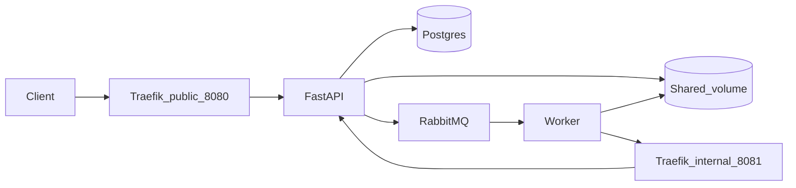

# FIAP Secure Systems — MVP backend

Backend MVP for the FIAP integrated module: upload architecture diagrams (image or PDF), asynchronous analysis with a placeholder “AI” step, structured technical report (components, risks, recommendations), token-based usage accounting, and observability (Prometheus, Grafana, Loki).

## Problem and goal

Organizations maintain many architecture diagrams (images/PDFs) that are reviewed manually. This MVP automates a minimal pipeline: **upload → queue → worker → structured report**, with **status tracking** and **token debits** tied to model usage.

## System composition

| Component | Role | Host port (Compose) |
|-----------|------|---------------------|
| **Traefik** | API gateway: `public` (:8080) exposes `/v1`, docs, health; `internal` (:8081, not published) exposes `/internal` only on the Docker network | `8080` |
| **api** | FastAPI: public REST + internal routes + Postgres + RabbitMQ publisher | (internal only) |
| **worker** | Consumes RabbitMQ, reads diagrams from disk, writes JSON report, calls internal API | (internal); metrics `9100` |
| **postgres** | Relational store for clients and job metadata (paths only, no file bytes) | internal |
| **rabbitmq** | Message bus (exchange `hackathon.diagrams`, queue `diagram.analysis`); Prometheus plugin on `15692` (internal) | internal |
| **prometheus** | Scrapes `api:8000`, `worker:9100`, `rabbitmq:15692` | `9090` |
| **grafana** | Dashboards; provisioned Prometheus + Loki datasources (`admin`/`admin`) | `3000` |
| **loki** | Log aggregation | `3100` |
| **promtail** | Ships Docker container logs to Loki (Docker socket mount) | internal |

Volumes: `uploads_data` (diagrams), `reports_data` (JSON reports), `pgdata`, `grafana_data`.

## Architecture (high level)



## Flow

1. Client `POST /v1/analysis-jobs` (via Traefik `8080`) with `Authorization: Bearer <token>` and multipart file.
2. API validates MIME type, stores the file under `/data/uploads/{job_id}/…`, persists job row (`RECEIVED`), publishes `AnalyzeDiagramJobV1` to RabbitMQ.
3. Worker consumes the message, `PATCH /internal/v1/analysis-jobs/{id}` → `PROCESSING`, reads the diagram bytes, runs placeholder analysis, writes `TechnicalReportV1` JSON to `/data/reports/{job_id}.json`, then `POST /internal/.../completion` with `tokens_used` and relative `report_storage_path`.
4. Client polls `GET /v1/analysis-jobs/{id}` and fetches `GET /v1/analysis-jobs/{id}/report` when status is `ANALYZED`.

## Prerequisites

- Docker + Docker Compose
- (Optional local dev) Python **3.12+** and **uv** or `pip` for tests

## Quick start (Docker)

```bash
cp .env.example .env   # set INTERNAL_TOKEN for non-local demos
docker-compose up -d --build
```

1. Wait until Postgres/RabbitMQ/API/Traefik are healthy.
2. Seed a client (prints **bearer token once**):

```bash
docker-compose exec api python -m hackathon_api.seed
```

3. Call the API through Traefik (public entrypoint):

```bash
export TOKEN='<bearer from seed>'
curl -sS -H "Authorization: Bearer $TOKEN" http://localhost:8080/v1/clients/me/token-balance
```

4. Upload a diagram (creates a minimal PNG under `/tmp` for the multipart `file` field):

```bash
printf '%s' 'iVBORw0KGgoAAAANSUhEUgAAAAEAAAABCAYAAAAfFcSJAAAADUlEQVR42mP8z8BQDwAEhQGAhKmMIQAAAABJRU5ErkJggg==' | base64 -d > /tmp/test-diagram.png
curl -sS -H "Authorization: Bearer $TOKEN" -F "file=@/tmp/test-diagram.png" \
  -D - http://localhost:8080/v1/analysis-jobs
```

5. Poll job and report:

```bash
JOB_ID='<uuid from Location or JSON>'
curl -sS -H "Authorization: Bearer $TOKEN" "http://localhost:8080/v1/analysis-jobs/$JOB_ID"
curl -sS -H "Authorization: Bearer $TOKEN" "http://localhost:8080/v1/analysis-jobs/$JOB_ID/report"
```

**Note:** The internal Traefik entrypoint (`8081`) is **not** published to the host by default; only containers on `internal` (e.g. the worker) can reach `/internal/*`.

## CI / deployment

CI builds images and runs tests (see `.github/workflows/ci.yml`). For **local deployment**, `docker-compose up -d` is the baseline. Production would add firewall rules, secrets management, TLS, and optionally mTLS on internal routes.

## Data model (relational)

- **clients**: `bearer_token_hash`, `bearer_token_prefix`, `token_balance`, …
- **analysis_jobs**: `status` (`RECEIVED` | `PROCESSING` | `ANALYZED` | `ERROR`), `diagram_storage_path`, `report_storage_path`, `tokens_used`, checksums, timestamps.

Structured report content lives **only on disk** as JSON conforming to `TechnicalReportV1` in `packages/contracts`.

## REST surface (public)

| Method | Path | Description |
|--------|------|-------------|
| `POST` | `/v1/analysis-jobs` | Multipart upload; `201` + `Location` |
| `GET` | `/v1/analysis-jobs/{id}` | Job metadata + status |
| `GET` | `/v1/analysis-jobs/{id}/report` | Structured JSON report when `ANALYZED` |
| `GET` | `/v1/clients/me/token-balance` | Remaining AI tokens |

Internal (Traefik `internal` only): `PATCH /internal/v1/analysis-jobs/{id}`, `POST /internal/v1/analysis-jobs/{id}/completion` with header `X-Internal-Token`.

## Security

- **Bearer tokens** are never stored in plaintext; only **bcrypt hashes** and a short **prefix** for lookup.
- **Internal token** (`X-Internal-Token`) is required for `/internal/*`; Traefik splits public vs internal entrypoints to reduce accidental exposure.
- **Upload validation**: MIME allowlist (`image/png`, `image/jpeg`, `application/pdf`) and configurable max size (`MAX_UPLOAD_BYTES`).
- **Token debit** occurs on successful completion using `tokens_used` from the worker (placeholder returns a small deterministic value today).
- **Operational caveats**: internal token is a shared secret (rotate via `.env`); Traefik dashboard is not enabled; Promtail needs Docker socket access; mTLS is not configured in this MVP.

## Observability

- **Prometheus:** `http://localhost:9090` — scrapes API, worker, and RabbitMQ (`rabbitmq_prometheus` on `rabbitmq:15692`).
- **Grafana:** `http://localhost:3000` (`admin` / `admin`) — datasources **Prometheus** and **Loki** are provisioned (fixed UIDs `prometheus`, `loki`). Provisioned dashboards:
  - **Application metrics** — HTTP rates/latency (mean/p95), upload throughput, jobs by status, worker FSM/diagram metrics, RabbitMQ queue depth for `diagram.analysis`, token debit rate, scrape `up`. Uses curated PromQL only (do not chart `*_created` or `process_start_time_seconds` as normal series — they are Unix timestamps).
  - **Application logs (API + Worker)** and **Platform logs (infrastructure)** — Loki log panels filtered by `compose_service`.
- **Loki:** `http://localhost:3100` — ingestion via **Promtail** (Docker container logs).

### Grafana Loki (Explore)

1. Open **Explore** → **Loki**.
2. Example LogQL (`compose_service` comes from Docker Compose / Promtail relabel):
   - `{compose_service="api"}`
   - `{compose_service="worker"}`
3. Services emit JSON (structlog); you can append `| json` when useful.

### Docker Desktop (macOS) vs Linux

Promtail depends on the Docker engine and host log paths. **Linux** (including GitHub Actions) is the reference for “logs in Loki”. On **Docker Desktop for macOS**, `/var/lib/docker/containers` on the host may not match Linux; if Explore is empty, validate on Linux CI or a Linux VM.

### Compose integration (CI and local)

From the repo root (requires Docker, `curl`, `jq`):

```bash
bash scripts/integration_compose_observability.sh
```

Set `KEEP_COMPOSE_UP=1` to skip `docker-compose down` at the end (debugging). The **compose-observability** GitHub Actions job runs the same script on `ubuntu-latest`.

## Tests (without Docker stack)

```bash
python -m venv .venv && source .venv/bin/activate
pip install -e "./packages/platform" -e "./packages/contracts[dev]" -e "./services/api[dev]" -e "./services/worker[dev]"
export PYTHONPATH=services/api/src:services/worker/src
pytest services/api/tests packages/contracts/tests services/worker/tests -v
```

## Repository layout

- `packages/contracts` — shared Pydantic contracts (queue, internal payloads, `TechnicalReportV1`)
- `packages/platform` — shared utilities (`hackathon_platform`, e.g. structlog `configure_logging`)
- `services/api` — FastAPI + Alembic + storage + RabbitMQ publisher
- `services/worker` — async consumer + placeholder AI + internal HTTP client
- `infra/gateway` — Traefik static + dynamic routing
- `observability/*` — Prometheus, Grafana, Promtail

## Documentation

- [Architecture and data flow](docs/architecture-and-data-flow.md)
- [Testing with curl](docs/testing-with-curl.md)
- [Layer boundaries (API + Worker)](docs/architecture-layer-boundaries.md)

## License

Educational use.
