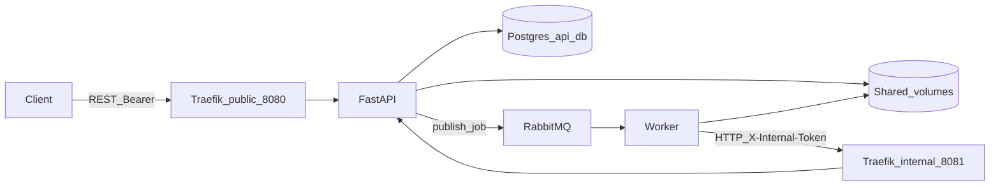

# Architecture and data flow

This document describes the MVP architecture and how data moves from upload to the technical report. For **layer rules** (what each package may import), see [architecture-layer-boundaries.md](architecture-layer-boundaries.md).

## Logical view

- **Traefik** exposes only the public entrypoint (`8080`) on the host. The internal entrypoint (`8081`) exists on the Docker network only; the worker uses `INTERNAL_API_BASE` (e.g. `http://traefik:8081`).
- **API**: a single ASGI process with `/v1/...` (client Bearer) and `/internal/v1/...` (`X-Internal-Token`).
- **Worker**: no database; reads diagrams and writes JSON reports on the same volume as the API; updates state and completion via the internal API.
- **Contracts**: shared types in [`packages/contracts`](../packages/contracts) (`AnalyzeDiagramJobV1`, `JobPatchV1`, `JobCompletionV1`, `TechnicalReportV1`, RabbitMQ topology in `messaging_topology`).
- **Shared platform**: minimal cross-service utilities in [`packages/platform`](../packages/platform) (`hackathon_platform`), including `configure_logging` for structlog across API and worker.

## RabbitMQ messaging topology

Exchange name, routing key, and the **default** queue name are centralized in `hackathon_contracts.messaging_topology`. At runtime the queue name remains configurable per service via `RABBITMQ_QUEUE_NAME` / `Settings.rabbitmq_queue_name` and must match between API and worker in the same environment.

## Data flow (step by step)

1. **Upload** — Client sends `POST /v1/analysis-jobs` (multipart) through public Traefik with `Authorization: Bearer <token>`.
2. **Initial persistence** — API validates upload policy (MIME, size, minimum token estimate), stores the file under a path relative to the uploads volume, creates the job row (`RECEIVED`), and records metadata in Postgres (no file bytes in the DB).
3. **Queue** — API publishes `AnalyzeDiagramJobV1` (including `job_id`, `diagram_storage_path`, etc.) to the direct exchange defined in contracts with the analysis routing key.
4. **Consumption** — Worker consumes the queue, declares the same topology (exchange, queue, binding), and processes messages with requeue disabled on handler exit.
5. **Processing** — Worker calls `PATCH /internal/v1/analysis-jobs/{id}` with `JobPatchV1` (`status: PROCESSING`). API updates the job.
6. **Analysis (placeholder)** — Worker reads the diagram from disk (`uploads_dir` + relative path from the message), runs placeholder analysis, produces `TechnicalReportV1`.
7. **Report on disk** — Worker serializes the report to JSON under `reports_dir` (convention `{job_id}.json`) and computes a checksum when applicable.
8. **Completion** — Worker calls `POST /internal/v1/analysis-jobs/{id}/completion` with `JobCompletionV1` (relative `report_storage_path`, `tokens_used`, checksum, schema version). API updates the job to `ANALYZED`, persists references, and debits `tokens_used` from the client balance in a transaction.
9. **Read results** — Client calls `GET /v1/analysis-jobs/{id}` for status and, when `ANALYZED`, `GET /v1/analysis-jobs/{id}/report` for JSON (validated against the contract when served).

On processing errors, the worker typically records `ERROR` via `PATCH` with a truncated message; the API reflects that on the job row.

## Source of truth

| Data | Source of truth |
|------|-----------------|
| Client/job metadata, token balance | Postgres (`api_db`) |
| Diagram and report bytes | Files on the shared volume; DB stores paths and checksums only |
| Queue payloads and internal API bodies | Schemas in `hackathon_contracts` |

## Further reading

- [architecture-layer-boundaries.md](architecture-layer-boundaries.md) — API, worker, and `packages/contracts`
- [testing-with-curl.md](testing-with-curl.md) — manual end-to-end checks with curl

## Observability (Grafana, Loki)

Promtail ships container logs to **Loki** with a `compose_service` label aligned with the Compose service name (`api`, `worker`, etc.). In **Grafana** (port 3000), use **Explore** with the **Loki** datasource; provisioned dashboards include **Application logs (API + Worker)** and **Platform logs (infrastructure)**, plus **Application metrics** for Prometheus.

On Linux (including CI), the log pipeline is exercised by [`scripts/integration_compose_observability.sh`](../scripts/integration_compose_observability.sh). On Docker Desktop for macOS, log visibility in Loki may differ; treat Linux as the reference environment.
